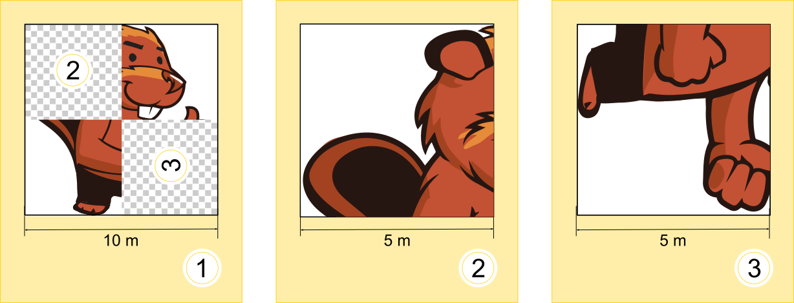
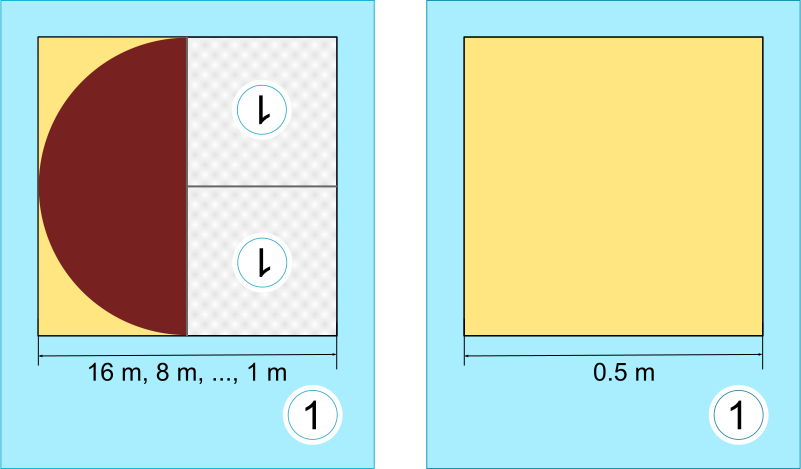

## Body

Tina und Ben helfen bei der Vorbereitung einer Sonderausstellung im Informatik-Museum.
Auf den Boden eines Ausstellungsraums sollen sie ein $16 \times 16$ Meter grosses Bild malen.

Vom Künstler bekommen sie einen Satz Malanweisungskarten in dessen berühmter Malkartensprache,
mit Hinweisen zu den Bildelementen, Massen und Drehungen.

Auf manchen Malanweisungskarten sind nummerierte Felder, die auf andere Karten verweisen. 

Hier ein Beispiel aus einem früheren Malkartenprojekt. 
Wenn man diese drei Karten richtig ausführt, entsteht ein Bild des Bibers:

Für die Sonderausstellung bekommen Tina und Ben nun diese zwei Karten:

Ben runzelt die Stirn. "Wie soll das gehen? Die linke Karte verweist auf sich selbst, 
und ausserdem haben beide Karten dieselbe Nummer!" 
Tina lacht: "Wir kriegen das hin! Zuerst verwenden wir nur die linke Karte. 
Die rechte Karte wird uns später anweisen, wann wir mit dem Malen aufhören sollen."

## Question/Challenge - for the brochures

Wie wird der Boden des Ausstellungsraums aussehen?

## Question/Challenge - for the online challenge

Wie wird der Boden des Ausstellungsraums aussehen?

## Answer Options/Interactivity Description

[A]: graphics/2016-AT-06-answerA.svg
[B]: graphics/2016-AT-06-answerB.svg
[C]: graphics/2016-AT-06-answerC.svg
[D]: graphics/2016-AT-06-answerD.svg

| :--: | :--: | :--: | :--: |
| ![A] | ![B] | ![C] | ![D] |
|  A)  |  B)  |  C)  |  D)  |

## Answer Explanation

Antwort A ist richtig: ![A]

Die linke Malanweisungskarte besagt, dass die linke Hälfte des Bodens mit einer Halbkreisfläche gefüllt werden soll, deren runde Seite bei normaler Orientierung nach links zeigt. Für die rechte Hälfte soll dieselbe Malanweisungskarte zwei Mal verwendet werden. Die Orientierungen der Bildelemente muss den Orientierungen der Einsen entsprechen.

In beiden Hinweisen auf Karte 1 ist die 1 um 180° gedreht, nach unten. Deshalb müssen die dort eingesetzten Bildelemente ebenfalls so gedreht werden, so dass die Rundung der dann gemalten Halbkreisflächen genau in die Gegenrichtung zeigt.  Bei der ersten Verwendung der linken Karte 1 (bei der Breite 16 m) zeigt die Rundung der Halbkreisfläche nach links, bei 8 m nach rechts, bei 4 m wieder nach links usw.  Bei 0,5 m wird die zweite Karte 1 verwendet: Ben und Tina malen die verbleibende freie Fläche noch aus und können danach aufhören.

Auf diese Weise entsteht genau das Bild von Antwort A.

## It's Informatics

Die erste Malanweisungskarte 1 in dieser Biberaufgabe verweist auf sich selbst. Sie ruft Ben und Tina sozusagen dazu auf, sie selbst erneut anzuwenden, mit einer geringeren Breite.  In der Informatik werden Anweisungen, die sich selbst aufrufen, als "rekursiv" bezeichnet. Der Begriff kommt von lateinisch "recurrere" (deutsch: zurücklaufen). Rekursion ist ein mächtiges Konzept. Für manche komplexen Aufgaben kann man kurz und überschaubar eine rekursive Anweisung zu ihrer Lösung formulieren.

Eine rekursive Anweisung muss eine Bedingung enthalten, die festlegt, wann die Rekursion abgebrochen werden soll. Sonst arbeitet die Rekursion solange weiter, bis irgendeine Ressource erschöpft ist. Etwa der Computerspeicher oder die Geduld des Benutzers.  In dieser Biberaufgabe hat die zweite Karte 1 diese Funktion:  Unter der Bedingung, dass noch eine Fläche der Breite 0,5 m bemalt werden soll, wird sie "aufgerufen".  Da sie keinen Verweis auf eine andere Karte enthält, bricht sie die Rekursion ab.

## This is Computational Thinking

Optional - not to be filled 2023

## Keywords and Websites

- Programmieren: https://de.wikipedia.org/wiki/Programmierung 
- Rekursion: https://de.wikipedia.org/wiki/Rekursion 
- Abbruchbedingung: https://de.wikipedia.org/wiki/Abbruchbedingung 

## Wording and Phrases

_Abbruch, Bedingung, Boden_
_Malanweisungskarte, Malkartensprache, Bildelement, Massstab, Drehungen_

## Comments

_Susanne Datzko-Thut, 2023-10-09_: neue "Version" mit abgeänderter Aufgabenstellung gemeinsam mit Chris Roffey erstellt.
For comments see original file.