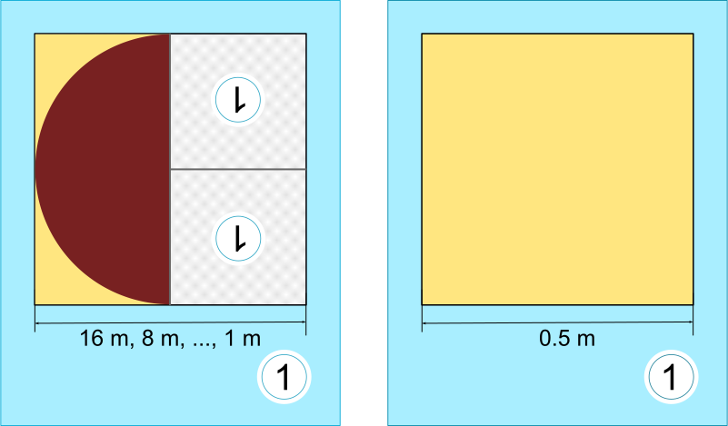

## Body

Tina e Ben aiutano a preparare una mostra speciale al Museo dell'Informatica.
Devono dipingere un quadro di $16 \times 16$ metri sul pavimento di uno spazio espositivo.

Ricevono dall'artista un set di schede di istruzioni per la pittura nel suo famoso linguaggio,
con note sugli elementi dell'immagine, sulle dimensioni e sulle rotazioni.

Su alcune schede di istruzione per la pittura sono presenti campi numerati che rimandano ad altre schede.

Ecco un esempio tratto da un precedente progetto.
Se si eseguono correttamente queste tre carte, emerge l'immagine del castoro:

 
 
Tina e Ben ottengono ora questi due carte per la mostra:

 
 
Ben aggrotta le sopracciglia. "Come dovrebbe funzionare? La carta di sinistra si riferisce a se stessa,
e inoltre, entrambe le carte hanno lo stesso numero!".
Tina ride: "Possiamo farcela! All'inizio usiamo solo la carta sinistra.
La carta giusta ci indicherà poi quando smettere di dipingere".

## Question/Challenge - for the brochures

Come sarà il pavimento dello spazio espositivo?

## Question/Challenge - for the online challenge

Come sarà il pavimento dello spazio espositivo?

## Answer Options/Interactivity Description

[A]: graphics/2016-AT-06-answerA.svg
[B]: graphics/2016-AT-06-answerB.svg
[C]: graphics/2016-AT-06-answerC.svg
[D]: graphics/2016-AT-06-answerD.svg

| :--: | :--: | :--: | :--: |
| ![A] | ![B] | ![C] | ![D] |
|  A)  |  B)  |  C)  |  D)  |

## Answer Explanation

La risposta A è corretta: ![A]

La carta di istruzione per la pittura di sinistra dice che la metà sinistra del pavimento deve essere riempita con un'area semicircolare con il lato rotondo rivolto a sinistra in orientamento normale. Per la metà destra, la stessa scheda di istruzioni per la pittura deve essere utilizzata due volte. Gli orientamenti degli elementi del quadro devono corrispondere a quelli degli indizi.

In entrambi gli indizi della tessera 1, l'1 è ruotato di 180°, verso il basso. Pertanto, anche gli elementi dell'immagine utilizzati devono essere ruotati in modo che l'arrotondamento delle aree semicircolari dipinte sia esattamente nella direzione opposta. Quando la carta 1 di sinistra viene utilizzata per la prima volta (con una larghezza di 16 m), l'arrotondamento dell'area semicircolare punta a sinistra, a 8 m a destra, a 4 m di nuovo a sinistra e così via.  A 0,5 m viene utilizzata la seconda carta 1: Ben e Tina colorano ancora nell'area libera rimanente e possono fermarsi dopo.

In questo modo, viene creata esattamente l'immagine della risposta A.

## It's Informatics

La prima scheda di istruzione per la pittura 1 di questo compito si riferisce a se stessa. Richiede a Ben e Tina per usarla di nuovo, con una larghezza minore. In informatica, le istruzioni che si richiamano da sole sono dette "ricorsive". Il termine deriva dal latino "recurrere" (ricorrere). La ricorsività è un concetto potente. Per alcuni compiti complessi, è possibile formulare un'istruzione ricorsiva breve e semplice per risolverli.

Un'istruzione ricorsiva deve contenere una condizione che specifichi quando la ricorsione deve essere terminata. In caso contrario, la ricorsione continuerà fino all'esaurimento di qualche risorsa. Ad esempio, la memoria del computer o la pazienza dell'utente. In questo compito, la seconda scheda 1 ha questa funzione: la condizione è quella che l'area da dipingere sia di larghezza 0,5 m. Poiché essa non contiene un riferimento a un'altra carta, interrompe la ricorsione.

## This is Computational Thinking

Optional - not to be filled 2023

## Keywords and Websites

- Programmazione: https://it.wikipedia.org/wiki/Programmazione_(informatica)
- Ricorsività: https://it.wikipedia.org/wiki/Algoritmo_ricorsivo 

## Wording and Phrases

_Abbruch, Bedingung, Boden_
_Malanweisungskarte, Malkartensprache, Bildelement, Massstab, Drehungen_

## Comments

_Susanne Datzko-Thut, 2023-10-09_: neue "Version" mit abgeänderter Aufgabenstellung gemeinsam mit Chris Roffey erstellt.
For comments see original file.
