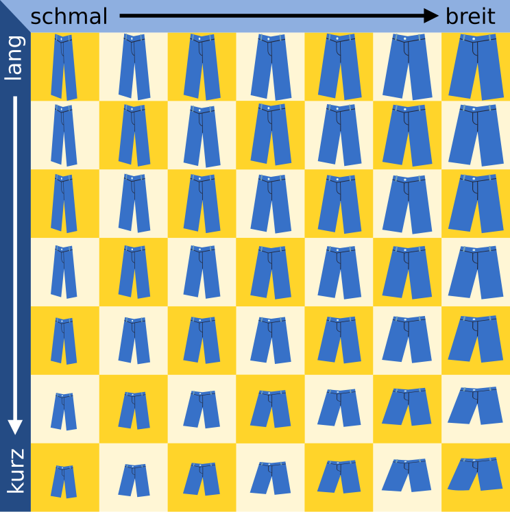
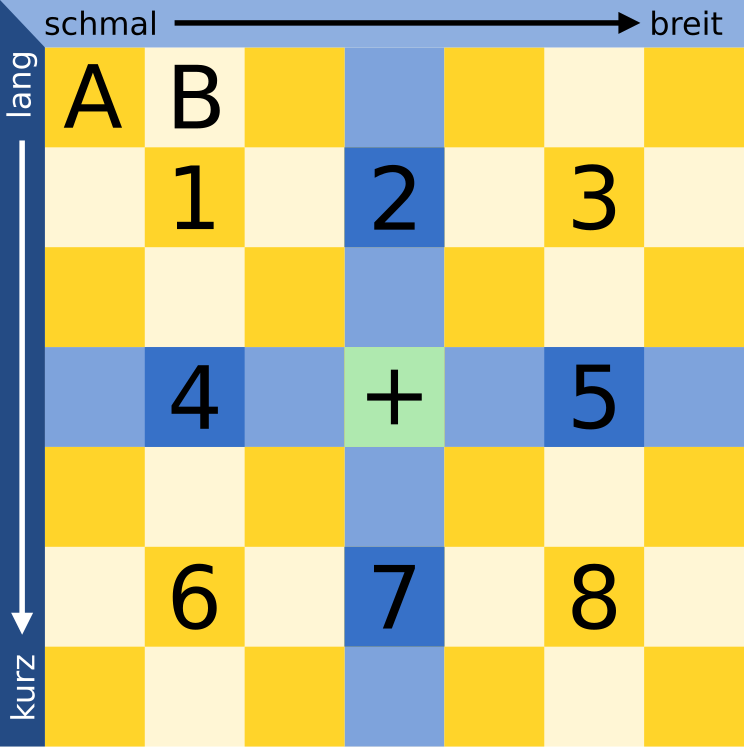

## Body

Christian braucht neue Hosen. Im Geschäft gibt es seine Lieblings-Hose in sieben Längen und sieben Breiten. Hosen in allen 49 Grössen sind im Regal, nach Länge und Breite sortiert.

Weil Christian seine richtige Grösse nicht weiss, muss er sie durch Anprobieren herausfinden.
Bei jeder Anprobe merkt Christian, ob die Hose passt oder ob er eine kürzere, längere, schmalere oder breitere Hose braucht.
Damit eine Hose passt, müssen Länge und Breite stimmen.

Der Verkäufer stöhnt: Bei 49 Grössen die richtige zu finden – das kann dauern.

Doch Christian ist eine Methode eingefallen, die richtige Grösse in jedem Fall nach möglichst wenigen Anproben zu wissen.

## Question/Challenge - for the brochures

Wie viele Anproben braucht er mit dieser Methode höchstens, bis er die richtige Grösse weiss?

## Question/Challenge - for the online challenge

Wie viele Anproben braucht er mit dieser Methode höchstens, bis er die richtige Grösse weiss?

## Answer Options/Interactivity Description

<!-- empty -->

:::comment
<!-- Auf keinen Fall:  Multiple-Choice Dropdown mit Zahlen von 1 bis 49. -->
Open Integer Grader; Range: 1 bis 49
:::

## Answer Explanation

2 ist die richtige Antwort.

Natürlich kann Christian Glück haben und direkt bei der ersten Anprobe die Hose in der richtigen Grösse erwischen. Aber auf Glück kann er sich nicht verlassen und geht nach dieser Methode vor:

Zuerst probiert er die Hose in der Mitte an (Position + im Bild). Bei der Anprobe prüft er Länge und Breite der Hose. 

- Wenn Länge und Breite stimmen, hat der die Hose mit der richtigen Grösse gefunden.
- Wenn die Hose zu kurz und zu breit ist, ist die passende Hose in Bereich 1.
- Wenn die Hose zu kurz ist aber die richtige Breite hat, ist die passende Hose in Bereich 2.
- Wenn die Hose zu kurz und zu schmal ist, ist die passende Hose in Bereich 3.
- Dies kann man für die Bereiche 4 bis 8 fortführen.

Nehmen wir an, die Hose mit der richtigen Grösse ist in Bereich 1. Christian wählt für die zweite Anprobe die Hose in der Mitte von Bereich 1.

Nun gibt es wieder mehrere Möglichkeiten:
- Wenn die Hose passt, hat er die richtige Grösse gefunden.
- Wenn die Hose immer noch zu kurz und zu breit ist, weiss Christian, dass die Hose an Position A die richtige Grösse hat. 
- Wenn die Hose zu kurz ist, aber die passende Breite hat, weiss Christian, dass die Hose an Position B die richtige Grösse hat. 
- Dies kann man für die anderen Positionen rund um die Mitte von Bereich 1 fortführen.

Weil in jedem nummerierten Bereich das mittlere Regalfach in jeder Richtung nur ein Nachbarfach hat, sind keine weiteren Anproben notwendig. Christian braucht also in jedem Fall höchstens zwei Anproben, um die richtige Grösse zu wissen.

## It's Informatics

Die Methode, die Christian bei der Anprobe anwendet, heisst in der Informatik binäre Suche. Der Begriff _binär_ kommt vom lateinischen Wort bis (zweimal). Bei der binären Suche nach einem Objekt in einer Folge sortierter Objekte wird deren mittleres Objekt mit dem gesuchten verglichen. Wenn das mittlere Objekt nicht schon das gesuchte ist, weiss man immerhin, in welcher Hälfte der Folge sich das gesuchte Objekt befindet und durchsucht diese Hälfte wieder binär. In jedem Schritt wird die Folge also in zwei Teile geteilt – deshalb "binär". Auf diese Weise kommt man sehr schnell beim gesuchten Objekt an. Bei 1.000 Objekten werden etwa 10 Suchschritte benötigt, bei 1.000.000 Objekten etwa 20. Allgemein kann man sagen: Bei _n_ Objekten werden etwa log(_n_) Schritte benötigt; die Funktion log ist der "Zweier-Logarithmus" oder der Logarithmus zur Basis 2. Weil die binäre Suche so schnell ist, wird sie in Computerprogrammen häufig für die Suche in sortierten Daten verwendet.

In dieser Biberaufgabe ist der Suchraum, nämlich die Hosen im Regal, in zwei Dimensionen (Länge und Breite) sortiert. Deshalb kann Christian die binäre Suche gleich auf beide Dimensionen anwenden. Dann teilt sich die Suchmenge in einem Schritt nicht in 2, sondern gleich in 8 Teile auf - falls Christian nicht direkt die richtige Grösse erwischt hat.

## This is Computational Thinking

Optional - not to be filled 2023

## Keywords and Websites

- Binäre Suche: https://de.wikipedia.org/wiki/Bin%C3%A4re_Suche 
- Suchverfahren: https://de.wikipedia.org/wiki/Suchverfahren 

## Wording and Phrases

_Regal:_ besteht aus Fächern
_Fach:_ enthält einen Hose zum Anprobieren
_Bereich:_ Zusammenhängende Gruppe von Fächern
_Grössenbezeichnungen für Hosen:_ breit, schmal, lang, kurz, Länge, Breite

## Comments

2019-05-15: Eslam AbdElAal, Georgios Fesakis, Vipul Shah:  
- Changed the story as per suggestion from the working group. Its now a story of a beaver in a shoe store. 
- Reworded the answer and informatics section.
- Replaced the graphics to show shoes instead of footprint.

2019-07-27: Michael Weigend (Germany) mw@creative-informatics.de: Translation to German. Erklärung und DII wurden überarbeitet. Aus den Grafiken habe ich die Farben in der Kopfzeile entfernt (sie haben eh keine Bedeutung), damit es keine Verwechslung mit den Farben in den markierten Bereichen gibt. Ausserdem gibt es einen Pfeil statt Doppelpfeil um die Richtung der Sortierung anzuzeigen. Das Bild des koreanischen Bibers habe ich gelassen. Falls es nicht der offizielle koreanische Biber ist, kann man ihn eventuell durch den deutschen Biber ersetzen oder auch ganz weglassen. Die Sprechblase habe ich durch eine Denkblase ersetzt und die multiplen Frage- bzw. Ausrufezeichen durch ein Fragezeichen ersetzt.

Christian Datzko, christian@bebras.services, 2023-07-21:
- Entbibert.
- Text ein wenig gestreamlined (einige ungewöhnliche Formulierungen vereinfacht / präzisiert).
- Optimalität in der Frage gefordert (fehlte).
- Antwortformat von Open Integer (unzuverlässig und fehleranfällig) zu Drop-Down-Multiple-Choice angepasst.
- Antworterklärung und It’s Informatik präzisiert, weil hier eine besondere binäre Suche (mit drei Antwortmöglichkeiten, <, = , >) vorgegeben ist. 1-2 Fehlerchen korrigiert.