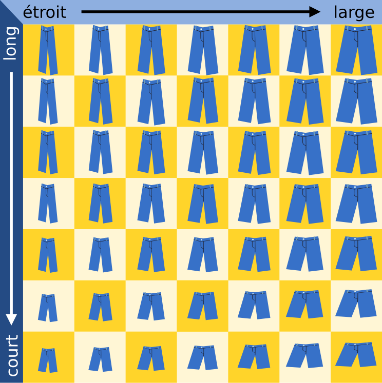
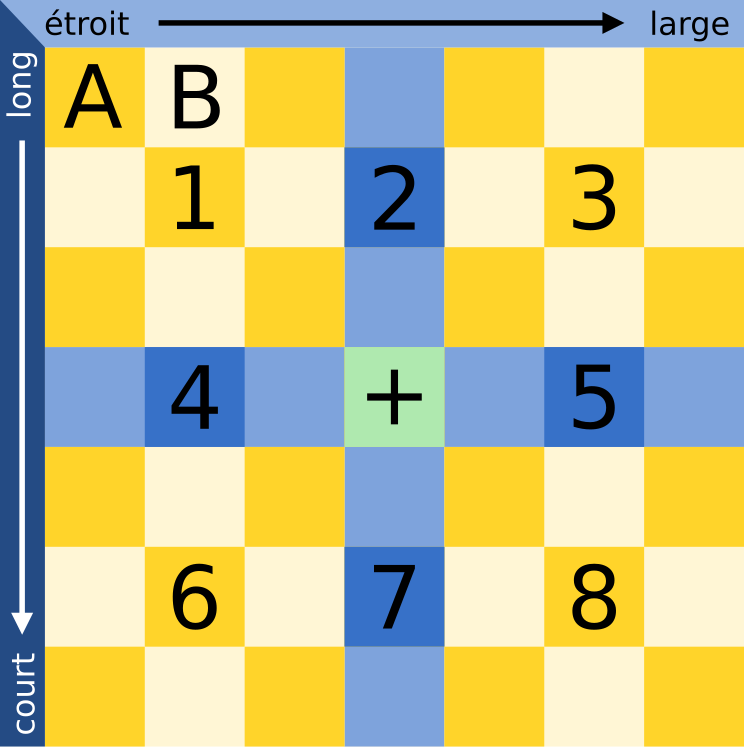

## Body

Christian a besoin d'un nouveau pantalon. Le magasin vend son pantalon préféré en sept longueurs et sept largeurs différentes. Les 49 tailles sont rangées dans les cases d'une étagère, classées par largeur et longueur.

Comme Christian ne connaît pas sa taille, il doit trouver la bonne taille en essayant les pantalons. À chaque essai, Christian note si le pantalon lui va ou s'il a besoin d'un pantalon plus large, plus étroit, plus court ou plus long. Pour qu'un pantalon lui aille, il faut que la largeur et la longueur soient bonnes.

<!-- kurz: court; lang: long; schmal: étroit; breit: large -->

Le vendeur gémit: ça risque de prendre du temps de trouver la bonne taille parmi 49.

Mais Christian a pensé à une méthode lui permettant de toujours trouver la bonne taille avec le moins d'essais possible.

## Question/Challenge - for the brochures

Combien de pantalons Christian doit-il au maximum essayer avant d'identifier la bonne taille?

## Question/Challenge - for the online challenge

Combien de pantalons Christian doit-il au maximum essayer avant d'identifier la bonne taille?

## Answer Options/Interactivity Description

<!-- empty -->

:::comment
<!-- Auf keinen Fall:  Multiple-Choice Dropdown mit Zahlen von 1 bis 49. -->
Open Integer Grader; Range: 1 bis 49
:::

## Answer Explanation

La bonne réponse est 2.

Christian pourrait bien sûr avoir de la chance et tomber sur la bonne taille de pantalon à son premier essai, mais il ne peut pas se fier au hasard et procède d'après la méthode suivante:

Il commence par essayer le pantalon du milieu (à la position + sur l'image) et en vérifie la longueur et la largeur.
- Si la longueur et la largeur vont, il a trouvé le pantalon à la bonne taille.
- Si le pantalon est trop court et trop large, le bon pantalon se trouve dans le secteur 1.
- Si le pantalon est trop court mais a la bonne largeur, le bon pantalon se trouve dans le secteur 2.
- Si le pantalon est trop court et trop étroit, le bon pantalon se trouve dans le secteur 3.
- Et ainsi de suite pour les secteurs 4 à 8.

Imaginons que le pantalon ayant la bonne taille soit dans le secteur 1. Pour son deuxième essai, Christian choisit le pantalon rangé au milieu du secteur 1. Il y a à nouveau plusieurs possibilités:

- Si la longueur et la largeur vont, il a trouvé le pantalon à la bonne taille.
- Si le pantalon est trop court et trop large, Christian sait que le bon pantalon se trouve en position A.
- Si le pantalon est trop court mais a la bonne largeur, Christian sait que le bon pantalon se trouve en position B.
- Et ainsi de suite pour les autres positions du secteur 1.

Comme la case centrale de chaque secteur numéroté ne possède qu'une case voisine dans chaque directions, aucun essai supplémentaire n'est nécessaire. Christian a donc besoin de deux essais au maximum pour trouver la bonne taille de pantalon.

## It's Informatics

La méthode que Christian utilise pour ses essais de pantalons s'appelle _recherche dichotomique_ en informatique. Lors de la recherche dichotomique d'un objet dans une liste d'objets triés, l'objet du milieu est comparé à l'objet recherché. Si l'objet du milieu ne correspond pas à celui que l'on recherche, on sait dans quelle moitié de la liste l'objet recherché se trouve et l'on peut y continuer la recherche dichotomique. Ainsi, la liste est est séparée en deux à chaque étape de la recherche – d'où "dichotomique". De cette manière, on trouve rapidement l'objet recherché. Environ 10 étapes sont nécessaire pour rechercher dans une liste de 1000 objets, et 20 étapes pour une liste de $1\,000\,000$ objets. De manière générale, on peut le formuler ainsi: il faut en moyenne $\log(n)$ étapes pour un tableau de $n$ objets (la fonction log est le logarithme en base 2). La recherche dichotomique est souvent utilisée par les programmes informatiques pour les recherches dans les données triées en raison de sa rapidité.

Dans cet exercice du Castor, l'espace de recherche (les pantalons dans l'étagère) est séparé en deux dimensions (longueur et largeur). Christian peut donc appliquer la recherche dichotomique dans les deux dimensions en même temps, et l'espace de recherche n'est pas divisé en deux à chaque étape, mais directement en huit – pour autant que Christian ne soit pas directement tombé sur la bonne taille!

## This is Computational Thinking

Optional - not to be filled 2023

## Keywords and Websites

- Recherche dichotomique: https://fr.wikipedia.org/wiki/Recherche_dichotomique
- Algorithme de recherche: https://fr.wikipedia.org/wiki/Algorithme_de_recherche

## Wording and Phrases

_Regal:_ besteht aus Fächern
_Fach:_ enthält einen Hose zum Anprobieren
_Bereich:_ Zusammenhängende Gruppe von Fächern
_Grössenbezeichnungen für Hosen:_ breit, schmal, lang, kurz, Länge, Breite

## Comments

2019-05-15: Eslam AbdElAal, Georgios Fesakis, Vipul Shah:  
- Changed the story as per suggestion from the working group. Its now a story of a beaver in a shoe store. 
- Reworded the answer and informatics section.
- Replaced the graphics to show shoes instead of footprint.

2019-07-27: Michael Weigend (Germany) mw@creative-informatics.de: Translation to German. Erklärung und DII wurden überarbeitet. Aus den Grafiken habe ich die Farben in der Kopfzeile entfernt (sie haben eh keine Bedeutung), damit es keine Verwechslung mit den Farben in den markierten Bereichen gibt. Ausserdem gibt es einen Pfeil statt Doppelpfeil um die Richtung der Sortierung anzuzeigen. Das Bild des koreanischen Bibers habe ich gelassen. Falls es nicht der offizielle koreanische Biber ist, kann man ihn eventuell durch den deutschen Biber ersetzen oder auch ganz weglassen. Die Sprechblase habe ich durch eine Denkblase ersetzt und die multiplen Frage- bzw. Ausrufezeichen durch ein Fragezeichen ersetzt.

Christian Datzko, christian@bebras.services, 2023-07-21:
- Entbibert.
- Text ein wenig gestreamlined (einige ungewöhnliche Formulierungen vereinfacht / präzisiert).
- Optimalität in der Frage gefordert (fehlte).
- Antwortformat von Open Integer (unzuverlässig und fehleranfällig) zu Drop-Down-Multiple-Choice angepasst.
- Antworterklärung und It’s Informatik präzisiert, weil hier eine besondere binäre Suche (mit drei Antwortmöglichkeiten, <, = , >) vorgegeben ist. 1-2 Fehlerchen korrigiert.