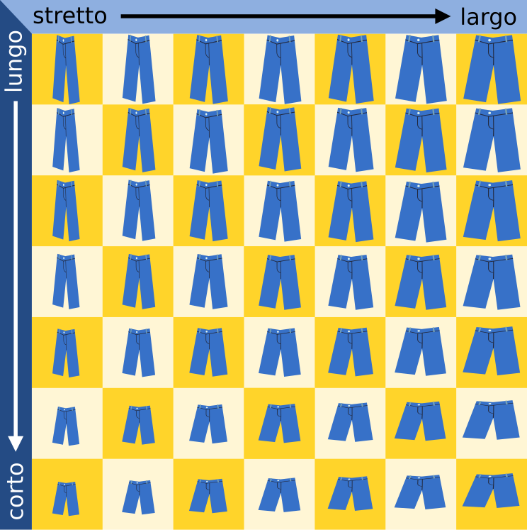
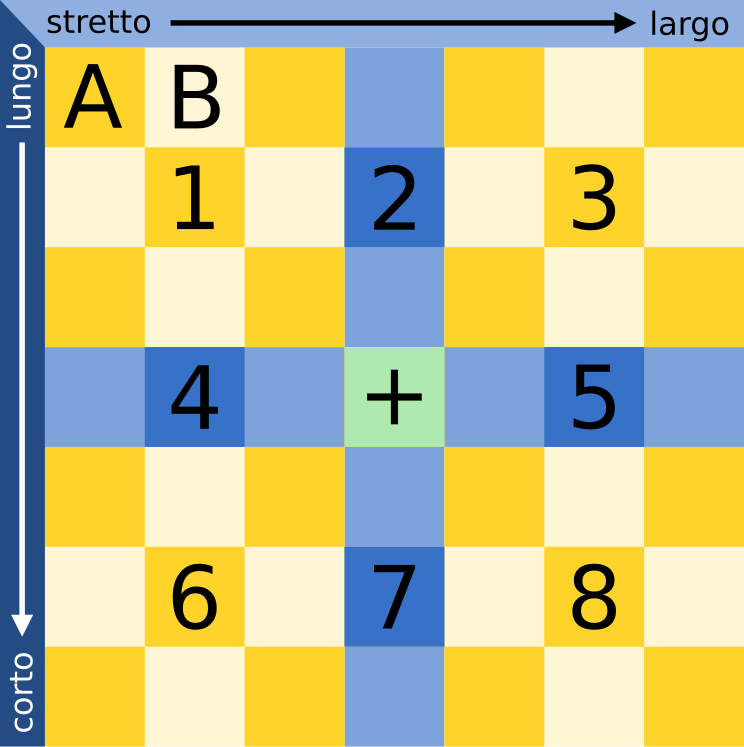

## Body

Christian ha bisogno di nuovi pantaloni. Nel negozio, i suoi pantaloni preferiti sono disponibili in sette lunghezze e sette larghezze. I pantaloni di tutte le 49 taglie sono sullo scaffale, ordinati per lunghezza e larghezza.

Poiché Christian non conosce la sua taglia, deve scoprirla provandola.
A ogni prova, Christian nota se i pantaloni gli vanno bene o se ha bisogno di pantaloni più corti, più lunghi, più stretti o più larghi.
Affinché un paio di pantaloni sia adatto, la lunghezza e la larghezza devono essere giuste.

 
 
La commessa si lamenta: "Trovare la taglia giusta in 49 taglie può richiedere molto tempo."

Ma Christian ha ideato un metodo per trovare la taglia giusta con il minor numero possibile di prove.

## Question/Challenge - for the brochures

Di quante prove ha bisogno al massimo per trovare la taglia giusta con il metodo ideato da Christian?

## Question/Challenge - for the online challenge

Di quante prove ha bisogno al massimo per trovare la taglia giusta con il metodo ideato da Christian?

## Answer Options/Interactivity Description

<!-- empty -->

:::comment
<!-- Auf keinen Fall:  Multiple-Choice Dropdown mit Zahlen von 1 bis 49. -->
Open Integer Grader; Range: 1 bis 49
:::

## Answer Explanation

La risposta giusta è 2.

Christian può essere fortunato e ottenere i pantaloni della taglia giusta alla prima prova. Ma non può affidarsi alla fortuna e dunque procede secondo questo metodo:

Prima prova i pantaloni al centro (posizione + nell'immagine). Durante la prova, controlla la lunghezza e la larghezza dei pantaloni. 

- Se la lunghezza e la larghezza sono giuste, ha trovato i pantaloni della taglia giusta.
- Se i pantaloni sono troppo corti e troppo larghi, i pantaloni corrispondenti si trovano nell'area 1.
- Se i pantaloni sono troppo corti ma hanno la larghezza giusta, i pantaloni corrispondenti si trovano nell'area 2.
- Se i pantaloni sono troppo corti e troppo stretti, i pantaloni abbinati si trovano nell'area 3.
- Ripete poi il metodo per le aree da 4 a 8.

Supponiamo che i pantaloni della taglia giusta siano nell'area 1. Christian sceglie i pantaloni al centro dell'area 1 per la seconda prova.

Ora ci sono di nuovo diverse possibilità:
- Se i pantaloni vanno bene, ha trovato la taglia giusta.
- Se i pantaloni sono ancora troppo corti e troppo larghi, Christian sa che i pantaloni nella posizione A sono della taglia giusta. 
- Se i pantaloni sono troppo corti ma hanno la larghezza giusta, Christian sa che i pantaloni della posizione B sono della taglia giusta. 
- Si può continuare così per le altre posizioni intorno alla metà dell'area 1.

Poiché in ogni area numerata il ripiano centrale ha solo un ripiano vicino in ogni direzione, non sono necessari altri controlli. Quindi Christian ha bisogno al massimo di due prove in ogni caso per trovare la taglia giusta.

## It's Informatics

Il metodo utilizzato da Christian per l'adattamento è chiamato ricerca binaria in informatica. Il termine _binario_ deriva dalla parola latina bis (due volte). In una ricerca binaria di un oggetto in una sequenza di oggetti ordinati, l'oggetto centrale viene confrontato con quello cercato. Se l'oggetto centrale non è già quello che si sta cercando, si sa almeno in quale metà della sequenza si trova l'oggetto che si sta cercando e si cerca nuovamente in questa metà in modo binario. In ogni fase, la sequenza viene divisa in due parti - da qui "binaria". In questo modo si arriva molto rapidamente all'oggetto cercato. Per 1.000 oggetti sono necessari circa 10 passi di ricerca, per 1.000.000 di oggetti circa 20. In generale, possiamo dire: per _n_ oggetti sono necessari circa log(_n_) passi; la funzione log è il "logaritmo di due" o il logaritmo in base 2. Poiché la ricerca binaria è così veloce, viene spesso utilizzata nei programmi informatici per la ricerca di dati ordinati.

In questo compito, lo spazio di ricerca, cioè i pantaloni sullo scaffale, è ordinato in due dimensioni (lunghezza e larghezza). Pertanto, Christian può applicare immediatamente la ricerca binaria in entrambe le dimensioni. Poi l'insieme di ricerca viene diviso in un unico passaggio non in 2, ma in 8 parti, nel caso in cui Christian non abbia ottenuto direttamente la dimensione giusta.

## This is Computational Thinking

Optional - not to be filled 2023

## Keywords and Websites

- Ricerca binaria: https://it.wikipedia.org/wiki/Ricerca_dicotomica
- Alrogitmo di ricerca: https://it.wikipedia.org/wiki/Algoritmo_di_ricerca

## Wording and Phrases

_Regal:_ besteht aus Fächern
_Fach:_ enthält einen Hose zum Anprobieren
_Bereich:_ Zusammenhängende Gruppe von Fächern
_Grössenbezeichnungen für Hosen:_ breit, schmal, lang, kurz, Länge, Breite

## Comments

2019-05-15: Eslam AbdElAal, Georgios Fesakis, Vipul Shah:  
- Changed the story as per suggestion from the working group. Its now a story of a beaver in a shoe store. 
- Reworded the answer and informatics section.
- Replaced the graphics to show shoes instead of footprint.

2019-07-27: Michael Weigend (Germany) mw@creative-informatics.de: Translation to German. Erklärung und DII wurden überarbeitet. Aus den Grafiken habe ich die Farben in der Kopfzeile entfernt (sie haben eh keine Bedeutung), damit es keine Verwechslung mit den Farben in den markierten Bereichen gibt. Ausserdem gibt es einen Pfeil statt Doppelpfeil um die Richtung der Sortierung anzuzeigen. Das Bild des koreanischen Bibers habe ich gelassen. Falls es nicht der offizielle koreanische Biber ist, kann man ihn eventuell durch den deutschen Biber ersetzen oder auch ganz weglassen. Die Sprechblase habe ich durch eine Denkblase ersetzt und die multiplen Frage- bzw. Ausrufezeichen durch ein Fragezeichen ersetzt.

Christian Datzko, christian@bebras.services, 2023-07-21:
- Entbibert.
- Text ein wenig gestreamlined (einige ungewöhnliche Formulierungen vereinfacht / präzisiert).
- Optimalität in der Frage gefordert (fehlte).
- Antwortformat von Open Integer (unzuverlässig und fehleranfällig) zu Drop-Down-Multiple-Choice angepasst.
- Antworterklärung und It’s Informatik präzisiert, weil hier eine besondere binäre Suche (mit drei Antwortmöglichkeiten, <, = , >) vorgegeben ist. 1-2 Fehlerchen korrigiert.
