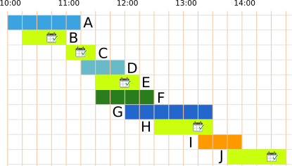
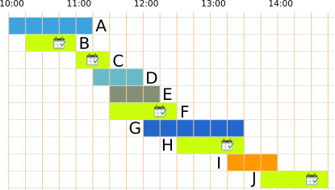
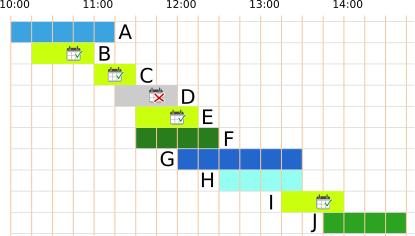

## Body

Heute ist Anja im Zoo. Sie will möglichst viele verschiedene Vorführungen besuchen.

Hier ist ein Plan mit allen Vorführungen.
Zum Beispiel siehst du ganz unten:
Die Vorführung der Affen beginnt um 13:45 Uhr und endet um 14:45 Uhr.

")

Anja besucht eine Vorführung immer ganz, von Anfang bis Ende.
Kannst du Anja helfen?

## Question/Challenge - for the brochures

Wähle so viele Vorführungen wie möglich aus, die Anja nacheinander besuchen kann.

## Question/Challenge - for the online challenge

Wähle so viele Vorführungen wie möglich aus, die Anja nacheinander besuchen kann.

## Interactivity instruction - for the online challenge

Klicke eine Vorführung an, um sie auszuwählen. Klicke nochmals, um sie nicht auszuwählen. Wenn du fertig bist, klicke auf "Antwort speichern".

## Answer Options/Interactivity Description

Every show can be selected by clicking on it. Then the show will be highlighted. By clicking again, the show is deselected.

## Answer Explanation

Anja kann höchstens 5 Vorführungen nacheinander besuchen. 
Das sind die beiden richtigen Antworten:

:::center
   
:::

Es gibt unterschiedliche Wege, die richtigen Antworten zu finden. 

Ein Besuchsplan für Anja ist eine Auswahl von Vorführungen, die sie nacheinander besuchen kann.  Ein Weg zu  den richtigen Antworten ist es, alle Besuchspläne aufzulisten.  In dieser Liste sind die Pläne mit den meisten Vorführungen die richtigen Antworten.  Alle Besuchspläne zu finden, ist leider sehr zeitaufwändig. 

Aber könnte es nicht auch einen Besuchsplan mit 6 Vorführungen geben?  Wir versuchen einmal, einen zu erstellen. Vorher schauen wir uns die Dauer der Vorführungen genauer an:  Der gesamte Tag ist auf dem Plan in 19 Zeiteinheiten zu je einer Viertelstunde unterteilt. Die Vorführungen dauern 2, 3, 4, 5 oder 6 Zeiteinheiten. 

:::center
| Zeiteinheiten | Vorstellungen |
| ------------- | ------------- |
| 2             | C             |
| 3             | B, D, E, I    |
| 4             | F, H, J       |
| 5             | A             |
| 6             | G             |
:::

Um möglichst viele Vorführungen in einen Besuchsplan zu packen, wählen wir so _kurze_ Vorführungen wie möglich. Die 6 kürzesten Vorführungen dauern zusammen 18 Zeiteinheiten $(2 + 3 + 3 + 3 + 3 + 4)$. Zu diesen kurzen Vorführungen gehören auch die Vorführungen C, D und E. Da die Vorführungen C und E aber genau hintereinander liegen, kann Anja Vorführung D dazwischen nicht besuchen. 

Wir müssen also die Vorführung D durch eine andere möglichst kurze ersetzen.  Es sind nur noch Vorführungen mit mindestens 4 Zeiteinheiten übrig.  Ohne die Vorführung D benötigen wir deshalb insgesamt mindestens 19 Zeiteinheiten für 6 Vorführungen: $2 + 3 + 3 + 3 + 4 + 4$.  Aber: Welche zwei Vorführungen mit 4 Zeiteinheiten wir auch wählen, eine davon überschneidet sich immer mit einer Vorführung mit 3 Zeiteinheiten.  Wir müssten auch diese durch eine Vorführung mit mindestens 4 Zeiteinheiten ersetzen und würden dann mindestens 20 Zeiteinheiten für 6 Vorführungen benötigen.  Es stehen aber nur 19 Zeiteinheiten zur Verfügung!  Wir schlussfolgern, dass es keinen Besuchsplan geben kann, der mehr als 5 Vorführungen enthält.

## This is Informatics

Diese Biberaufgabe enthält einen Zeitplan der Vorführungen im Zoo. Solche Zeitpläne herzustellen, ist nicht einfach und wird in der Informatik als _Scheduling-Problem_ bezeichnet. Natürlich möchte der Zoo seinen Besuchern ermöglichen, möglichst viele Vorführungen zu sehen, aber es müssen auch andere Bedingungen beachtet werden. Beispielsweise können Vorführungen nur angeboten werden, wenn die Tierpfleger Zeit haben, die verfügbaren Arenas frei sind und die Vorführungen sich mit den Lebensrhythmen der Tiere vereinbaren lassen. 

Es gibt viele ähnliche Probleme im Leben, auf die sich dieselben Überlegungen anwenden lassen. Ein Beispiel ist die Erstellung eines Stundenplanes in der Schule, oder die Zuteilung von Kinofilmen zu Kinosälen. Die Erstellung dieser Zeitpläne ist so aufwändig, dass man dies schon für relativ kleine Beispiele (die Stundenpläne deiner Schule) oft nicht mehr von Hand erarbeiten kann. Auch die _Prozessoren_ deines Computers müssen viele Aufgaben übernehmen und diese nacheinander abarbeiten. Der Zeitplan, wann welcher Prozessor was tut, wird vom _Betriebssystem_ blitzschnell und ohne dass man es merkt erstellt. Scheduling ist eines der grossen Themen der Informatik, mit welchen sich die Forschung auch heute noch beschäftigt. 

## This is Computational Thinking

Optional - not to be filled 2023

## Informatics Keywords and Websites

- Sheduling-Problem: https://de.wikipedia.org/wiki/Scheduling
- Betriebssystem: https://de.wikipedia.org/wiki/Betriebssystem

## Computational Thinking Keywords and Websites

Optional - not to be filled 2023

## Wording and Phrases

German wording and phrases please here!

 - _Vorführung_: Tiervorführung
 - _Plan_: Zeitplan für den Tag im Zoo 

## Comments

Report changes on this file (older comments can be looked up in the original document)

_Susanne Datzko, 2023-07-04_: Offene Fragen:
- Ist das Plakat selbsterklärend, oder muss man ein Beispiel geben?
- Ist es klar, dass Anja immer nur eine Tiershow aufs Mal besuchen kann? Oder ist das evtl. schon durch das "hintereinander" klar genug definiert.
- It's informatics: Nur Sheduling-Problem oder auch Brute-Force und Dekomposition
- Ist die Erläuterung ausreichend, oder muss sie mehr ins Detail gehen wie im Original?
- Evtl. die Tabelle in der Expl. so anpassen?
| Shows      | kürzere Show      | direkt anschliessend | Auswahl |
| ---------- | ----------------- | -------------------- | ------- |
| A, B       | B                 | -                    | B       |
| A, B, C    | -                 | C an B               | C       |
| C, D, E, F | E                 | E, F an C            | E       |
| E, G       | E                 | -                    | E       |
| H, I       | -                 | H                    | H       |
| H, I       | I                 | nicht an H           | H       |
| J          | keine Überlappung || J                    | 

- Was ist besser Anfang/Ende und anfangen. Oder Beginn/Ende und beginnen? Oder kann man es mischen?
- Graphik: Ist evtl. noch zu verspielt. Ich bin aber dagegen die Shows mit schriftl. Beschreibungen zu versehen wie im Original. Nur mit Farben und Mustern zu arbeiten ist mir aber zu abstrakt.

_Michael Weigend, mw@creative-informatics.de, 2023-07-17_: **Anmerkungen zur Übersetzung:**
_Aufgabenstellung_
Statt "aufs Mal" vielleicht besser "gleichzeitig" Statt "hintereinander" (da denke ich an "direkt/unmittelbar hintereinander") vielleicht besser "gleichzeitig".
_Answer Explanation_
Mir fällt es nicht leicht, in den Bildern die Lösung zu erkennen. Vielleicht sollte man an Stelle der "Bildbalken" einfache Balken mit klaren Farben verwenden. Ich möchte vorschlagen, den Text ab "Teilt man das Problem in kleinere Probleme auf …." zu überarbeiten. Mir fallen hier folgende Probleme auf: Der Aspekt "kürzere Shows bevorzugt" wurde schon erwähnt. Punkt 2 "Shows, die möglichst direkt anschliessend an die vorhergehende Show , so dass möglichst keine Pause entstehen" ist für mich kein wirklich klares Auswahlkriterium. Was ist z.B. mit "möglichst" gemeint? Wenn man eine Strategie formuliert, müsste die glasklar sein. Was ist hier mit Aufteilung in kleinere Probleme gemeint? Was passiert in der Tabelle? Die Strategie, die hier beschrieben werden soll, müsste man noch deutlicher herausarbeiten oder aber weglassen. Die eingangs erwähnten einfachen Überlegungen wie "kürzere Shows bevorzugen" reichen vielleicht schon. Auf jeden Fall sollte ein Beweis geliefert werden, warum es keine bessere Lösung gibt, als die beiden genannten Lösungen.
_This is Informatics_
Ich möchte vorschlagen, diesen Abschnitt ganz umzuschreiben. Wenn man auf Scheduling abhebt, könnte man damit beginnen, dass die Aufgabe dem Scheduling ähnelt, dann erklären, was man in der Informatik unter Scheduling versteht (z.B. Betriebssystem: Aufträge müssen einem Pool von Prozessoren zugeordnet werden), und dann eventuell noch auf die Algorithmik eingehen. Zur offenen Frage zu II ist meine Meinung: Nur Scheduling. Vielleicht gibt es aber auch ein Standardproblem, das der Aufgabe noch mehr ähnelt als Scheduling. 

_Susanne Datzko, 2023-07-18_: Aufgrund der Rückmeldung von Michael habe ich die Darstellung nochmal komplett überdacht und finde, dass es so viel viel besser ist. Vielleicht kann man in der Lösungserklärung dann sogar Zeile für Zeile vorgehen und daraus auch einen Beweis erarbeiten. Dafür fehlt mir aber die Zeit - Die Darstellungen unten müssen natürlich entsprechend angepasst werden.

_Jacqueline Staub_, 2023-07-22: Zwei offene Stellen:
- An einer Stelle sollte noch ein Bild rein. Die Stelle ist im Text markiert
- Achtung bei der Überarbeitung der Bilder, dass diese nur 19 Zeiteinheiten haben, also die letzte Stunde nur noch 45 Minuten hat. Das ist im ersten Bild etwas unklar, in den hinteren Bildern sind es schon jetzt 19 Zeiteinheiten. Dies ist wichtig, da sonst die Erklärung nochmal um einen weiteren Fall (überflüssigen) ergänzt werden müsste.

 * We don't delete the original english version of the task for making possible to look up the older comments.