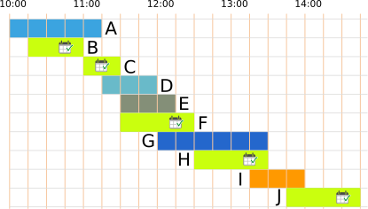

## Body

Aujourd'hui, Anja passe la journée au zoo. Elle veut voir le plus de présentations possible.

Voici un programme avec toutes les présentations. Tout en bas, tu vois par exemples que la présentation des singes commence à 13h45 et finit à 14h45.

")

Anja assiste toujours à une présentation en entier, du début à la fin. Peux-tu l'aider?

## Question/Challenge - for the brochures

Choisis le plus de présentations possible qu'Anja peut voir les unes après les autres.

## Question/Challenge - for the online challenge

Choisis le plus de présentations possible qu'Anja peut voir les unes après les autres.

## Interactivity instruction - for the online challenge

Clique sur une présentation pour la séléctionner. Clique à nouveau pour la déselectionner. Quand tu as fini, clique sur "Enregistrer la réponse".

## Answer Options/Interactivity Description

Every show can be selected by clicking on it. Then the show will be highlighted. By clicking again, the show is deselected.

## Answer Explanation

Anja peut voir au maximum cinq présentations les unes après les autres. Voici les deux réponses justes:

:::center
   
:::

Il y a différentes façons d'arriver aux bonnes réponses.

Un plan de visite pour Anja est une sélection de présentations qu'elle peut voir les unes après les autres. Un moyen de trouver les bonnes réponses est de faire une liste de tous les plans de visite possibles. Les bonnes réponses sont les plans contenant le plus de présentations dans cette liste. Cela prend malheureusement beaucoup de temps pour trouver tous les plans possibles.

Ne pourrait-il pas y avoir de plan de visite avec six présentations? Essayons d'en faire un. Pour commencer, nous observons la durée des présentations: sur le programme, la journée est divisée en 19 unités de temps d'un quart d'heure chacune. Les présentations durent 2, 3, 4, 5 ou 6 unités de temps.

:::center
| Unités de temps | Présentation |
| --------------- | ------------ |
| 2               | C            |
| 3               | B, D, E, I   |
| 4               | F, H, J      |
| 5               | A            |
| 6               | G            |
:::

Pour pouvoir mettre le plus de présentations possible dans un plan de visite, nous choisissons les présentations les plus _courtes_. Les six présentations les plus courtes durent en tout 18 unités de temps $(2 + 3 + 3 + 3 + 3 + 4)$. Les présentations C, D et E font partie des 6 présentations les plus courtes; mais comme les présentations C et E sont directement l'une après l'autre, Anja ne peut pas aller voir la présentation D entre deux.

Nous devons donc remplacer la présentation D par une autre présentation aussi courte que possible. Il ne reste que des présentations durant au moins quatre unités de temps. Sans la présentation D, nous avons donc besoin d'au moins 19 unités de temps pour voir six présentations: $2 + 3 + 3 + 3 + 4 + 4$. Mais quelles que soient les deux présentations à quatre unités de temps que nous choisissons, l'une d'entre elles a lieu en même temps qu'une présentation à 3 unités de temps. Nous devrions donc remplacer l'une d'elles par une présentation d'au moins quatre unités de temps et aurions besoin d'au moins 20 unités de temps en tout pour voir six présentations. Mais nous n'avons que 19 unités de temps à disposition et ne pouvons donc pas faire de plan de visite à plus de cinq présentations.

## This is Informatics

Cet exercice du Castor contient un horaire des présentations du zoo. Ce n'est pas facile de créer de tels horaires; en informatique, on parle de _séquençage de tâches_. Le zoo aimerait évidemment permettre à ses visiteurs de voir le plus de présentations possible, mais d'autres contraintes doivent aussi être prises en compte. Par exemple, une présentation ne peut être proposée que quand les gardiens animaliers sont disponibles, que les arènes sont libres et que les heures sont compatibles avec le rythme de vie des animaux.

Il existe beaucoup de problèmes de ce type dans la vie quotidienne auxquels les mêmes réflexions peuvent être appliquées, par exemple l'élaboration d'un horaire pour l'école ou la programmation des films dans les salles d'un cinéma. L'élaboration de ces horaires est si compliquée que même ces simples exemples (les horaires de ton école) ne peuvent pas être fait manuellement. Les _processeurs_ de ton ordinateurs doivent eux aussi effectuer beaucoup de tâches les unes après les autres. Le programme déterminant quel processeur fait quoi à quel moment est créé très rapidement par le _système d'exploitation_ sans que l'on ne le remarque. Le _séquençage de tâches_ est un thème important en informatique et en recherche.

## This is Computational Thinking

Optional - not to be filled 2023

## Informatics Keywords and Websites

- Ordonnancement: https://fr.wikipedia.org/wiki/Ordonnancement_de_travaux_informatiques
- Système d'exploitation: https://fr.wikipedia.org/wiki/Système_d%27exploitation
- Séquençage des tâches: https://fr.wikipedia.org/wiki/Séquençage_de_tâches

## Computational Thinking Keywords and Websites

Optional - not to be filled 2023

## Wording and Phrases

German wording and phrases please here!

 - _Vorführung_: Tiervorführung
 - _Plan_: Zeitplan für den Tag im Zoo 

## Comments

Report changes on this file (older comments can be looked up in the original document)

_Susanne Datzko, 2023-07-04_: Offene Fragen:
- Ist das Plakat selbsterklärend, oder muss man ein Beispiel geben?
- Ist es klar, dass Anja immer nur eine Tiershow aufs Mal besuchen kann? Oder ist das evtl. schon durch das "hintereinander" klar genug definiert.
- It's informatics: Nur Sheduling-Problem oder auch Brute-Force und Dekomposition
- Ist die Erläuterung ausreichend, oder muss sie mehr ins Detail gehen wie im Original?
- Evtl. die Tabelle in der Expl. so anpassen?
| Shows      | kürzere Show      | direkt anschliessend | Auswahl |
| ---------- | ----------------- | -------------------- | ------- |
| A, B       | B                 | -                    | B       |
| A, B, C    | -                 | C an B               | C       |
| C, D, E, F | E                 | E, F an C            | E       |
| E, G       | E                 | -                    | E       |
| H, I       | -                 | H                    | H       |
| H, I       | I                 | nicht an H           | H       |
| J          | keine Überlappung || J                    | 

- Was ist besser Anfang/Ende und anfangen. Oder Beginn/Ende und beginnen? Oder kann man es mischen?
- Graphik: Ist evtl. noch zu verspielt. Ich bin aber dagegen die Shows mit schriftl. Beschreibungen zu versehen wie im Original. Nur mit Farben und Mustern zu arbeiten ist mir aber zu abstrakt.

_Michael Weigend, mw@creative-informatics.de, 2023-07-17_: **Anmerkungen zur Übersetzung:**
_Aufgabenstellung_
Statt "aufs Mal" vielleicht besser "gleichzeitig" Statt "hintereinander" (da denke ich an "direkt/unmittelbar hintereinander") vielleicht besser "gleichzeitig".
_Answer Explanation_
Mir fällt es nicht leicht, in den Bildern die Lösung zu erkennen. Vielleicht sollte man an Stelle der "Bildbalken" einfache Balken mit klaren Farben verwenden. Ich möchte vorschlagen, den Text ab "Teilt man das Problem in kleinere Probleme auf …." zu überarbeiten. Mir fallen hier folgende Probleme auf: Der Aspekt "kürzere Shows bevorzugt" wurde schon erwähnt. Punkt 2 "Shows, die möglichst direkt anschliessend an die vorhergehende Show , so dass möglichst keine Pause entstehen" ist für mich kein wirklich klares Auswahlkriterium. Was ist z.B. mit "möglichst" gemeint? Wenn man eine Strategie formuliert, müsste die glasklar sein. Was ist hier mit Aufteilung in kleinere Probleme gemeint? Was passiert in der Tabelle? Die Strategie, die hier beschrieben werden soll, müsste man noch deutlicher herausarbeiten oder aber weglassen. Die eingangs erwähnten einfachen Überlegungen wie "kürzere Shows bevorzugen" reichen vielleicht schon. Auf jeden Fall sollte ein Beweis geliefert werden, warum es keine bessere Lösung gibt, als die beiden genannten Lösungen.
_This is Informatics_
Ich möchte vorschlagen, diesen Abschnitt ganz umzuschreiben. Wenn man auf Scheduling abhebt, könnte man damit beginnen, dass die Aufgabe dem Scheduling ähnelt, dann erklären, was man in der Informatik unter Scheduling versteht (z.B. Betriebssystem: Aufträge müssen einem Pool von Prozessoren zugeordnet werden), und dann eventuell noch auf die Algorithmik eingehen. Zur offenen Frage zu II ist meine Meinung: Nur Scheduling. Vielleicht gibt es aber auch ein Standardproblem, das der Aufgabe noch mehr ähnelt als Scheduling. 

_Susanne Datzko, 2023-07-18_: Aufgrund der Rückmeldung von Michael habe ich die Darstellung nochmal komplett überdacht und finde, dass es so viel viel besser ist. Vielleicht kann man in der Lösungserklärung dann sogar Zeile für Zeile vorgehen und daraus auch einen Beweis erarbeiten. Dafür fehlt mir aber die Zeit - Die Darstellungen unten müssen natürlich entsprechend angepasst werden.

_Jacqueline Staub_, 2023-07-22: Zwei offene Stellen:
- An einer Stelle sollte noch ein Bild rein. Die Stelle ist im Text markiert
- Achtung bei der Überarbeitung der Bilder, dass diese nur 19 Zeiteinheiten haben, also die letzte Stunde nur noch 45 Minuten hat. Das ist im ersten Bild etwas unklar, in den hinteren Bildern sind es schon jetzt 19 Zeiteinheiten. Dies ist wichtig, da sonst die Erklärung nochmal um einen weiteren Fall (überflüssigen) ergänzt werden müsste.

 * We don't delete the original english version of the task for making possible to look up the older comments.