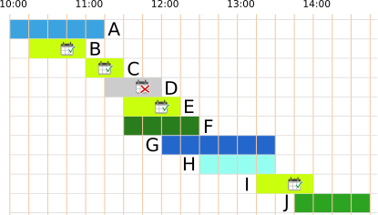

## Body

Oggi Anja è allo zoo. Vuole visitare il maggior numero possibile di spettacoli diversi.

Ecco un piano con tutti gli spettacoli.
Ad esempio, dall'immagine possiamo vedere che lo spettacolo delle scimmie inizia alle 13:45 e termina alle 14:45.

") 
 
Anja assiste sempre a uno spettacolo dall'inizio alla fine.
Puoi aiutare Anja?

## Question/Challenge - for the brochures

Scegli il maggior numero possibile di spettacoli a cui Anja può partecipare uno dopo l'altro.

## Question/Challenge - for the online challenge

Scegli il maggior numero possibile di spettacoli a cui Anja può partecipare uno dopo l'altro.

## Interactivity instruction - for the online challenge

Fai clic su uno spettacolo per selezionarlo. Fai nuovamente clic per deselezionarlo. Al termine, fai clic su "Salva risposta".

## Answer Options/Interactivity Description

Every show can be selected by clicking on it. Then the show will be highlighted. By clicking again, the show is deselected.

## Answer Explanation

Anja può assistere a un massimo di 5 spettacoli consecutivi.
Queste sono le due risposte corrette:

:::center
  
:::

Ci sono diversi modi per trovare le risposte giuste.

Un piano di azione per Anja è una selezione di spettacoli ai quali può assistere uno dopo l'altro.  Un modo per ottenere le risposte giuste è elencare tutti i piani di azione.  In questo elenco, i piani con il maggior numero di spettacoli sono le risposte corrette.  Purtroppo, trovare tutti i piani richiede molto tempo.

Ma non potrebbe esserci anche un programma di visite con 6 presentazioni?  Cercheremo di crearne uno. Innanzitutto, diamo un'occhiata più da vicino alla durata degli spettacoli:  Nel programma, l'intera giornata è suddivisa in 19 unità temporali di un quarto d'ora ciascuna. Gli spettacoli durano 2, 3, 4, 5 o 6 unità di tempo.

| Unità di tempo | Presentazioni
|----------|----------|
| 2 | C |
| 3 | B, D, E, I |
| 4 | F, H, J |
| 5 | A |
| 6 | G |

Al fine di racchiudere il maggior numero possibile di presentazioni in un unico programma di visita, scegliamo presentazioni che siano il più breve possibile. Le 6 presentazioni più brevi durano complessivamente 18 unità di tempo $(2 + 3 + 3 + 3 + 4)$. Queste prestazioni brevi comprendono anche gli spettacoli C, D ed E. Tuttavia, poiché gli spettacoli C ed E sono esattamente uno dopo l'altro, Anja non può assistere allo spettacolo D nel mezzo.

 
 
Quindi dobbiamo sostituire la presentazione D con un'altra il più breve possibile.  Rimangono solo le presentazioni con almeno 4 unità di tempo.  Senza la presentazione D, abbiamo quindi bisogno di un totale di almeno 19 unità di tempo per 6 presentazioni: $2 + 3 + 3 + 3 + 4 + 4$. Ma entrambi gli spettacoli con 4 unità di tempo si sovrappongono sempre a uno spettacolo con 3 unità di tempo.  Dovremmo sostituire anche questo con uno spettacolo di almeno 4 unità di tempo e quindi avremmo bisogno di almeno 20 unità di tempo per 6 spettacoli, ma ci sono solo 19 unità di tempo disponibili!  Concludiamo che non può esistere un programma di visite che contenga più di 5 spettacoli.

## This is Informatics

Questo compito contiene un programma di spettacoli allo zoo. Produrre programmi di questo tipo non è facile e in informatica si chiama _problema di programmazione_. Naturalmente, lo zoo vuole permettere ai suoi visitatori di vedere il maggior numero possibile di presentazioni, ma bisogna tenere conto anche di altre condizioni. Per esempio, le presentazioni possono essere offerte solo se i guardiani hanno tempo, se le arene disponibili sono libere e se gli spettacolli sono compatibili con i ritmi di vita degli animali.

Ci sono molti problemi simili nella vita ai quali si possono applicare le stesse considerazioni. Un esempio è la creazione di un orario scolastico o l'assegnazione dei film al cinema. La creazione di questi orari richiede così tanto tempo che anche per esempi relativamente piccoli (gli orari della vostra scuola) è spesso impossibile lavorare a mano. Anche i _processori_ del computer devono svolgere molti compiti ed elaborarli uno dopo l'altro. Il sistema operativo crea, alla velocità della luce e senza che l'utente se ne accorga, la programmazione di quando un processore fa cosa. La programmazione è uno dei grandi temi dell'informatica, di cui la ricerca si occupa ancora oggi.

## This is Computational Thinking

Optional - not to be filled 2023

## Informatics Keywords and Websites

- Scheduler: https://it.wikipedia.org/wiki/Scheduler
- Sistema operativo: https://it.wikipedia.org/wiki/Sistema_operativo

## Computational Thinking Keywords and Websites

Optional - not to be filled 2023

## Wording and Phrases

German wording and phrases please here!

 - _Vorführung_: Tiervorführung
 - _Plan_: Zeitplan für den Tag im Zoo 

## Comments

Report changes on this file (older comments can be looked up in the original document)

_Susanne Datzko, 2023-07-04_: Offene Fragen:
- Ist das Plakat selbsterklärend, oder muss man ein Beispiel geben?
- Ist es klar, dass Anja immer nur eine Tiershow aufs Mal besuchen kann? Oder ist das evtl. schon durch das "hintereinander" klar genug definiert.
- It's informatics: Nur Sheduling-Problem oder auch Brute-Force und Dekomposition
- Ist die Erläuterung ausreichend, oder muss sie mehr ins Detail gehen wie im Original?
- Evtl. die Tabelle in der Expl. so anpassen?
| Shows      | kürzere Show      | direkt anschliessend | Auswahl |
| ---------- | ----------------- | -------------------- | ------- |
| A, B       | B                 | -                    | B       |
| A, B, C    | -                 | C an B               | C       |
| C, D, E, F | E                 | E, F an C            | E       |
| E, G       | E                 | -                    | E       |
| H, I       | -                 | H                    | H       |
| H, I       | I                 | nicht an H           | H       |
| J          | keine Überlappung || J                    | 

- Was ist besser Anfang/Ende und anfangen. Oder Beginn/Ende und beginnen? Oder kann man es mischen?
- Graphik: Ist evtl. noch zu verspielt. Ich bin aber dagegen die Shows mit schriftl. Beschreibungen zu versehen wie im Original. Nur mit Farben und Mustern zu arbeiten ist mir aber zu abstrakt.

_Michael Weigend, mw@creative-informatics.de, 2023-07-17_: **Anmerkungen zur Übersetzung:**
_Aufgabenstellung_
Statt "aufs Mal" vielleicht besser "gleichzeitig" Statt "hintereinander" (da denke ich an "direkt/unmittelbar hintereinander") vielleicht besser "gleichzeitig".
_Answer Explanation_
Mir fällt es nicht leicht, in den Bildern die Lösung zu erkennen. Vielleicht sollte man an Stelle der "Bildbalken" einfache Balken mit klaren Farben verwenden. Ich möchte vorschlagen, den Text ab "Teilt man das Problem in kleinere Probleme auf …." zu überarbeiten. Mir fallen hier folgende Probleme auf: Der Aspekt "kürzere Shows bevorzugt" wurde schon erwähnt. Punkt 2 "Shows, die möglichst direkt anschliessend an die vorhergehende Show , so dass möglichst keine Pause entstehen" ist für mich kein wirklich klares Auswahlkriterium. Was ist z.B. mit "möglichst" gemeint? Wenn man eine Strategie formuliert, müsste die glasklar sein. Was ist hier mit Aufteilung in kleinere Probleme gemeint? Was passiert in der Tabelle? Die Strategie, die hier beschrieben werden soll, müsste man noch deutlicher herausarbeiten oder aber weglassen. Die eingangs erwähnten einfachen Überlegungen wie "kürzere Shows bevorzugen" reichen vielleicht schon. Auf jeden Fall sollte ein Beweis geliefert werden, warum es keine bessere Lösung gibt, als die beiden genannten Lösungen.
_This is Informatics_
Ich möchte vorschlagen, diesen Abschnitt ganz umzuschreiben. Wenn man auf Scheduling abhebt, könnte man damit beginnen, dass die Aufgabe dem Scheduling ähnelt, dann erklären, was man in der Informatik unter Scheduling versteht (z.B. Betriebssystem: Aufträge müssen einem Pool von Prozessoren zugeordnet werden), und dann eventuell noch auf die Algorithmik eingehen. Zur offenen Frage zu II ist meine Meinung: Nur Scheduling. Vielleicht gibt es aber auch ein Standardproblem, das der Aufgabe noch mehr ähnelt als Scheduling. 

_Susanne Datzko, 2023-07-18_: Aufgrund der Rückmeldung von Michael habe ich die Darstellung nochmal komplett überdacht und finde, dass es so viel viel besser ist. Vielleicht kann man in der Lösungserklärung dann sogar Zeile für Zeile vorgehen und daraus auch einen Beweis erarbeiten. Dafür fehlt mir aber die Zeit - Die Darstellungen unten müssen natürlich entsprechend angepasst werden.

_Jacqueline Staub_, 2023-07-22: Zwei offene Stellen:
- An einer Stelle sollte noch ein Bild rein. Die Stelle ist im Text markiert
- Achtung bei der Überarbeitung der Bilder, dass diese nur 19 Zeiteinheiten haben, also die letzte Stunde nur noch 45 Minuten hat. Das ist im ersten Bild etwas unklar, in den hinteren Bildern sind es schon jetzt 19 Zeiteinheiten. Dies ist wichtig, da sonst die Erklärung nochmal um einen weiteren Fall (überflüssigen) ergänzt werden müsste.

 * We don't delete the original english version of the task for making possible to look up the older comments.
