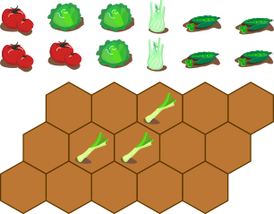
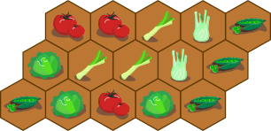
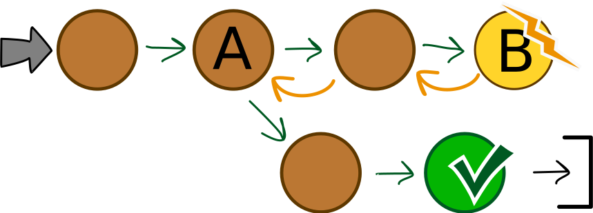

## Body

[good]: graphics/2023-AU-01-good.svg "compatible (20px)"
[bad]: graphics/2023-AU-01-bad.svg "incompatible (35px)"
[leek]: graphics/2023-AU-01-leek.svg "poireau"

Lisa prépare un jardin potager. Elle veut y cultiver cinq sortes de légumes différentes. Certaines sortes de légumes se supportent bien et sont compatibles ![good], d'autres sont incompatibles ![bad]:

Lisa a divisé le jardin en domaines hexagonaux. Elle veut planter exactement une sorte de légumes dans chaque domaine.

Lisa a déjà planté des poireaux ![leek] dans trois domaines.

Lisa plante en suivant la règle suivante: les légumes incompatibles ne peuvent pas être plantés dans des domaines qui se touchent.

## Question/Challenge - for the brochures

Plante une sorte de légumes dans chaque domaine encore libre en respectant la règle de Lisa.

## Question/Challenge - for the online challenge

Plante une sorte de légumes dans chaque domaine encore libre en respectant la règle de Lisa.

## Interactivity instruction - for the online challenge

Glisse le légume sur la bonne case. Quand tu as fini, clique sur "Enregistrer la réponse".

## Answer Options/Interactivity Description

The vegetables are draggable and can be placed on any hexagonal field, but not the ones with the leek. To change the already planted vegetables you can move over another vegetable or click on the planted vegatable to pull it out ;).

## Answer Explanation

Voici la bonne réponse:

--+|--
Comme les petits pois ne sont pas compatibles avec les poireaux, Lisa ne plante pas de petits pois dans les domaines jaunes. Il ne reste que les autres domaines pour le petits pois.|")

Comme les tomates ne sont pas compatibles avec les petits pois, Lisa ne plante pas de tomates dans les domaines jaunes. Elle peut planter des tomates dans les autres domaines, car les tomates et les poireaux sont compatibles.|")

Comme les fenouils ne sont pas compatibles avec les tomates, Lisa ne plante pas de fenouil dans les domaines jaunes. Elle peut planter du fenouil dans les deux domaines entre les poireaux et les petits poids. Lisa peut planter de la salade dans les domaines jaunes, car la salade est compatible avec tous les autres légumes.|")

## This is Informatics

Pour planter des légumes afin d'avoir une récolte aussi grande que possible, il faut respecter beaucoup de _conditions_: chaque sorte a des besoins de place, de nutriments et de lumière différents, par exemple. Dans cet exercice du Castor, nous ne considérons qu'une sorte de condition: la compatiblité des différentes sortes de légumes entre elles.

Pour déterminer quoi planter où dans le jardin de Lisa tout en respectant les conditions de compatiblité, on pourrait procéder de la manière suivante: on essaie toutes les combinaisons de légumes de manière systématique. Une fois que le jardin est rempli, on vérifie si les conditions sont remplies et si la combinaison est une solution au problème de Lisa. En informatique, on appelle un telle manière d'essayer toutes les combinaisons possibles une _recherche exhaustive_. Cette méthode peut prendre beaucoup de temps si elle est appliquée à des problèmes ayant beaucoup de combinaisons possibles et peu de solutions.

C'est souvent mieux de procéder étape par étape et de prendre en compte toutes les conditions à chaque étape. C'est ainsi que nous avons trouvé la solution au problème de Lisa, et aucune "fausse" combinaison ou arrangement du jardin n'était possible.

Heureusement, c'était possible de trouver la solution directement: il y avait toujours des domaines dans lesquels nous pouvions planter certains des légumes restants. Ce n'est pas toujours le cas.

Lorsque l'on essaie d'assembler la réponse étape par étape, il peut y avoir plusieurs possibilités de remplir toutes les conditions à une certaine étape A:

Suivant le choix fait en A, il peut ne plus y avoir de possibilités à une étape suivante B. On revient alors en arrière sur les dernières étapes jusu'à arriver à nouveau à l'étape A offrant plusieurs possibilités. On choisit alors une autre possibilité et essaie de trouver un solution depuis là.

Ce retour en arrière est appelé _retour sur trace_ en informatique (_backtracking_ en anglais).

## This is Computational Thinking

Optional - not to be filled 2023

## Informatics Keywords and Websites

 - Recherche exhaustive: https://fr.wikipedia.org/wiki/Recherche_exhaustive
 - Retour sur trace: https://fr.wikipedia.org/wiki/Retour_sur_trace

## Computational Thinking Keywords and Websites

 - Decomposition: https://en.wikipedia.org/wiki/Decomposition_(computer_science)

## Wording and Phrases

German wording and phrases please here!

 - _in einen Bereich pflanzen_ : Eine Pflanze(nart) in einen der sechseckigen Bereich platzieren.

## Comments

Report changes on this file (older comments can be looked up in the original document)

_Name, Datum_: Kommentar 1

_Name, Datum_: Kommentar 2

 * We don't delete the original english version of the task for making possible to look up the older comments.