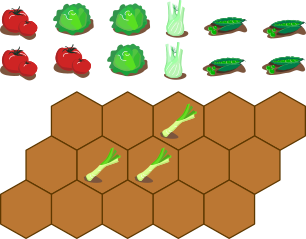
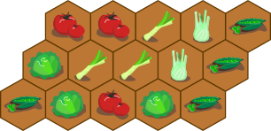
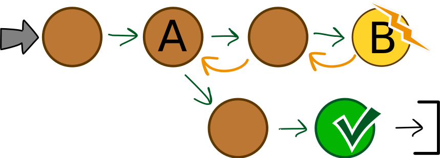

## Body

[good]: graphics/2023-AU-01-good.svg "verträglich (20px)"
[bad]: graphics/2023-AU-01-bad.svg "unverträglich (35px)"
[leek]: graphics/2023-AU-01-leek.svg "Lauch"

Lisa crea un orto. Vuole piantare cinque ortaggi diversi. Alcuni ortaggi vanno d'accordo tra loro ![good], altri no ![bad]:

 
 
Lisa ha diviso l'orto in aree esagonali. Vuole piantare esattamente un ortaggio in ogni area.

Lisa ha già piantato porri ![leek] in tre aree.

 
 
Quando si pianta, Lisa osserva la seguente regola: gli ortaggi che non vanno d'accordo non devono essere piantati in zone che si toccano.

## Question/Challenge - for the brochures

Pianta tutte le aree ancora libere seguendo la regola di Lisa!

## Question/Challenge - for the online challenge

Pianta tutte le aree ancora libere e seguendo la regola di Lisa!

## Interactivity instruction - for the online challenge

Trascina le verdure nei campi corretti. Al termine, fa clic su "Salva risposta".

## Answer Options/Interactivity Description

The vegetables are draggable and can be placed on any hexagonal field, but not the ones with the leek. To change the already planted vegetables you can move over another vegetable or click on the planted vegatable to pull it out ;).

## Answer Explanation

La risposta gista:

 
 
--+|--
Poiché i piselli non vanno d'accordo con i porri, Lisa non pianta i piselli nelle aree chiare. Solo le aree rimanenti rimangono per i piselli.|")

Poiché i pomodori non vanno d'accordo con i piselli, Lisa non pianta i pomodori nelle aree chiare. Può piantare i pomodori nelle altre zone; i pomodori vanno d'accordo con i porri.|")

Poiché i pomodori non vanno d'accordo con i finocchi, Lisa non li pianta nelle aree chiare. Può piantare il finocchio nelle due aree tra i porri e i piselli.  Può piantare la lattuga nelle aree chiare: Lisa non è a conoscenza di alcuna discordanza tra gli ortaggi vicini e la lattuga. | ")

## This is Informatics

Se si vuole piantare ortaggi in modo che il raccolto sia il più abbondante possibile, si deve osservare molte _condizioni_: Ad esempio, le singole varietà hanno esigenze diverse in termini di spazio, nutrienti e luce. In questo compito consideriamo solo un tipo di condizione: la compatibilità tra le varietà di ortaggi.

Per trovare un piano per l'orto di Lisa che rispetti tutte le condizioni di compatibilità, si potrebbe procedere in questo modo: si provano sistematicamente tutte le combinazioni per disporre gli ortaggi sull'orto. Solo quando l'orto è pieno, si verifica se questa combinazione soddisfa tutte le condizioni ed è una soluzione al problema di Lisa. In informatica, tale prova di tutte le combinazioni è nota come metodo _forza bruta_. Per problemi con molte combinazioni e poche soluzioni, procedere secondo questo metodo può richiedere molto tempo.

Pertanto, di solito è meglio procedere per gradi e considerare tutte le condizioni a ogni passo. In questo modo possiamo trovare la soluzione al problema di Lisa, una combinazione o una piantumazione "sbagliata" dell'orto infatti non può verificarsi.

Fortunatamente, la soluzione si può trovare in modo diretto: ci sono sempre aree in cui possiamo piantare alcuni degli ortaggi rimasti. Questo di solito non funziona sempre.

Se si cerca di assemblare la soluzione passo dopo passo, ci possono essere diverse possibilità di soddisfare tutte le condizioni in un unico passo A.

 
 
A seconda della scelta, in una fase successiva B potrebbero non esserci più opzioni. Quindi si fanno gli ultimi passi indietro fino ad arrivare al passo A con diverse possibilità. A questo punto si sceglie un'altra possibilità e si cerca di trovare una soluzione.

In informatica, questo ritorno sui propri passi è noto come _backtracking_.

## This is Computational Thinking

Optional - not to be filled 2023

## Informatics Keywords and Websites

- Metodo forza bruta: https://it.wikipedia.org/wiki/Metodo_forza_bruta
- Backtracking: https://it.wikipedia.org/wiki/Backtracking

## Computational Thinking Keywords and Websites

 - Decomposition: https://en.wikipedia.org/wiki/Decomposition_(computer_science)

## Wording and Phrases

German wording and phrases please here!

 - _in einen Bereich pflanzen_ : Eine Pflanze(nart) in einen der sechseckigen Bereich platzieren.

## Comments

Report changes on this file (older comments can be looked up in the original document)

_Name, Datum_: Kommentar 1

_Name, Datum_: Kommentar 2

 * We don't delete the original english version of the task for making possible to look up the older comments.
