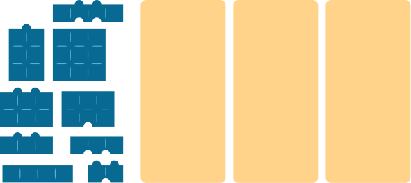
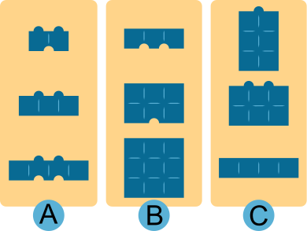

## Body

Les briques castor ont quatre propriétés qui les différencient:

--+ | --
1. Largeur: étroite, moyenne, large |  \
2. Hauteur: petite, moyenne, grande | \
3. Nombre de bosses en haut: zéro, une, deux | \
4. Nombre de creux en bas: zéro, un, deux    |

")

Otto répartit les briques en groupes de trois. Il le fait de manière à ce que les trois briques de chaque groupe aient, pour chacune des quatre propriétés...
- ... trois fois la même valeur...
- ... ou trois valeurs différentes.

Voici l'un des groupes d'Otto, à droite.

Ces trois briques ont:
- toutes la même largeur,
- trois hauteurs différentes,
- un nombre de bosses différent,
- un nombre de creux différent.

## Question/Challenge - for the brochures

Répartis ces briques en groupes de trois comme le ferait Otto.

")

## Question/Challenge - for the online challenge

Répartis ces briques en groupes de trois comme le ferait Otto.

## Interactivity instruction - for the online challenge

Glisse les brique dans les cases des groupes. Quand tu as fini, clique sur "Enregistrer la réponse".

## Answer Options/Interactivity Description

The blocks are draggable. The script should check if the draggbles in the group fit the contraints in the taskbody.

## Answer Explanation

Voici la bonne répartition:

Les briques sont réparties en groupes comme Otto le ferait. La table suivante montre quelles propriétés ont la même valeur ou des valeurs différentes pour chaque groupe.

:::center
| Propriété |  Groupe A   |  Groupe B   |  Groupe C   |
| --------- | :---------: | :---------: | :---------: |
| Largeur   | différentes |   égales    | différentes |
| Hauteur   |   égales    | différentes | différentes |
| Bosses    |   égales    |   égales    | différentes |
| Creux     | différentes | différentes |   égales    |
:::

Mais est-ce la seule possibilité de répartir les briques comme Otto le ferait?

On peut y réfléchir de la manière suivante: si une propriété doit avoir des valeurs différentes dans chaque groupe, chaque valeur doit être présente sur le même nombre de briques qu'il y a de groupes. Si ce n'est pas le cas, il doit y avoir au moins un groupe dans lequel toutes les briques ont la même valeur pour cette propriété.

En observant les briques, on voit que les valeurs de largeur étroite et large ne sont présentes que sur deux briques chacune. Il doit donc y avoir un groupe pour lequel la valeur de la largeur est moyenne pour toutes les briques.

Aucune des cinq briques de largeur moyenne n'a qu'une seule bosse; il ne peut donc pas y avoir de groupe dans lequel toutes les briques ont un nombre de bosses différent. Par contre, il y a trois briques avec zéro bosse – et elles ont toutes une hauteur différente et un nombre de creux différent. Le groupe B est donc le seul groupe de brique de largeur moyenne possible.

Chacun des deux autres groupes doit contenir des briques ayant toutes une largeur différente.

Parmi les six briques restantes, la valeur de la hauteur n'est grande ou moyenne qu'une seule fois. Il doit donc y avoir un groupe dans lequel toute les briques sont petites. Le groupe A est le seul groupe correspondant aux règles d'Otto avec des briques de petite taille. Les trois briques restantes forment le groupe C, qui correspond également aux règles d'Otto.

## This is Informatics

Dans cet exercice du Castor, les briques castor sont décrites à l'aide de quatre _propriétés_ (ou _attributs_). Pour pouvoir répartir les briques dans des groupes de trois comme Otto, il faut connaître la valeur des propriétés de chaque brique.

Pour cela, il suffit à un être humain de jeter un coup d'œil à chaque brique. Un programme informatique devant faire des groupes de trois ne peut généralement pas voir et a besoin d'une description enregistrée dans une _structure de données_.

On peut par exemple décrire les briques dans les lignes d'une _base de données_. Les colonnes de la base de données correspondent aux propriétés, et dans chaque ligne (aussi appelée _enregistrement_) se trouvent les valeurs d'une brique dans les colonnes correspondantes:

:::center
| Brique | Largeur | Hauteur | Bosses | Creux |
| ------ | ------- | ------- | ------ | ----- |
| 1      | étroite | grande  | 1      | 0     |
| 2      | moyenne | moyenne | 2      | 0     |
| …      | …       | …       | …      | …     |
:::

L'élaboration de bases de données est une tâche habituelle pour les informaticiennes et informaticiens.
C'est un travail minutieux et il faut bien réfléchir à quels attributs des objets sont importants pour le traitement des données par un programme informatique. Ce n'est pas facile de faire des changements une fois la base de données remplie, surtout quand les données de beaucoup d'objets sont déjà enregistrées.

## This is Computational Thinking

Optional - not to be filled 2023

## Informatics Keywords and Websites

 - Structure de données: https://fr.wikipedia.org/wiki/Structure_de_données
 - Base de données: https://fr.wikipedia.org/wiki/Base_de_données
 - Enregistrement: https://fr.wikipedia.org/wiki/Enregistrement_(base_de_données)

## Computational Thinking Keywords and Websites

--

## Wording and Phrases

German wording and phrases please here!

 - _Noppe_: Noppen sind die Erhebungen an der Oberseite des Bausteins
 - _Nut_: Nuten sind die Vertiefungen an der Unterseite des Bausteins

## Comments

Report changes on this file (older comments can be looked up in the original document)

_Name, Datum_: Kommentar 1

_Name, Datum_: Kommentar 2

 * We don't delete the original english version of the task for making possible to look up the older comments.