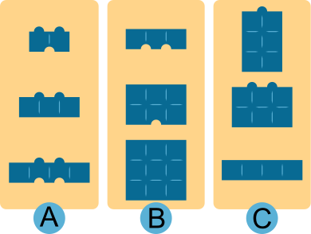

## Body

I mattoni di castoro Otto si differenziano per quattro caratteristiche:

--+ | --
1. larghezza: stretta, media, larga |  \
2. altezza: piccola, media, grande  | \
3. numero di sporgenze sulla parte superiore: zero, uno, due    | \
4. numero di scanalature nella parte inferiore: zero, una, due. |

") 
 
Otto divide i mattoni in gruppi di tre. Lo fa in modo che per ogni gruppo valga quanto segue: i tre mattoni hanno per ciascuna delle quattro proprietà ...
- ... o tutte con lo stesso valore ...
- ... o tutte con tre valori diversi.

A destra, uno dei gruppi di Otto.

Perché questi tre mattoni hanno tutti

- la stessa larghezza,
- diverse altezze,
- numero diverso di sporgenze e
- numero diverso di scanalature.
 

## Question/Challenge - for the brochures

Dividi questi mattoni in gruppi di tre, come farebbe Otto.

")
 

## Question/Challenge - for the online challenge

Dividi questi mattoni in gruppi di tre, come farebbe Otto.

 
 
## Interactivity instruction - for the online challenge

Trascina i mattoni nelle caselle. Al termine, fai clic su "Salva risposta".

## Answer Options/Interactivity Description

The blocks are draggable. The script should check if the draggbles in the group fit the contraints in the taskbody.

## Answer Explanation

La risposta giusta:

 
 
I mattoni sono divisi in gruppi secondo le regole di Otto.
La tabella mostra i tre gruppi, per i quali i valori delle proprietà sono tutti diversi o tutti uguali.

:::center
| Proprietà   | Gruppo A | Gruppo B | Gruppo C |
| ----------- | :------: | :------: | :------: |
| Larghezza   | diversa  |  uguale  | diversa  |
| Altezza     |  uguale  | diversa  | diversa  |
| Sporgenze   |  uguali  |  uguali  | diversi  |
| Scanalature | diverse  | diverse  |  uguali  |
:::

Ma è questo l'unico modo per dividere i mattoni come farebbe Otto?

Si può considerare che se i valori di una proprietà devono essere diversi in tutti i gruppi, i valori diversi devono verificarsi in tutti i mattoni tante volte quanti sono i gruppi. In caso contrario, deve esistere almeno un gruppo in cui i valori di questa proprietà sono tutti uguali.

Un'analisi più attenta di tutti i mattoni mostra che i valori di larghezza di 2 e 4 unità si verificano solo due volte. Deve quindi esistere un gruppo in cui tutti i mattoni hanno una larghezza di tre unità.

Dei cinque mattoni di larghezza di tre unità, nessuno ha una sola sporgenza. Pertanto, non è possibile formare un gruppo con un numero diverso di sporgenze. Ma ci sono tre mattoni con zero sporgenze - e tutti hanno altezze diverse e un numero diverso di scanalature. Pertanto, il gruppo B è l'unico gruppo possibile di mattoni con larghezza di tre unità.

Negli altri due gruppi, le larghezze devono essere tutte diverse.

Nei sei mattoni rimanenti, i valori di altezza di tre unità e due unità si verifica solo una volta. Deve quindi esistere un gruppo in cui tutti i mattoni hanno un'altezza di un'unità. Il gruppo A è l'unico gruppo possibile di tre mattoni con altezza di un'unità che corrisponde alle idee di Otto. Restano i tre mattoni del gruppo C. Anch'essi formano un gruppo di tre, proprio come vorrebbe Otto.

## This is Informatics

In questo compito i mattoni sono descritti usando quattro _proprietà_ (o _attributi_).

Per poter dividere i mattoni in gruppi di tre come vuole Otto, è necessario conoscere i valori delle proprietà di ciascun mattone.

Per questo, è sufficiente guardare ciascun elemento costitutivo. Un programma informatico che deve creare i gruppi di tre non può "vedere" e ha bisogno di una descrizione in una _struttura di dati_.

Ad esempio, i mattoni in una _base di dati_ possono essere descritti come righe di una tabella. Le colonne della tabella corrispondono alle proprietà e ogni riga (chiamata anche _dataset_) contiene i valori di un mattone nelle colonne appropriate:

:::center
| Mattone n. | Larghezza | Altezza | Sporgenze | Scanalature |
| ---------- | --------- | ------- | --------- | ----------- |
| 1          | 1         | 3       | 1         | 0           |
| 2          | 2         | 2       | 2         | 0           |
| ...        | ...       | ...     | ...       | ...         |
:::

La progettazione di tabelle di basi di dati è un'attività comune per gli informatici.

È necessario essere scrupolosi e considerare quali proprietà degli oggetti sono importanti per l'elaborazione da parte di un programma informatico. Le modifiche successive non sono così facili, soprattutto se i dati di molti oggetti sono già memorizzati.

## This is Computational Thinking

Optional - not to be filled 2023

## Informatics Keywords and Websites

- Struttura dati: https://it.wikipedia.org/wiki/Struttura_dati
- Basi di dati: https://it.wikipedia.org/wiki/Tabella_(basi_di_dati)

## Computational Thinking Keywords and Websites

--

## Wording and Phrases

German wording and phrases please here!

 - _Noppe_: Noppen sind die Erhebungen an der Oberseite des Bausteins
 - _Nut_: Nuten sind die Vertiefungen an der Unterseite des Bausteins

## Comments

Report changes on this file (older comments can be looked up in the original document)

_Name, Datum_: Kommentar 1

_Name, Datum_: Kommentar 2

 * We don't delete the original english version of the task for making possible to look up the older comments.
