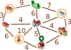
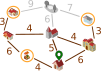
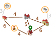

## Body

Emma ist zu Hause ![home].  Sie soll drei Aufgaben erledigen 
und zurückkommen:

- beim Kiosk ![kiosk] ein Päckchen abholen,
- auf dem Markt ![markt] Obst kaufen und
- in der Apotheke ![apotheke] ein Medikament besorgen.

Emma weiss nicht, wie lange sie in jedem Geschäft brauchen wird.
Aber zumindest ihr Weg soll so kurz wie möglich sein.

Auf einem Plan hat Emma eingetragen, wie viele Minuten sie für die
Strecken zwischen einzelnen Orten ihrer Stadt benötigt.
Ausserdem hat sie im Plan markiert, welche Strecke sie auf ihrem Weg geht.

:::comment
_Used for the online-contest_
Ausserdem hat sie im Plan markiert, welche Strecke sie auf ihrem Weg geht und in welcher Richtung. 
:::

Für diesen Weg benötigt Emma insgesamt $6 + 3 + 7 + 9 + 3 + 6 + 4 = 38$ Minuten.

Emma überlegt, ob es noch schneller geht.
Vielleicht hilft es, manche Strecken hin und zurück zu gehen?

## Question/Challenge - for the brochures

Bestimme den kürzesten Weg, den Emma gehen kann, um ihre drei Aufgaben zu erledigen.

## Question/Challenge - for the online challenge

Bestimme den kürzesten Weg, den Emma gehen kann, um ihre drei Aufgaben zu erledigen.
Welche Strecken geht sie dazu in welcher Richtung?

## Interactivity instruction - for the online challenge

Klicke auf einen Pfeil, um die Strecke in Richtung des Pfeils für den kürzesten Weg aus- oder abzuwählen.
Links unten siehst du, wie viele Minuten Emma für den Weg über die ausgewählten Strecken benötigt.
Wenn du fertig bist, klicke auf "Antwort speichern".

## Answer Options/Interactivity Description

Die Pfeile und Linien haben zwei Zustände: ausgewählt und abgewählt.
Ein Klick auf einen Pfeil bewirkt einen Zustandswechsel:

Abgewählt -> Ausgewählt:
Der Pfeil ist danach hervorgehoben, die zugehörige Linie auch (sie war möglicherweise auch vorher schon hervorgehoben).

Ausgewählt -> Abgewählt:
Der Pfeil ist danach nicht mehr hervorgehoben.  Die zugehörige Linie ist danach (a) immer noch hervorgehoben, wenn der Pfeil in Gegenrichtung ausgewählt ist, oder (b) sonst nicht hervorgehoben.

Zu Beginn sind die zum Beispielweg gehörenden Linien mit jeweils einem der beiden Pfeile so ausgewählt, dass sich ein Rundweg ergibt.

## Answer Explanation

So ist es richtig:

Emma kann so entlang der ausgewählten Strecken gehen (oder in die Gegenrichtung):

Für diesen Weg braucht sie $6 + 3 + 3 + 4 + 4 + 3 + 3 + 6 + 4 = 36$ Minuten.

| ---+ | --- |
| Nun wollen wir begründen, warum es keinen noch kürzeren Weg geben kann. Dazu benutzen wir eine vereinfachte Darstellung des Plans. |  |
Die grau gezeichneten Strecken können wir ignorieren. Es gibt kürzere Wege zwischen den durch die Strecken verbundenen Orte, nämlich über andere Orte. | |
Auch den Park können wir ignorieren.  Emma muss nicht zum Park. Zudem gibt es für jeden Weg, der über den Park geht, eine kürzere Alternative. |  |
| Emma muss zur Apotheke ![Apotheke] und zum Kiosk ![Kiosk] gehen.  Dorthin kommt sie jeweils nur von der Bäckerei ![Backerei] bzw. der Schule ![Schule]. Sie muss jeweils die Strecke zwischen diesen Orten hin- und her gehen. Das dauert jeweils $3 + 3 = 6$, ingesamt also 12 Minuten. Das merken wir uns und fassen nun die beiden Orte oben mit denen darunter zu einem zusammen. |  |
| Nun bleibt nur noch der Plan rechts übrig.  Start und Ende des Weges ist hier ![home]. Diese drei Orte (![backerei] ![Schule] ![Markt]) müssen besucht werden. Der kürzeste Weg, der das erfüllt, geht über alle fünf Orte und entlang aller Strecken ausser der grauen und dauert $4 + 6 + 4 + 4 + 6 = 24$ Minuten. Mit den 12 Minuten von oben macht das 36 Minuten. Die vorherigen Überlegungen zeigen, dass es keinen kürzeren Weg geben kann. |  |

[apotheke]: graphics/2023-BE-01-inline-apotheke.svg  "Apotheke       (20px inline(-0.2ex))"
[markt]: graphics/2023-BE-01-inline-markt.svg        "Markt          (15px inline(-0.2ex))"
[kiosk]: graphics/2023-BE-01-inline-kiosk.svg        "Kiosk          (20px inline(-0.2ex))"
[home]: graphics/2023-BE-01-inline-meinstandort.svg  "Emma's Zuhause (16px inline(-0.2ex))"
[schule]: graphics/2023-BE-01-inline-schule.svg      "Schule         (21px inline(-0.2ex))"
[backerei]: graphics/2023-BE-01-inline-baeckerei.svg "Bäckerei       (20px inline(-0.2ex))"

## This is Informatics

Für die Begründung der richtigen Antwort wurde eine vereinfachte Darstellung des Plans benutzt.
Es wäre möglich gewesen, den Plan noch deutlich abstrakter darzustellen:

Diese Darstellung enthält alle für Emmas Weg wichtigen Informationen, nämlich
- Objekte: die Orte, wobei die für den Weg wichtigen Orte markiert sind;
- und Beziehungen zwischen den Objekten: die Strecken zwischen den Orten, für die jeweils eine Länge angegeben ist.

Ein wichtiges Werkzeug zur Modellierung von Beziehungen zwischen Objekten sind _Graphen_.
Graphen bestehen aus Knoten (für die Objekte) und Kanten (Paare von Objekten, für die Beziehungen).
Emmas Plan lässt sich als _gewichteter Graph_ modellieren, 
bei denen die einzelnen Beziehungen mit Zahlenwerten (den _Gewichten_) versehen werden.

Die Informatik interessiert sich für Fragen, die in Bezug auf Graphen gestellt werden können,
und für Algorithmen, mit denen man die Fragen beantworten kann.
Eine für gewichtete Graphen bedeutsame Frage lautet:
Was ist der kürzeste (oder schnellste) Weg zwischen zwei Knoten?
Die "Graphen-Frage" in dieser Biberaufgabe ist ähnlich:
Was ist der kürzeste Rundweg von einem Knoten aus, bei dem eine Menge anderer Knoten besucht werden?
Die Informatik kennt viele Algorithmen, die kürzeste Wege in Graphen effizient bestimmen können.
Solche Algorithmen werden zum Beispiel in Software zur Routenplanung implementiert.

## This is Computational Thinking

Optional - not to be filled 2023

## Informatics Keywords and Websites

- Weg (in Graphen): https://de.wikipedia.org/wiki/Weg_(Graphentheorie)
- Kürzeste Wege:  Abenteuer Informatik, Kapitel 1  (http://abenteuer-informatik.de/dasbuch.html)

## Computational Thinking Keywords and Websites

 Optional - not to be filled 2023

## Wording and Phrases

German wording and phrases please here!

 - _Word 1_: Bedeutung in dieser Aufgabe
 - _Phrase 1_: Bedeutung in dieser Aufgabe 

## Comments

Report changes on this file (older comments can be looked up in the original document)

_Wolfgang Pohl, 17.07.2023_:  Ich plädiere dafür, auf die Kennzeichnung möglicher Positionen durch Nummern zu verzichten.  Das ist nur bei Multiple-Choice sinnvoll.  Ohne Nummern wird die Aufgabe nur unwesentlich schwieriger.

_Name, Datum_: Kommentar 2

