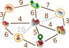

## Body

Emma est à la maison ![home]. Elle doit faire trois courses et revenir à la maison:

- Aller chercher un paquet au kiosque ![kiosk],
- Aller acheter des fruits au marché ![markt],
- Aller récupérer un médicament à la pharmacie ![apotheke].

Emma ne sait pas de combien de temps elle aura besoin dans chaque magasin, mais son trajet doit être le plus court possible.

Emma a noté sur un plan de combien de minutes elle a besoin pour parcourir les chemins entre différents endroits de sa ville. Elle a aussi noté quels chemins elle prend pour faire ses courses.

:::comment
_Used for the online-contest_
Elle a aussi noté quels chemins elle prend pour faire ses courses et dans quelle direction.
:::

 Pour le trajet en entier, Emma a besoin de $6 + 3 + 7 + 9 + 3 + 6 + 4 = 38$ minutes.

Emma se demande si elle pourrait être plus rapide. Peut-être en faisant l'aller-retour sur certains chemins?

## Question/Challenge - for the brochures

Détermine le trajet le plus court qu'Emma peut faire pour effectuer ses trois courses. 

## Question/Challenge - for the online challenge

Détermine le trajet le plus court qu'Emma peut faire pour effectuer ses trois courses. Quels chemins prend-elle et dans quelle direction?

## Interactivity instruction - for the online challenge

Clique sur une flèche pour sélectionner ou désélectionner le chemin en direction de la flèche. Tu peux voir en bas à gauche de combien de minutes Emma a besoin pour les chemins sélectionnés. Quand tu as fini, clique sur "Enregistrer la réponse". 

## Answer Options/Interactivity Description

Die Pfeile und Linien haben zwei Zustände: ausgewählt und abgewählt.
Ein Klick auf einen Pfeil bewirkt einen Zustandswechsel:

Abgewählt -> Ausgewählt:
Der Pfeil ist danach hervorgehoben, die zugehörige Linie auch (sie war möglicherweise auch vorher schon hervorgehoben).

Ausgewählt -> Abgewählt:
Der Pfeil ist danach nicht mehr hervorgehoben.  Die zugehörige Linie ist danach (a) immer noch hervorgehoben, wenn der Pfeil in Gegenrichtung ausgewählt ist, oder (b) sonst nicht hervorgehoben.

Zu Beginn sind die zum Beispielweg gehörenden Linien mit jeweils einem der beiden Pfeile so ausgewählt, dass sich ein Rundweg ergibt.

## Answer Explanation

Voici la bonne réponse:

Emma peut faire le trajet suivant le long des chemins sélectionnés (ou dans la direction opposée):

Pour ce trajet, elle a besoin de $6 + 3 + 3 + 4 + 4 + 3 + 3 + 6 + 4 = 36$ minutes.

| ---+ | --- |
| Nous voulons maintenant démontrer qu'il ne peut pas y avoir de trajet plus court. Pour cela, nous utilisons une version simplifiée du plan. | |
Nous pouvons ignorer les chemins en gris. Il existe des chemins plus courts passant par d'autres endroits entre les endroits qu'ils relient. | |
Nous pouvons également ignorer le parc. Emma ne doit pas aller au parc, et il existe un chemin plus court pour chaque chemin passant par le parc. |  |
| Emma doit aller à la pharmacie ![Apotheke] et au kiosque ![Kiosk]. Elle ne peut y aller que depuis la boulangerie ![Backerei] et l'école  ![Schule], respectivement. Elle doit faire l'aller-retour entre ces endroits, ce qui dure $3 + 3 = 6$ minutes pour chacun, donc 12 minutes en tout. Nous en prenons note et simplifions la plan en enlevant les deux endroits déjà visités. |  |
| Il nous reste à présent le plan à droite. Le début et la fin du trajet se trouvent ici ![home]. Il faut passer par les trois endroits ![backerei], ![Schule] et ![Markt]. Pour cela, le trajet le plus court passe par tous les cinq endroits restants sur le plan en passant par tous les chemins sauf le gris et dure $4 + 6 + 4 + 4 + 6 = 24$ minutes. Avec les 12 minutes de l'étape du haut, on arrive à 36 minutes. Les réflexions précédentes montrent qu'il n'y a pas de trajet plus court. |  |

[apotheke]: graphics/2023-BE-01-inline-apotheke.svg  "Pharmacie     (20px inline(-0.2ex))"
[markt]: graphics/2023-BE-01-inline-markt.svg        "Marché        (15px inline(-0.2ex))"
[kiosk]: graphics/2023-BE-01-inline-kiosk.svg        "Kiosque       (20px inline(-0.2ex))"
[home]: graphics/2023-BE-01-inline-meinstandort.svg  "Maison d'Emma (16px inline(-0.2ex))"
[schule]: graphics/2023-BE-01-inline-schule.svg      "Ecole         (21px inline(-0.2ex))"
[backerei]: graphics/2023-BE-01-inline-baeckerei.svg "Boulangerie   (20px inline(-0.2ex))"

## This is Informatics

Nous avons utilisé un plan simplifié pour démontrer la bonne réponse. Il aurait été possible de réprésenter le plan de manière encore plus abstraite:

Cette représentation contient toutes les informations importantes pour le trajet d'Emma:
- Les objets: les endroits, avec une mise en évidence des endroits importants pour le trajet;
- Les relations entre les endroits: les chemins reliant deux endroits avec une indication de la lonueur du chemin.

Les _graphes_ sont un outil important pour la modélisation des relations entre objets. Les graphes sont composés de nœuds (représentant les objets) et d'arêtes (reliant des paires d'objets et représentant leur relation). Le plan d'Emma peut être modélisé par un _graphe orienté_ dans lequel un nombre (le poids) est indiqué pour chaque relation.

L'informatique s'intéresse aux problèmes qui peuvent être représentés par des graphes et aux algorithmes avec lesquels on peut résoudre ces problèmes. Une question importante relative aux graphes orientés est: quel est le chemin le plus court (ou le plus rapide) entre deux nœuds? La question de cet exercice du Castor est similaire: quel est le plus court trajet circulaire partant d'un nœud et passant par un ensemble d'autres nœuds? Beaucoup d'algorithmes capables de calculer le plus court chemin dans un graphe de manière efficace sont connus en informatique. De tels algorithmes sont par exemple utilisés dans les logiciels de navigation.

## This is Computational Thinking

Optional - not to be filled 2023

## Informatics Keywords and Websites

- Théorie des graphes:  https://fr.wikipedia.org/wiki/Théorie_des_graphes
- Graphe:  https://fr.wikipedia.org/wiki/Graphe_(mathématiques_discrètes)
- Problème du plus court chemin: https://fr.wikipedia.org/wiki/Problème_de_plus_court_chemin

## Computational Thinking Keywords and Websites

 Optional - not to be filled 2023

## Wording and Phrases

German wording and phrases please here!

 - _Word 1_: Bedeutung in dieser Aufgabe
 - _Phrase 1_: Bedeutung in dieser Aufgabe 

## Comments

Report changes on this file (older comments can be looked up in the original document)

_Wolfgang Pohl, 17.07.2023_:  Ich plädiere dafür, auf die Kennzeichnung möglicher Positionen durch Nummern zu verzichten.  Das ist nur bei Multiple-Choice sinnvoll.  Ohne Nummern wird die Aufgabe nur unwesentlich schwieriger.

_Name, Datum_: Kommentar 2

