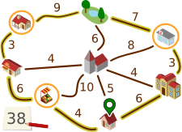
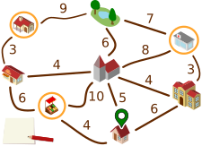
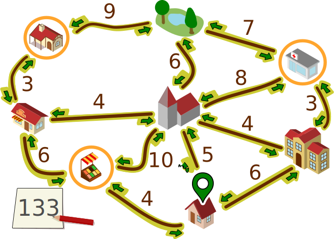
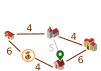

## Body

Emma è a casa ![home].  Deve svolgere tre compiti
e tornare:

- ritirare un pacco al chiosco![kiosk]
- comprare frutta al mercato ![markt] e
- Andare in farmacia ![apotheke] per prendere una medicina.

Emma non sa quanto tempo impiegherà in ogni negozio.
Ma il viaggio dovrebbe essere il più breve possibile.

Emma ha scritto su una mappa quanti minuti dedicherà all'attività di
spostamento tra le singole località della città.

Ha anche segnato sulla planimetria il percorso che sta facendo.

:::comment
_Used for the online-contest_
Ha anche segnato sulla planimetria il percorso che sta facendo e in quale direzione.
:::

Emma ha bisogno in questo caso di un totale di $6 + 3 + 7 + 9 + 3 + 6 + 4 = 38$ minuti per completare il percorso.

 

Emma si chiede se si può essere ancora più veloci.
Forse è utile percorrere alcune strade più di una volta?

## Question/Challenge - for the brochures

Determina il percorso più breve che Emma può intraprendere per completare i suoi tre compiti.

 

## Question/Challenge - for the online challenge

Determina il percorso più breve che Emma può intraprendere per completare i suoi tre compiti.
Quali sono i percorsi da seguire per farlo e in quale direzione?

## Interactivity instruction - for the online challenge

Fa clic su una freccia per selezionare o deselezionare il percorso nella direzione della freccia del percorso più breve.
In basso a sinistra è possibile vedere quanti minuti impiega Emma per percorrere i percorsi selezionati.
Al termine, fa clic su "Salva risposta".

## Answer Options/Interactivity Description

Die Pfeile und Linien haben zwei Zustände: ausgewählt und abgewählt.
Ein Klick auf einen Pfeil bewirkt einen Zustandswechsel:

Abgewählt -> Ausgewählt:
Der Pfeil ist danach hervorgehoben, die zugehörige Linie auch (sie war möglicherweise auch vorher schon hervorgehoben).

Ausgewählt -> Abgewählt:
Der Pfeil ist danach nicht mehr hervorgehoben.  Die zugehörige Linie ist danach (a) immer noch hervorgehoben, wenn der Pfeil in Gegenrichtung ausgewählt ist, oder (b) sonst nicht hervorgehoben.

Zu Beginn sind die zum Beispielweg gehörenden Linien mit jeweils einem der beiden Pfeile so ausgewählt, dass sich ein Rundweg ergibt.

## Answer Explanation

Questa è la soluzione:

 
 
Emma può camminare lungo i percorsi selezionati (o nella direzione opposta):

") 
 
Per percorrere questa distanza ha bisogno di $6 + 3 + 3 + 4 + 4 + 3 + 3 + 6 + 4 = 36$ minuti.

| ---+ | --- |
| Vogliamo giustificare perché non può esistere un percorso ancora più breve. Per farlo, utilizziamo una rappresentazione semplificata del piano. |  |
Possiamo ignorare i percorsi disegnati in grigio. Esistono percorsi più brevi tra i luoghi collegati dai percorsi, ossia attraverso altri luoghi. | |
Possiamo anche ignorare il parco, Emma infatti non deve andare al parco. Inoltre, per ogni percorso che passa per il parco, esiste un'alternativa più breve. |  |
| Emma deve andare in farmacia ![apotheke] e al chiosco ![kiosk].  Può arrivarci solo dal panificio ![backerei] o dalla scuola ![schule]. Deve percorrere a piedi la distanza tra questi luoghi. Ci vogliono $3 + 3 = 6$, ovvero 12 minuti in totale. Ricordiamolo e combiniamo i due luoghi di cui sopra con quelli di cui sotto in uno solo. |  |
| Ora rimane solo il grafico a destra. L'inizio e la fine del percorso sono qui ![home]. Questi tre luoghi (![backerei] ![schule] ![markt]) devono essere visitati. Il percorso più breve che soddisfa questo requisito passa attraverso tutti e cinque i luoghi e lungo tutti i percorsi tranne quello grigio e richiede $4 + 6 + 4 + 6 = 24$ minuti. Con i 12 minuti di cui sopra, fanno 36 minuti. Le considerazioni precedenti dimostrano che non può esistere un percorso più breve. |  |

[apotheke]: graphics/2023-BE-01-inline-apotheke.svg  "Apotheke       (20px inline(-0.2ex))"
[markt]: graphics/2023-BE-01-inline-markt.svg        "Markt          (15px inline(-0.2ex))"
[kiosk]: graphics/2023-BE-01-inline-kiosk.svg        "Kiosk          (20px inline(-0.2ex))"
[home]: graphics/2023-BE-01-inline-meinstandort.svg  "Emma's Zuhause (16px inline(-0.2ex))"
[schule]: graphics/2023-BE-01-inline-schule.svg      "Schule         (21px inline(-0.2ex))"
[backerei]: graphics/2023-BE-01-inline-baeckerei.svg "Bäckerei       (20px inline(-0.2ex))"

## This is Informatics

Per giustificare la risposta corretta è stata utilizzata una rappresentazione semplificata della mappa.
Sarebbe stato possibile presentare la mappa in modo molto più astratto:

 
 
Questa rappresentazione contiene tutte le informazioni importanti per il percorso di Emma, ovvero
- Oggetti: i luoghi, con segnati i luoghi importanti per il percorso;
- e relazioni tra gli oggetti: le distanze tra i luoghi per ognuno dei quali è indicata una lunghezza.

Uno strumento importante per modellare le relazioni tra gli oggetti sono i _grafi_.
I grafi sono costituiti da nodi (per gli oggetti) e da bordi (coppie di oggetti, per le relazioni).
La mappa di Emma può essere modellata come un _grafo pesato_,
dove alle singole relazioni vengono assegnati dei valori numerici (i _pesi_).

L'informatica è interessata a domande che possono essere poste in relazione ai grafi,
e per gli algoritmi che possono essere utilizzati per rispondere alle domande.
Una domanda importante per i grafi pesati è:
Qual è il percorso più breve (o più veloce) tra due nodi?
La "domanda del grafico" in questo compito è simile:
Qual è il viaggio di andata e ritorno più breve da un nodo che visita molti altri nodi?
L'informatica conosce molti algoritmi in grado di determinare in modo efficiente i percorsi più brevi nei grafi.
Tali algoritmi sono implementati in software per, ad esempio, la pianificazione di itinerari.

## This is Computational Thinking

Optional - not to be filled 2023

## Informatics Keywords and Websites

- Grafi: https://it.wikipedia.org/wiki/Grafo

## Computational Thinking Keywords and Websites

 Optional - not to be filled 2023

## Wording and Phrases

German wording and phrases please here!

 - _Word 1_: Bedeutung in dieser Aufgabe
 - _Phrase 1_: Bedeutung in dieser Aufgabe 

## Comments

Report changes on this file (older comments can be looked up in the original document)

_Wolfgang Pohl, 17.07.2023_:  Ich plädiere dafür, auf die Kennzeichnung möglicher Positionen durch Nummern zu verzichten.  Das ist nur bei Multiple-Choice sinnvoll.  Ohne Nummern wird die Aufgabe nur unwesentlich schwieriger.

_Name, Datum_: Kommentar 2

