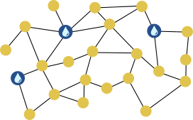
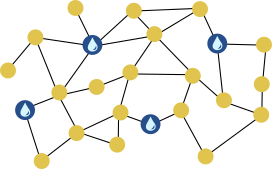
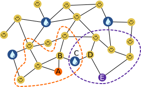

## Body

Der Sommer in der Stadt ist heiss.  Die Bürgermeisterin lässt deshalb Brunnen mit Trinkwasser aufstellen.

Die Brunnen sollen so stehen, dass man von jeder Strassenecke aus höchstens zwei Strassenabschnitte gehen muss, um einen Brunnen zu erreichen. Dann ist die Bürgermeisterin zufrieden.

Hier ist ein Stadtplan. Die Linien sind Strassenabschnitte, und die Punkte sind Strassenecken.
An drei Ecken stehen bereits Brunnen ").

## Question/Challenge - for the brochures

Stelle einen weiteren Brunnen so auf, dass die Bürgermeisterin zufrieden ist.

## Question/Challenge - for the online challenge

Stelle einen weiteren Brunnen so auf, dass die Bürgermeisterin zufrieden ist.

## Interactivity instruction - for the online challenge

Klicke auf eine Strassenecke, um dort einen Brunnen aufzustellen. Wenn du fertig bist, klicke auf "Antwort speichern".

## Answer Options/Interactivity Description

Wenn eine unbesetzte Strassenecke angeklickt wird, wird dort ein Brunnen angezeigt. Ein evtl. vorher durch Klick aufgestellter Brunnen verschwindet durch einen Klick auf die gleiche oder eine andere Strassenecke wieder. Strassenecken mit vorab aufgestellten Brunnen können nicht angeklickt werden.

## Answer Explanation

So ist es richtig:

Wenn ein weiterer Brunnen unten in der Mitte aufgestellt wird, muss man von jeder Strassenecke aus höchstens zwei Strassenabschnitte gehen, um einen Brunnen zu erreichen.
Dann ist die Bürgermeisterin zufrieden.

Wie können wir herausfinden, an welcher Strassenecke 
ein weiterer Brunnen aufgestellt werden soll?
Im Stadtplan markieren wir alle Strassenecken mit einem "), 
die höchstens zwei Strassenabschnitte von einem der Brunnen entfernt sind, die bereits aufgestellt sind.
In Bezug auf diese Ecken kann die Bürgermeisterin bereits zufrieden sein.

Für die fünf übrigen Strassenecken A, B, C, D und E stellen wir einen weiteren Brunnen bei C auf. Damit muss man auch von diesen Ecken höchstens zwei Strassenabschnitte zum nächsten Brunnen gehen.

Die Ecke C ist die einzige Stelle für einen neuen Brunnen, die das ermöglicht:
Wenn wir für die Ecken A und E jeweils alle anderen Ecken betrachten, die über zwei Strassenabschnitte erreichbar sind (im Bild mit gestrichtelten Linien umrandet),
ist die Strassenecke C die einzige, die diese Bedingung für A _und_ E erfüllt.

## This is Informatics

Der Stadtplan kann als _Graph_ modelliert werden.
Das ist ein für die Informatik wichtiges Werkzeug, um Beziehungen zwischen Objekten zu modellieren
und Fragen in Bezug auf diese Beziehungen zu beantworten.
Hier kann man die Strassenecken als Objekte und damit _Knoten_ des Graphen auffassen.
Die Beziehung zwischen zwei Objekten wird im Graph durch _Kanten_ modelliert, die man als Verbindungslinien darstellt. Hier bedeutet eine Kante zwischen zwei Strassenecken, dass sie durch einen Strassenabschnitt verbunden sind. Diese Beziehung kann man Nachbarschaft nennen. Kanten können aber auch andere Beziehungen modellieren, wie z.B. Freundschaft.

In dieser Biberaufgabe soll eine Teilmenge der Knoten gefunden werden (zum Aufstellen der Brunnen), so dass jeder Knoten ausserhalb dieser Teilmenge über einen Weg mit einem "Brunnen-Knoten" verbunden ist, der höchstens zwei Kanten lang ist.  In der Fachsprache der Informatik würde dies als Suche nach einem "distance-2 dominating set" bezeichnet. Im allgemeinen (für alle Weglängen $k \geq 1$) gehört diese Suche nach einer möglichst kleinen solchen Teilmenge zu den schwierigsten Problemen der Informatik.

Solche "minimum distance _k_-dominating sets" spielen in der letzten Zeit eine grössere Rolle, insbesondere im Bereich des _Social Computing_ (auf Deutsch auch _Sozioinformatik_):
Zur automatischen Verarbeitung von Daten über soziale Netzwerke (etwa um die Verbreitung von Fake News zu erkennen)
werden die Fan- oder Follower-Beziehungen zwischen den Nutzern als Graph modelliert.
Diese Graphen können so gross sein, dass nur eine (möglichst kleine) repräsentative Auswahl von Nutzern betrachtet werden kann - zum Beispiel ein "minimum distance 3-dominating set".
Da die wirklich kleinste Auswahl nicht effizient berechnet werden kann, entwickelt die Informatik Verfahren,
die in kurzer Zeit möglichst kleine, aber nicht garantiert kleinste Auswahlen berechnen.

## This is Computational Thinking

Optional - not to be filled 2023

## Informatics Keywords and Websites

- Minimum Distance k-Dominating Sets: https://computationalsocialnetworks.springeropen.com/articles/10.1186/s40649-020-00078-5
- Sozioinformatik: https://de.wikipedia.org/wiki/Sozioinformatik

## Computational Thinking Keywords and Websites

Optional - not to be filled 2023

## Wording and Phrases

German wording and phrases please here!

 - _Word 1_: Bedeutung in dieser Aufgabe
 - _Phrase 1_: Bedeutung in dieser Aufgabe 

## Comments

Report changes on this file (older comments can be looked up in the original document)

_Wolfgang Pohl, 17.07.2023_:  Ich plädiere dafür, auf die Kennzeichnung möglicher Positionen durch Nummern zu verzichten.  Das ist nur bei Multiple-Choice sinnvoll.  Ohne Nummern wird die Aufgabe nur unwesentlich schwieriger.

_Name, Datum_: Kommentar 2

