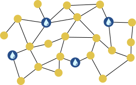

## Body

L'estate è calda in città. Per questo il sindaco ha fatto installare delle fontane con acqua potabile.

Le fontane devono essere posizionate in modo tale che per raggiungerle non si debbano percorrere più di due segmenti di strada da ogni angolo di strada. Solo in quel caso il sindaco sarà soddisfatto.

Ecco una mappa della città. Le linee sono segmenti di strada e i punti sono angoli di strada.
In tre angoli ci sono già delle fontane ").

 
 
## Question/Challenge - for the brochures

Colloca un'altra fontana in modo che il sindaco sia soddisfatto.

## Question/Challenge - for the online challenge

Colloca un'altra fontana in modo che il sindaco sia soddisfatto.

## Interactivity instruction - for the online challenge

Fa clic su un angolo della strada per collocare una fontana. Al termine, fai clic su "Salva risposta".

## Answer Options/Interactivity Description

Wenn eine unbesetzte Strassenecke angeklickt wird, wird dort ein Brunnen angezeigt. Ein evtl. vorher durch Klick aufgestellter Brunnen verschwindet durch einen Klick auf die gleiche oder eine andere Strassenecke wieder. Strassenecken mit vorab aufgestellten Brunnen können nicht angeklickt werden.

## Answer Explanation

La risposta corretta:

 
 
Collocando un'altra fontana in basso al centro, per raggiungere una fontana si devono percorrere al massimo due segmenti di strada da ogni angolo di strada.
Così facendo il sindaco sarà soddisfatto.

Come possiamo scoprire a quale angolo della strada si prevede l'installazione di un'altra fontana?
Nella mappa della città segniamo tutti gli angoli delle strade con un "),
che non si trovino a più di due tratti stradali di distanza da una delle fontane già esistenti.
Per quanto riguarda questi angoli, il sindaco può già ritenersi soddisfatto.

 
 
Per i cinque angoli di strada rimanenti, A, B, C, D ed E, posizioniamo un'altra fontana in C. In questo modo, da questi angoli alla fontana successiva si devono percorrere al massimo due segmenti di strada.

L'angolo C è l'unica posizione per una nuova fontna che lo consente.
Se consideriamo per gli angoli A ed E rispettivamente tutti gli altri angoli che possono essere raggiunti attraverso due tratti di strada (delineati con linee tratteggiate nella figura),
l'angolo di strada C è l'unico che soddisfa questa condizione per A _e_ E.

## This is Informatics

La mappa della città può essere modellata come un _grafo_.
Si tratta di uno strumento importante per l'informatica per modellare le relazioni tra gli oggetti e rispondere alle domande relative a queste relazioni.
In questo caso, gli angoli delle strade possono essere intesi come oggetti e quindi come _nodi_ del grafo.
La relazione tra due oggetti è modellata nel grafo da _bordi_, che sono rappresentati come linee di collegamento. In questo caso, un bordo tra due angoli di strada significa che sono collegati da un segmento di strada. Questa relazione può essere chiamata vicinato. Tuttavia, i bordi possono modellare anche altre relazioni, come per esempio l'amicizia.

In questo compito, si deve trovare un sottoinsieme di nodi (per la creazione delle fontane) tale che ogni nodo al di fuori di questo sottoinsieme sia collegato tramite un percorso a un "nodo fontana" lungo al massimo due bordi.  Nella terminologia informatica, questo si chiama trovare un "insieme dominante a distanza 2".  In generale (per tutti i percorsi di lunghezza $k \geq 1$), la ricerca del più piccolo sottoinsieme possibile è uno dei problemi più difficili dell'informatica.

Questi "insiemi dominanti a distanza minima _k_" hanno assunto un ruolo sempre più importante negli ultimi tempi, soprattutto nel campo della _Social Computing_ (in italiano anche _socioinformatica_):
Per il trattamento automatico dei dati attraverso le reti sociali (ad esempio, per rilevare la diffusione di fake news)
le relazioni di fan o follower tra gli utenti sono modellate come un grafo.
Questi grafi possono essere così grandi che è possibile visualizzare solo una selezione rappresentativa di utenti (la più piccola possibile) - ad esempio, un "insieme dominante a distanza minima 3".
Poiché la selezione veramente minima non può essere calcolata in modo efficiente, l'informatica sviluppa delle procedure,
che calcolano le selezioni più piccole possibili, ma non garantite, in un tempo breve.

## This is Computational Thinking

Optional - not to be filled 2023

## Informatics Keywords and Websites

- Socioinformatica: https://it.wikipedia.org/wiki/Socioinformatica

## Computational Thinking Keywords and Websites

Optional - not to be filled 2023

## Wording and Phrases

German wording and phrases please here!

 - _Word 1_: Bedeutung in dieser Aufgabe
 - _Phrase 1_: Bedeutung in dieser Aufgabe 

## Comments

Report changes on this file (older comments can be looked up in the original document)

_Wolfgang Pohl, 17.07.2023_:  Ich plädiere dafür, auf die Kennzeichnung möglicher Positionen durch Nummern zu verzichten.  Das ist nur bei Multiple-Choice sinnvoll.  Ohne Nummern wird die Aufgabe nur unwesentlich schwieriger.

_Name, Datum_: Kommentar 2

