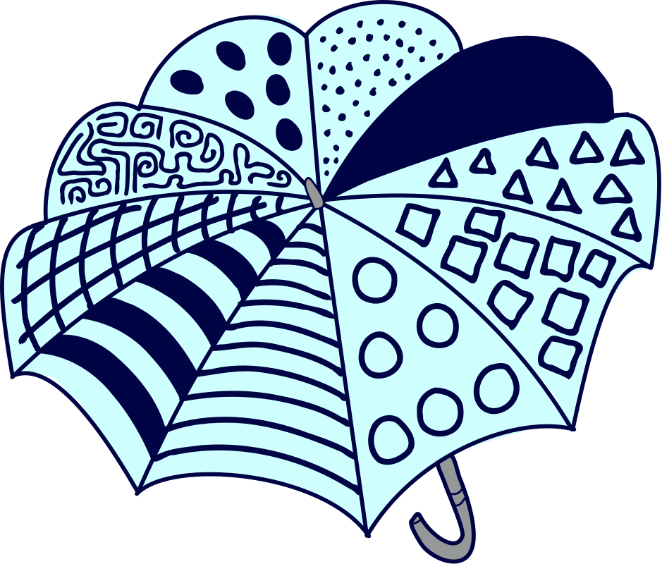

## Body

Das ist Annas Regenschirm:

## Question/Challenge - for the brochures

Eines der vier Bilder zeigt Annas Regenschirm. Welches?

## Question/Challenge - for the online challenge

Eines der vier Bilder zeigt Annas Regenschirm. Welches?

## Interactivity instruction - for the online challenge

Klicke auf das richtige Bild.

## Answer Options/Interactivity Description

| :--: | :--: | :--: | :--: |
| ![A] | ![B] | ![C] | ![D] |
|  A)  |  B)  |  C)  |  D)  |

[A]: graphics/2023-CH-01-A.svg
[B]: graphics/2023-CH-01-B.svg
[C]: graphics/2023-CH-01-C.svg
[D]: graphics/2023-CH-01-D.svg

## Answer Explanation
Jedes Muster auf Annas Regenschirm kommt genau einmal vor.

Um das korrekte Bild zu finden, vergleichen wir nacheinander jedes der Bilder mit Annas Regenschirm:
- wir wählen das Muster, welches am weitesten links ist, und suchen dessen Position auf Annas Regenschirm
- wir prüfen, ob die angrenzenden Muster dieselben sind wie die auf Annas Regenschirm.

  |                   |    A)    |    B)    |    C)    |    D)    |
  | ----------------- | :------: | :------: | :------: | :------: |
  | Antwortbild    | ![A_sm]  | ![B_sm]  | ![C_sm]  | ![D_sm]  |
  | Annas Regenschirm | ![explA] | ![explB] | ![explC] | ![explD] |

[A_sm]: graphics/2023-CH-01-A.svg "A (90px)"
[B_sm]: graphics/2023-CH-01-B.svg "B (90px)"
[C_sm]: graphics/2023-CH-01-C.svg "C (90px)"
[D_sm]: graphics/2023-CH-01-D.svg "D (90px)"
[explA]: graphics/2023-CH-02-explanation-A.svg "ExplanationA (90px)"
[explB]: graphics/2023-CH-02-explanation-B.svg "ExplanationB (90px)"
[explC]: graphics/2023-CH-02-explanation-C.svg "ExplanationC (90px)"
[explD]: graphics/2023-CH-02-explanation-D.svg "ExplanationD (90px)"

Jedes der vier Bilder zeigt eine Folge von nur fünf Mustern und nicht alle zehn. Wir können nicht wissen, ob die Musterfolge von einem der vier Bilder mit der vollständigen Reihenfolge aller zehn Muster von Annas Regenschirm übereinstimmt.

Bild C hat als einziges eine Folge von fünf Mustern, die vollständig mit denen auf Annas Regenschirm übereinstimmt. Aus diesem Grund kann nur Bild C Annas Regenschirm zeigen. Alle anderen Bilder weisen Musterfolgen auf, die nicht oder nur teilweise mit denen von Annas Regenschirm übereinstimmen. Diese Bilder können also nicht Annas Regenschirm zeigen.
 

## This is Informatics

In den Antwortmöglichkeiten ist jeweils nur ein Teil der Musterfolge abgebildet. Obwohl sie nur eine _Teilinformation_ enthalten, können wir feststellen, welches der vier Bilder Annas Regenschirm zeigt: Ein Bild zeigt nur dann Annas Regenschirm, wenn die Musterfolge vollständig in der Musterfolge von Annas Regenschirm vorkommt.

Das gleiche Prinzip wie bei der "Regenschirm-Mustersuche" wird bei der Suche in einem Textdokument angewendet. Der Computer sucht mit gegebenen Teilinformationen (Suchwort) nach passenden _Zeichenketten_ im Dokument. Eine Zeichenkette ist eine Folge von Zeichen (z.B. Buchstaben, Ziffern, Sonderzeichen). 
Dabei gilt bei der Suche: 
- Je länger das Suchwort, desto weniger mögliche Übereinstimmungen gibt es und desto grösser ist die Chance, die gesuchte Stelle im Dokument zu finden.

- Je kürzer das Suchwort, desto mehr mögliche Übereinstimmungen ergibt die Suche und desto ungenauer ist die Suche.

Um das Durchsuchen zu verbessern, wurden verschiedene Suchverfahren (oder _Suchalgorthimen_) entwickelt. Sie sollen möglichst schnell eine genaue Suche durchführen, und ein passendes Resultat liefern. Diese Suchalgorthimen werden ständig weiterentwickelt und können riesige Datenmengen in sehr kurzer Zeit durchsuchen (z.B. Internetsuchmaschinen verwenden solche Suchalgorthimen).

## This is Computational Thinking

--

## Informatics Keywords and Websites

- Zeichenkette, String: https://de.wikipedia.org/wiki/Zeichenkette
- Suchverfahren: https://de.wikipedia.org/wiki/Suchverfahren 

## Computational Thinking Keywords and Websites

--

## Wording and Phrases

 - _Muster_: Unterschiedliche Verzierungen der Schirmteile. 
 - _Musterfolge_: Eine Reihenfolge von Mustern auf dem Schirm.

## Comments

Report changes on this file (older comments can be looked up in the original document)

_Susanne Datzko, 2023/11/08_: Folgende Änderungen habe ich gemacht:
- Abfolge in Folge umgewandelt
- DiI: Zeichenkette und Volltextsuche drastisch gekürzt. Mehr Gewicht auf Suchverfahren.
- Graphiken: Gelb mit Hellblau erstetzt, Schwarz mit Dunkelblau.

_Name, Datum_: Kommentar 2

 * We don't delete the original english version of the task for making possible to look up the older comments.