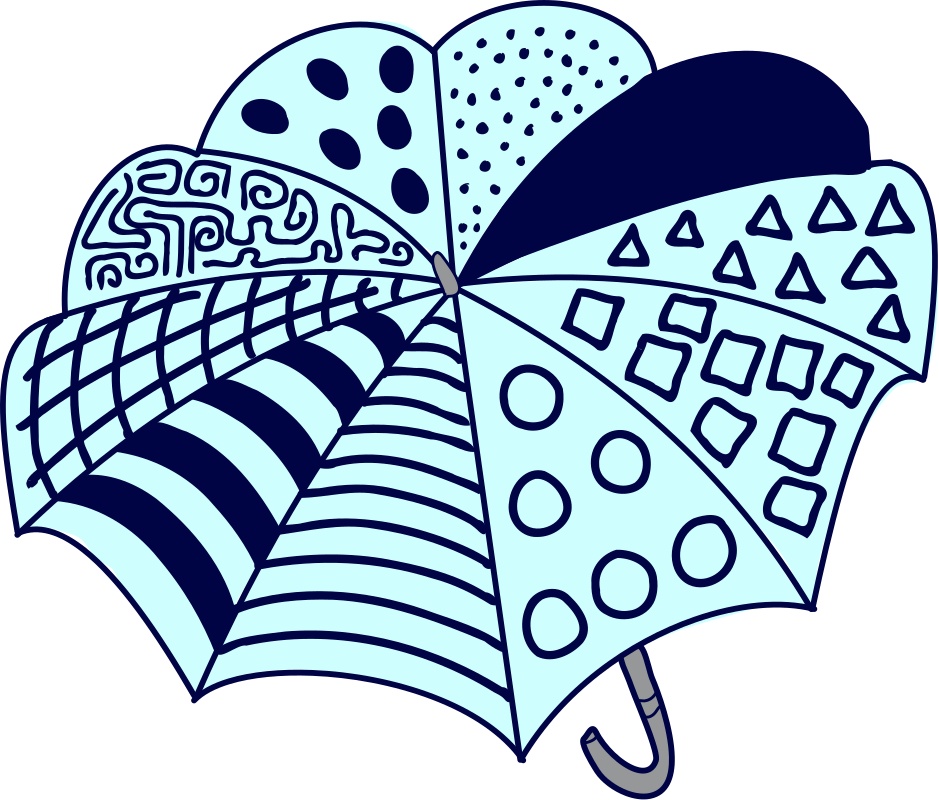
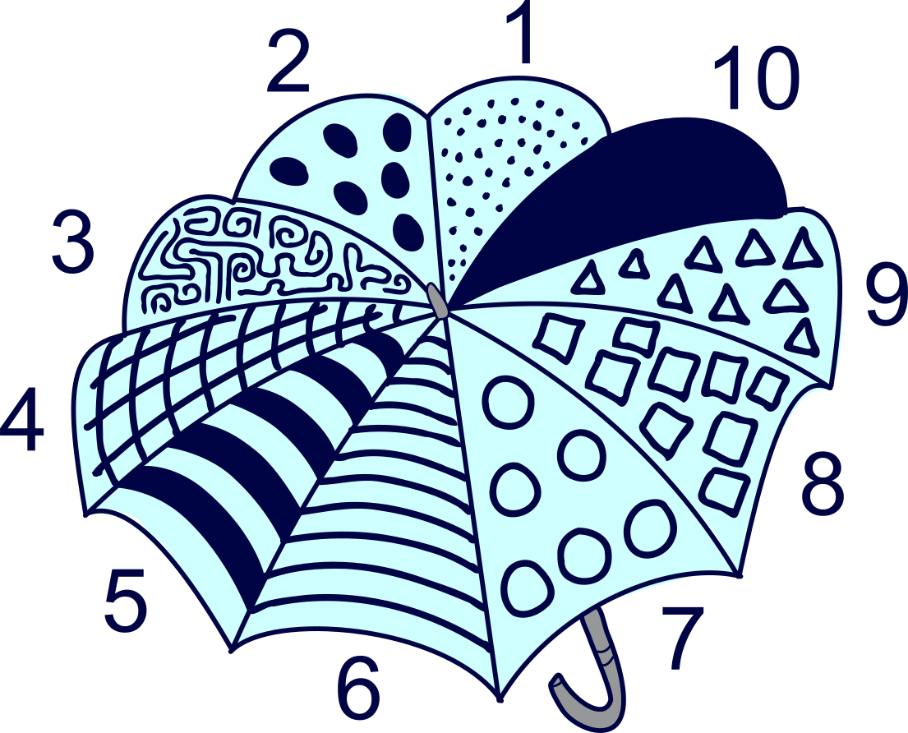

## Body

Voici le parapluie d'Anna:

## Question/Challenge - for the brochures

Une des quatre images montre le parapluie d'Anna. Laquelle?

## Question/Challenge - for the online challenge

Une des quatre images montre le parapluie d'Anna. Laquelle?

## Interactivity instruction - for the online challenge
Clique sur la bonne image.

## Answer Options/Interactivity Description

| :--: | :--: | :--: | :--: |
| ![A] | ![B] | ![C] | ![D] |
|  A)  |  B)  |  C)  |  D)  |

[A]: graphics/2023-CH-01-A.svg
[B]: graphics/2023-CH-01-B.svg
[C]: graphics/2023-CH-01-C.svg
[D]: graphics/2023-CH-01-D.svg

## Answer Explanation

Chaque motif n'apparaît qu'une seule fois sur le parapluie d'Anna.

Pour trouver la bonne image, nous comparons chacune des images l'une après l'autre avec le parapluie d'Anna:
- Nous cherchons la position du motif situé tout à gauche du parapluie de la réponse possible sur le parapluie d'Anna,
- Nous vérifions que les motifs voisins soient les mêmes sur le parapluie de la réponse possible que sur le parapluie d'Anna.

  |                  |    A)    |    B)    |    C)    |    D)    |
  | ---------------- | :------: | :------: | :------: | :------: |
  | Réponse possible | ![A_sm]  | ![B_sm]  | ![C_sm]  | ![D_sm]  |
  | Parapluie d'Anna | ![explA] | ![explB] | ![explC] | ![explD] |

[A_sm]: graphics/2023-CH-01-A.svg "A (90px)"
[B_sm]: graphics/2023-CH-01-B.svg "B (90px)"
[C_sm]: graphics/2023-CH-01-C.svg "C (90px)"
[D_sm]: graphics/2023-CH-01-D.svg "D (90px)"
[explA]: graphics/2023-CH-02-explanation-A.svg "ExplanationA (90px)"
[explB]: graphics/2023-CH-02-explanation-B.svg "ExplanationB (90px)"
[explC]: graphics/2023-CH-02-explanation-C.svg "ExplanationC (90px)"
[explD]: graphics/2023-CH-02-explanation-D.svg "ExplanationD (90px)"

Chacune des quatre images montre une suite de seulement cinq motifs et pas tous les dix. Nous ne pouvons pas savoir si la suite de cinq motifs d'une des quatre images correspond à la suite de dix motifs complète du parapluie d'Anna.

L'image C est la seule qui montre un parapluie avec cinq motifs correspondants à ceux présents sur le parapluie d'Anna. Toutes les autres images montrent des suites de motifs qui ne correpondent pas, ou seulement en partie, au parapluie d'Anna. Seule l'image C peut donc montrer le parapluie d'Anna. 

## This is Informatics

Les réponses possibles ne montrent qu'une partie de la suite de motifs. Même si elles ne contiennt que des _informations partielles_, nous pouvons déterminer laquelle des quatre images montre le parapluie d'Anna: une image ne montre le parapluie d'Anna que si sa suite de motifs correspond exactement à une partie de la suite de motifs du parapluie d'Anna. 

Lors d'une recherche dans un document texte, le même principe est appliqué que pour la recherche de motifs sur les parapluies. L'ordinateur recherche des chaînes de caractères correspondant à une information partielle donnée (le mot recherché) dans le document. Une chaîne de caractères est une suite de caractères (par exemple des lettres, des chiffres, des caractères spéciaux). Lors d'une recherche:
- plus le mot recherché est long, moins il y a de correspondances possible dans le texte et plus la chance de trouver l'endroit recherché dans le texte est élevée,
- plus le mot recherché est court, plus il y a de correspondances possible dans le texte et moins la recherche est exacte.

Pour améliorer la recherche et le parcours des données, différentes méthodes de recherche (ou _algorithmes de recherche_) ont été développées. Leur but est d'effectuer une recherche exacte le plus rapidement possible et de générer un résultat adapté. Ces algorithmes de recherche sont sans cesse améliorés et peuvent parcourir d'immenses quantités de données en très peu de temps (les moteurs de recherche sur internet utilisent de tels algorithmes).

## This is Computational Thinking

--

## Informatics Keywords and Websites

- Chaîne de caractères, string: https://fr.wikipedia.org/wiki/Chaîne_de_caractères
- Algorithme de recherche: https://fr.wikipedia.org/wiki/Algorithme_de_recherche

## Computational Thinking Keywords and Websites

--

## Wording and Phrases

 - _Muster_: Unterschiedliche Verzierungen der Schirmteile. 
 - _Musterfolge_: Eine Reihenfolge von Mustern auf dem Schirm.

## Comments

Report changes on this file (older comments can be looked up in the original document)

_Susanne Datzko, 2023/11/08_: Folgende Änderungen habe ich gemacht:
- Abfolge in Folge umgewandelt
- DiI: Zeichenkette und Volltextsuche drastisch gekürzt. Mehr Gewicht auf Suchverfahren.
- Graphiken: Gelb mit Hellblau erstetzt, Schwarz mit Dunkelblau.

_Name, Datum_: Kommentar 2

 * We don't delete the original english version of the task for making possible to look up the older comments.