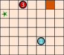

## Body

Die Go-Bots sind sehr einfache Roboter. Sie fahren über ein Spielbrett mit Feldern.

 

Um sie zu steuern, wählt man zunächst einen der Go-Bots aus. 
Den schickt man dann mit einem Pfeil-Befehl in eine Richtung:
hoch ![arrow-up], runter ![arrow-down], links ![arrow-left] und rechts ![arrow-right].
Der Go-Bot fährt dann stur geradeaus, bis er direkt vor einem Hindernis ![square] oder einem anderen Roboter ankommt.
Dort bleibt er stehen, bis er einen neuen Befehl bekommt.

Mit einer geschickten Folge von Befehlen sollst du dafür sorgen, dass Go-Bot ![robot1] das Ziel ![star] erreicht, also genau dort stehen bleibt.

[arrow-up]: graphics/2023-CZ-01-arrow-up.svg "Pfeil nach oben"
[arrow-down]: graphics/2023-CZ-01-arrow-down.svg "Pfeil nach unten"
[arrow-left]: graphics/2023-CZ-01-arrow-left.svg "Pfeil nach links"
[arrow-right]: graphics/2023-CZ-01-arrow-right.svg "Pfeil nach rechts"
[star]: graphics/2023-CZ-01-star.svg "Ziel"
[square]: graphics/2023-CZ-01-square.svg "Hindernis (19px)"

Mit dieser Befehlsfolge erreicht Go-Bot ![robot1] das Ziel ![star]: 

:::center
![robot3] ![arrow-right]   ![robot1] ![arrow-up]   ![robot1] ![arrow-left]

:::

[robot1]: graphics/2023-CZ-01-robot1.svg "Go-Bot 1"
[robot2]: graphics/2023-CZ-01-robot2.svg "Go-Bot 2"
[robot3]: graphics/2023-CZ-01-robot3.svg "Go-Bot 3"
[robot4]: graphics/2023-CZ-01-robot4.svg "Go-Bot 4"

## Question/Challenge - for the brochures

Erstelle eine Befehlsfolge mit vier Pfeilen, mit der Go-Bot ![robot1] das Ziel ![star] erreicht!
:::center

:::

## Question/Challenge - for the online challenge

Erstelle eine Befehlsfolge mit vier Pfeilen, mit der Go-Bot ![robot1] das Ziel ![star] erreicht!

## Interactivity instruction - for the online challenge

Ziehe immer abwechselnd einen Go-Bot und einen Pfeil auf die grauen Felder. Wenn du fertig bist, klicke auf "Antwort speichern".

## Answer Options/Interactivity Description

Die Bot-Symbole und die Pfeile können auf die Felder gezogen werden.  Es gibt 8 Felder (die richtige Antwort besteht aus 8 Symbolen.)  Man könnte dafür sorgen, dass auf ungerade Felder nur Bot-Symbole und auf gerade Felder nur Pfeile gezogen werden dürfen; das ist aber nicht zwingend.  Bot-Symbole und Pfeile müssen mehrfach verwendbar sein.  Bot-Symbole, Pfeile und Felder sind oberhalb des Spielbretts zu sehen.

## Answer Explanation

So ist es richtig:
![robot3] ![arrow-up]  ![robot2] ![arrow-left]  ![robot1] ![arrow-down]  ![robot1] ![arrow-right]

Damit Go-Bot ![robot1] durch eine Befehlsfolge mit vier Pfeilen das Ziel erreichen kann, müssen drei Go-Bots kooperieren.
Zuerst geht ![robot3] nach oben, bis er vor einem Hindernis stehen bleibt.
Damit wird er selbst zum Hindernis für ![robot2] auf seinem Weg nach links.
Wenn man nun ![robot1] nach unten schickt, geht er bis ![robot2] und kann von dort aus nach rechts gehen, 
wo er vor dem Hindernis stehen bleibt - auf dem Ziel.

Wie findet man die richtige Befehlsfolge?  Man kann hinten anfangen und sich überlegen, was die letzte Bewegung von Go-Bot ![robot1] zum Ziel sein muss. Es gibt nur zwei Möglichkeiten:  
a) Er kommt von links, wie in unserer Lösung.  
b) Er kommt von oben. In diesem Fall müsste Go-Bot ![robot4] mit drei Befehlen nach oben rechts bewegt werden, um für ![robot1] als Hindernis zu dienen. Wir benötigten dann $3 + 2 = 5$ Pfeil-Befehle. 
Gesucht ist aber eine Folge mit vier Befehlen. Also muss Möglichkeit a) korrekt sein, von Go-Bot ![robot1] kommt von links zum Ziel. Dann geht die vorletzte Bewegung des Go-Bots ![robot1] von oben nach unten. Damit er an der richtigen Stelle stehen bleibt, müssen zuvor ![robot2] und ![robot3] wie im Bild bewegt werden.

## This is Informatics

In dieser Biberaufgabe haben mehrere Roboter zusammen gearbeitet, um gemeinsam ein Ziel zu erreichen. Dabei hatten sie unterschiedliche Aufgaben. Der blaue Roboter musste zum Ziel kommen, und die anderen dienten als Hindernisse.

Aufgabenverteilung ist ein wichtiger Aspekt der Robotik. Zum Beispiel arbeiten in einem automatisierten Warenlager unterschiedliche Roboter zusammen, um Waren einzulagern, wiederzufinden und zu transportieren. Dabei werden alle Aktivitäten so koordiniert, dass möglichst wenig nutzlose Ruhezeiten entstehen, alle Transportwege möglichst kurz sind, wenig Energie verbraucht wird und so insgesamt das Warenlager möglichst effizient arbeitet.

Ein besonderes Gebiet der Robotik sind Schwarmroboter. Das sind – wie die Go-Bots – einfache Maschinen, die in einer grossen Gruppe gemeinsam eine Aufgabe lösen. In der Landwirtschaft können inzwischen Schwärme von Robotern die Aussaat von Mais erledigen, die Entwicklung der Pflanzen und die Bodenbeschaffenheit beobachten und schliesslich sogar das Getreide ernten. Jeder Schwarmroboter ist klein und einfach konstruiert, aber der Schwarm als Ganzes kann Grosses leisten. Dieses Prinzip gilt auch für Multiagentensysteme: Das sind einfache Softwareeinheiten, die gemeinsam komplexe Probleme lösen können. Die Aufgabe der Informatik ist, Algorithmen für eine optimale Koordination und Kooperation von Gesamtsystemen mit mehreren Akteuren – ob Hardware oder Software – zu entwickeln.

## This is Computational Thinking

Dieser Abschnitt wird in diesem Jahr nicht bearbeitet.

## Informatics Keywords and Websites

- Multi-Robotersysteme: https://www.hsu-hh.de/rt/forschung/multirobotersysteme
- Robotik: https://www.infineon.com/cms/de/discoveries/grundlagen-robotics/
- Schwarmroboter
- Industrieroboter: https://de.wikipedia.org/wiki/industrieroboter
- Multiagentensystem: https://de.wikipedia.org/wiki/Multiagentensystem

## Computational Thinking Keywords and Websites

Dieser Abschnitt wird in diesem Jahr nicht bearbeitet.

## Wording and Phrases

- _Go-Bot_
- _Spielfeld_
- _Befehl_
- _Robot, bump, obstacle, direction, board, stop, combine_

## Comments

_Jiří Vaníček, author, after pre-review_:
Text in the task body was corrected (especially the word "step" changed to "movement"). Graphics were improved (description of arrows in explanation figures 3 and 4 showing the order of movements when more than 1 robot moves). Added a text with another explanatory figure, describing the strategy to get the correct solution. A proof was also added as to why it is impossible to solve the problem in fewer moves than the correct solution offers. I tried to improve IT/CT parts too and thanks for additional ideas.

_Mao (maoyong@itccc.org.cn) – Koleszar (vkoleszar@ceilbal.edu.uy) – Workshop group 5, 2023/05/16_:
Rephrased the body to conclude the rules of the game into 4 bullet points. Rephrased the explanation part to clarify the solution and the way to find the solution. Added a paragraph into TiI section, which explains the complexity of this collaborative optimization task. Added a TiCT section. Changed the keywords.

_Michael Weigend, mw@creative-informatics.de, 2023-07-03_:
Translation to German.
Änderungen:
1) Aufgabe wurde stark gekürzt. Insbesondere gibt es jetzt keine Gliederungspunkte mit Regeln mehr. Das ist m.E. für die sehr einfache Arbeitsweise der Roboter nicht notwendig.
2) Der Robotertyp hat einen Namen bekommen "Go-Bot". M.E. verbessert das die Lesbarkeit.
3) Entsprechend der DACHHU-Besprechung wurde die Frage abgewandelt. Man muss jetzt nicht mehr nach der kürzesten Befehlsfolge suchen, sondern die Anzahl der notwendigen Befehle (4) wurde vorgegeben. Man muss jetzt angeben, welche Roboter an der Lösung der Aufgabe beteiligt sind.
4) Die Erklärung der richtigen Lösung wurde stark gekürzt.
5) "Das ist Informatik" wurde völlig überarbeitet. Der Aspekt der kollaborativen Roboter (Cobots) wurde entfernt, weil das m.E. nicht zur Aufgabe passt. Bei kollaborativen Robotik geht es um das gemeinsame Arbeiten von Robotern und Menschen. Hier stehen Aspekte wie Mensch-Maschine-Interaktion und Sicherheit im Vordergrund. Dagegen passt die Aufgabe besser zu Schwarmrobotik. Darauf hebt die neue Version dieses Abschnitts jetzt ab.
