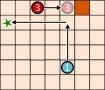
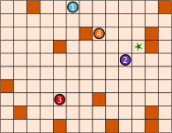
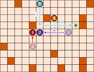

## Body
Les robots tamponneurs sont des robots très simples. Ils roulent sur un plateau de jeu divisé en cases.

Pour les diriger, on commence par sélectionner un robot tamponneur. On l'envoie ensuite dans une certaine direction à l'aide d'une flèche-commande: en haut ![arrow-up], en bas ![arrow-down], à gauche ![arrow-left] ou à droite ![arrow-right]. Le robot tamponneurs roule ensuite tout droit dans la direction de la commande jusqu'à ce qu'il rencontre un obstacle ![square] ou un autre robot. Il s'arrête alors et ne bouge plus jusqu'à ce qu'il reçoive une nouvelle commande.

En utilisant un suite de commandes adaptée, tu dois faire en sorte que le robot tamponneur ![robot1] atteigne le but ![star] et y reste.

[arrow-up]: graphics/2023-CZ-01-arrow-up.svg "Flèche vers le haut"
[arrow-down]: graphics/2023-CZ-01-arrow-down.svg "Flèche vers le bas"
[arrow-left]: graphics/2023-CZ-01-arrow-left.svg "Flèche vers la gauche"
[arrow-right]: graphics/2023-CZ-01-arrow-right.svg "Flèche vers la droite"
[star]: graphics/2023-CZ-01-star.svg "But"
[square]: graphics/2023-CZ-01-square.svg "Obstacle"

Le robot tamponneur ![robot1] atteint le but ![star] en suivant la suite de commandes suivante:

:::center
![robot3] ![arrow-right] ![robot1] ![arrow-up] ![robot1] ![arrow-left]

[robot1]: graphics/2023-CZ-01-robot1.svg "Robot 1"
[robot2]: graphics/2023-CZ-01-robot2.svg "Robot 2"
[robot3]: graphics/2023-CZ-01-robot3.svg "Robot 3"
[robot4]: graphics/2023-CZ-01-robot4.svg "Robot 4"

:::

## Question/Challenge - for the brochures

Crée une suite de commandes avec quatre flèches permettant au robot tamponneur ![robot1] d'atteindre le but ![star].
:::center

:::

## Question/Challenge - for the online challenge

Crée une suite de commandes avec quatre flèches permettant au robot tamponneur ![robot1] d'atteindre le but ![star].

## Interactivity instruction - for the online challenge

Glisse alternativement un robot tamponneur puis une flèche dans les cases grises. Quand tu as fini, clique sur "Enregistrer la réponse".

## Answer Options/Interactivity Description

Die Bot-Symbole und die Pfeile können auf die Felder gezogen werden.  Es gibt 8 Felder (die richtige Antwort besteht aus 8 Symbolen.)  Man könnte dafür sorgen, dass auf ungerade Felder nur Bot-Symbole und auf gerade Felder nur Pfeile gezogen werden dürfen; das ist aber nicht zwingend.  Bot-Symbole und Pfeile müssen mehrfach verwendbar sein.  Bot-Symbole, Pfeile und Felder sind oberhalb des Spielbretts zu sehen.

## Answer Explanation

Voici la bonne suite de commandes:
![robot3] ![arrow-up]  ![robot2] ![arrow-left]  ![robot1] ![arrow-down]  ![robot1] ![arrow-right]

Afin que le robot ![robot1] atteigne le but grâce à une suite de commandes à quatre flèches, trois robots tamponneurs doivent coopérer. D'abord, ![robot3] roule vers le haut jusqu'à ce qu'il rencontre un obstacle. Il devient ainsi lui-même un obstacle pour ![robot2], qui roule vers la gauche. ![robot2] va maintenant arrêter ![robot1] sur son chemin vers le bas à la hauteur du but. ![robot1] va aller à droite après ![robot2] et s'arrêter devant l'obstacle, juste sur la case du but.

Comment trouver la bonne suite de commandes? Nous pouvons commencer par la fin et réfléchir à quel doit être le dernier mouvement de ![robot1] avant le but. Il n'y a que deux possibilités: a) il vient de la gauche, comme dans notre exemple; b) il vient d'en haut. Dans ce cas, le robot tamponneur ![robot4] devrait être déplacé vers le haut à droite à l'aide de trois commandes afin d'être un obstacle pour ![robot1]. Nous aurions alors besoin de $3 + 2 = 5$ flèches-commandes. 

Nous cherchons cependant une solution avec 4 flèches-commandes, donc la solution a), dans laquelle ![robot1] vient de la gauche, doit être la bonne. L'avant-dernier mouvement de ![robot1] est alors de haut en bas. Pour qu'il s'arrête au bon endroit, il faut d'abord que les robots ![robot2] et ![robot3] se déplacent comme montré sur l'image.

## This is Informatics

Dans cet exercice du Castor, plusieurs robots ont travaillé ensemble pour atteindre un but. Ils avaient des tâches différentes: le robot bleu devait atteindre le but alors que les autres servaient d'obstacles.

La répartition des tâches est un aspect important de la robotique. Par exemple, dans un entrepôt automatisé, plusieurs robots différents travaillent ensemble pour ranger des marchandises, les touver et les transporter. Toutes les activités sont coordonnées de manière à ce que le moins de pauses inutiles aient lieu, à ce que les chemins de transport soient les plus courts possible, à ce que le moins d'énergie possible soit utilisé et donc à ce que l'entrepôt marche de manière aussi efficace que possible.

La _robotique en essaim_ est un domaine particulier de la robotique. Les robots y sont, comme les robots tamponneurs, des machines simples qui effectuent une tâche en groupe. En agriculture, des robots travaillant en essaim peuvent semer le maïs, observer le développement des plantes et la qualité du sol et même récolter les céréales. Chaque robot de l'essaim est petit et construit de manière simple, mais l'essaim dans son ensemble est un outil puissant. Ce principe est aussi valable pour les systèmes multi-agents: ce sont de simples unités logicielles qui peuvent ensemble résoudre des problèmes complexes. Le rôle de l'informatique est de développer des algorithmes permmettant une coordination et coopération optimales des agents – qu'il s'agisse de logiciel ou de matériel – composant ces systèmes.

## This is Computational Thinking

Dieser Abschnitt wird in diesem Jahr nicht bearbeitet.

## Informatics Keywords and Websites

- Robotique: https://fr.wikipedia.org/wiki/Robotique
- Robotique en essaim: https://fr.wikipedia.org/wiki/Robotique_en_essaim
- Robotique industrielle: https://fr.wikipedia.org/wiki/Robotique_industrielle
- Système multi-agents: https://fr.wikipedia.org/wiki/Système_multi-agents

## Computational Thinking Keywords and Websites

Dieser Abschnitt wird in diesem Jahr nicht bearbeitet.

## Wording and Phrases

- _Go-Bot_
- _Spielfeld_
- _Befehl_
- _Robot, bump, obstacle, direction, board, stop, combine_

## Comments

_Jiří Vaníček, author, after pre-review_:
Text in the task body was corrected (especially the word "step" changed to "movement"). Graphics were improved (description of arrows in explanation figures 3 and 4 showing the order of movements when more than 1 robot moves). Added a text with another explanatory figure, describing the strategy to get the correct solution. A proof was also added as to why it is impossible to solve the problem in fewer moves than the correct solution offers. I tried to improve IT/CT parts too and thanks for additional ideas.

_Mao (maoyong@itccc.org.cn) – Koleszar (vkoleszar@ceilbal.edu.uy) – Workshop group 5, 2023/05/16_:
Rephrased the body to conclude the rules of the game into 4 bullet points. Rephrased the explanation part to clarify the solution and the way to find the solution. Added a paragraph into TiI section, which explains the complexity of this collaborative optimization task. Added a TiCT section. Changed the keywords.

_Michael Weigend, mw@creative-informatics.de, 2023-07-03_:
Translation to German.
Änderungen:
1) Aufgabe wurde stark gekürzt. Insbesondere gibt es jetzt keine Gliederungspunkte mit Regeln mehr. Das ist m.E. für die sehr einfache Arbeitsweise der Roboter nicht notwendig.
2) Der Robotertyp hat einen Namen bekommen "Go-Bot". M.E. verbessert das die Lesbarkeit.
3) Entsprechend der DACHHU-Besprechung wurde die Frage abgewandelt. Man muss jetzt nicht mehr nach der kürzesten Befehlsfolge suchen, sondern die Anzahl der notwendigen Befehle (4) wurde vorgegeben. Man muss jetzt angeben, welche Roboter an der Lösung der Aufgabe beteiligt sind.
4) Die Erklärung der richtigen Lösung wurde stark gekürzt.
5) "Das ist Informatik" wurde völlig überarbeitet. Der Aspekt der kollaborativen Roboter (Cobots) wurde entfernt, weil das m.E. nicht zur Aufgabe passt. Bei kollaborativen Robotik geht es um das gemeinsame Arbeiten von Robotern und Menschen. Hier stehen Aspekte wie Mensch-Maschine-Interaktion und Sicherheit im Vordergrund. Dagegen passt die Aufgabe besser zu Schwarmrobotik. Darauf hebt die neue Version dieses Abschnitts jetzt ab.
