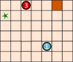
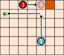
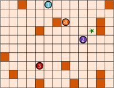

## Body
I Go-Bot sono robot molto semplici. Si muovono su una tavola con delle caselle.

Per controllarli, bisogna prima selezionare uno dei go-bot.
Quindi si invia il Go-bot in una direzione con un comando a freccia:
su ![arrow-up], giù ![arrow-down], sinistra ![arrow-left] e destra ![arrow-right].
Il Go-Bot procede ostinatamente dritto finché non arriva direttamente davanti a un ostacolo ![quadrato] o a un altro robot.
Rimane lì finché non riceve un nuovo commando.

Con un'abile sequenza di comandi si deve fare in modo che il Go-Bot ![robot1] raggiunga l'obiettivo ![stella] e che si fermi esattamente lì.

[arrow-up]: graphics/2023-CZ-01-arrow-up.svg "Fraccia su"
[arrow-down]: graphics/2023-CZ-01-arrow-down.svg "Freccia giù"
[arrow-left]: graphics/2023-CZ-01-arrow-left.svg "Freccia sinistra"
[arrow-right]: graphics/2023-CZ-01-arrow-right.svg "Freccia destra"
[stella]: graphics/2023-CZ-01-star.svg "Stella"
[quadrato]: graphics/2023-CZ-01-square.svg "Ostacolo"

In basso a sinistra c'è una tavola con due Go-Bot.
Con questa sequenza di comandi, il Go-Bot ![robot1] raggiunge l'obiettivo ![stella] - vedi sotto a destra:

:::center
![robot3] ![arrow-right] ![robot1] ![arrow-up] ![robot1] ![arrow-left] 
 
[robot1]: graphics/2023-CZ-01-robot1.svg "Go-Bot 1"
[robot2]: graphics/2023-CZ-01-robot2.svg "Go-Bot 2"
[robot3]: graphics/2023-CZ-01-robot3.svg "Go-Bot 3"
[robot4]: graphics/2023-CZ-01-robot4.svg "Go-Bot 4"

 
:::

## Question/Challenge - for the brochures

Crea una sequenza di comandi con quattro frecce che il Go-Bot ![robot1] utilizza per raggiungere l'obiettivo ![stella]!

:::center

:::

 
## Question/Challenge - for the online challenge

Crea una sequenza di comandi con quattro frecce che il Go-Bot ![robot1] utilizza per raggiungere l'obiettivo ![stella]!

 
 
 
## Interactivity instruction - for the online challenge

Trascina alternando un Go-Bot e una freccia sulle caselle grigie. Al termine, fai clic su "Salva risposta".

## Answer Options/Interactivity Description

Die Bot-Symbole und die Pfeile können auf die Felder gezogen werden.  Es gibt 8 Felder (die richtige Antwort besteht aus 8 Symbolen.)  Man könnte dafür sorgen, dass auf ungerade Felder nur Bot-Symbole und auf gerade Felder nur Pfeile gezogen werden dürfen; das ist aber nicht zwingend.  Bot-Symbole und Pfeile müssen mehrfach verwendbar sein.  Bot-Symbole, Pfeile und Felder sind oberhalb des Spielbretts zu sehen.

## Answer Explanation

La risposta corretta:
![robot3] ![arrow-up] ![robot2] ![arrow-left] ![robot1] ![arrow-down] ![robot1] ![arrow-right] 
 
Affinché il Go-Bot ![robot1] raggiunga l'obiettivo attraverso una sequenza di comandi con quattro frecce, i tre Go-Bot devono cooperare.
Prima ![robot3] sale fino a fermarsi davanti a un ostacolo.
Così diventa un ostacolo per ![robot2] nel suo percorso verso sinistra.
Se ora si invia ![robot1] verso il basso, esso raggiunge ![robot2] e da lì può andare a destra,
dove si ferma prima dell'ostacolo - sulla stella.

 
 
Come trovare la giusta sequenza di comandi?  Si può partire dal fondo e pensare a quale deve essere l'ultimo movimento del Go-Bot ![robot1] verso l'obiettivo. Ci sono solo due possibilità: 

a) Viene da sinistra, come nella nostra soluzione.  
b) Viene dall'alto. In questo caso, il Go-Bot ![robot4] dovrebbe essere spostato verso l'alto a destra con tre comandi per fungere da ostacolo per ![robot1]. Avremmo quindi bisogno di $3 + 2 = 5$ comandi. 

Ma stiamo cercando una sequenza con quattro comandi. Quindi la possibilità a) deve essere corretta, in quanto il Go-Bot ![robot1] arriva alla stella da sinistra. Quindi il penultimo movimento del Go-Bot ![robot1] è dall'alto verso il basso. Affinché si fermi nel punto giusto, i robot ![robot2] e ![robot3] devono essere spostati prima come nell'immagine.

## This is Informatics

In questo compito, diversi robot hanno lavorato insieme per raggiungere un obiettivo. Avevano compiti diversi. Il robot blu doveva raggiungere l'obiettivo e gli altri fungevano da ostacoli.

La distribuzione dei compiti è un aspetto importante della robotica. Ad esempio, in un magazzino automatizzato, diversi robot lavorano insieme per immagazzinare, prelevare e trasportare le merci. Tutte le attività sono coordinate in modo da ridurre al minimo i tempi morti inutili, da ridurre al minimo i percorsi di trasporto, da consumare poca energia e da far funzionare il magazzino nel modo più efficiente possibile.

I robot sciame sono un settore speciale della robotica. Si tratta, come i Go-Bot, di macchine semplici che lavorano insieme in un grande gruppo per risolvere un compito. In agricoltura, gli sciami di robot possono ora effettuare la semina del mais, osservare lo sviluppo delle piante e le condizioni del terreno e, infine, raccogliere il grano. Ogni robot dello sciame è piccolo e progettato in modo semplice, ma lo sciame nel suo insieme può fare grandi cose. Questo principio si applica anche ai sistemi multi-agente: Si tratta di semplici unità software che possono lavorare insieme per risolvere problemi complessi. Il compito dell'informatica è quello di sviluppare algoritmi per il coordinamento e la cooperazione ottimali di sistemi complessivi con più attori, siano essi hardware o software.

## This is Computational Thinking

Dieser Abschnitt wird in diesem Jahr nicht bearbeitet.

## Informatics Keywords and Websites

- Robotica degli sciami: https://it.wikipedia.org/wiki/Robotica_degli_sciami
- Robot industriali: https://it.wikipedia.org/wiki/Robot_industriale
- Sistema multiagente: https://it.wikipedia.org/wiki/Sistema_multiagente

## Computational Thinking Keywords and Websites

Dieser Abschnitt wird in diesem Jahr nicht bearbeitet.

## Wording and Phrases

- _Go-Bot_
- _Spielfeld_
- _Befehl_
- _Robot, bump, obstacle, direction, board, stop, combine_

## Comments

_Jiří Vaníček, author, after pre-review_:
Text in the task body was corrected (especially the word "step" changed to "movement"). Graphics were improved (description of arrows in explanation figures 3 and 4 showing the order of movements when more than 1 robot moves). Added a text with another explanatory figure, describing the strategy to get the correct solution. A proof was also added as to why it is impossible to solve the problem in fewer moves than the correct solution offers. I tried to improve IT/CT parts too and thanks for additional ideas.

_Mao (maoyong@itccc.org.cn) – Koleszar (vkoleszar@ceilbal.edu.uy) – Workshop group 5, 2023/05/16_:
Rephrased the body to conclude the rules of the game into 4 bullet points. Rephrased the explanation part to clarify the solution and the way to find the solution. Added a paragraph into TiI section, which explains the complexity of this collaborative optimization task. Added a TiCT section. Changed the keywords.

_Michael Weigend, mw@creative-informatics.de, 2023-07-03_:
Translation to German.
Änderungen:
1) Aufgabe wurde stark gekürzt. Insbesondere gibt es jetzt keine Gliederungspunkte mit Regeln mehr. Das ist m.E. für die sehr einfache Arbeitsweise der Roboter nicht notwendig.
2) Der Robotertyp hat einen Namen bekommen "Go-Bot". M.E. verbessert das die Lesbarkeit.
3) Entsprechend der DACHHU-Besprechung wurde die Frage abgewandelt. Man muss jetzt nicht mehr nach der kürzesten Befehlsfolge suchen, sondern die Anzahl der notwendigen Befehle (4) wurde vorgegeben. Man muss jetzt angeben, welche Roboter an der Lösung der Aufgabe beteiligt sind.
4) Die Erklärung der richtigen Lösung wurde stark gekürzt.
5) "Das ist Informatik" wurde völlig überarbeitet. Der Aspekt der kollaborativen Roboter (Cobots) wurde entfernt, weil das m.E. nicht zur Aufgabe passt. Bei kollaborativen Robotik geht es um das gemeinsame Arbeiten von Robotern und Menschen. Hier stehen Aspekte wie Mensch-Maschine-Interaktion und Sicherheit im Vordergrund. Dagegen passt die Aufgabe besser zu Schwarmrobotik. Darauf hebt die neue Version dieses Abschnitts jetzt ab.
