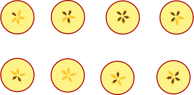
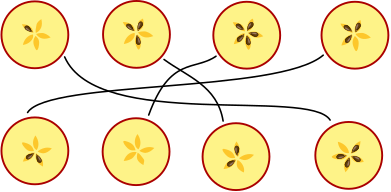
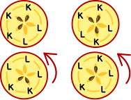

## Body

Äpfel kann man in eine obere und untere Hälfte teilen.
Einige Apfelkerne bleiben in der oberen Hälfte, die anderen in der unteren Hälfte.
An den Löchern und Kernen sieht man, dass die Hälften zusammen passen:

Das macht man in Tschechien zu Weihnachten. Gala halbiert vier Äpfel.
Sie legt die oberen Hälften und die unteren Hälften in zwei Reihen.

## Question/Challenge - for the brochures

Welche Apfelhälften passen zusammen? Ordne die Apfelhälften einander zu.

## Question/Challenge - for the online challenge

Welche Apfelhälften passen zusammen?

[interactive]

## Interactivity instruction - for the online challenge

Ziehe Linien zwischen den Apfelhälften, die zusammen passen. Wenn du fertig bist, klicke auf "Antwort speichern".

## Answer Options/Interactivity Description
4 apple slices are draggables in 4 containers. The draggables can be dropped in the fields with question mark.

## Answer Explanation

So ist es richtig:

Jeder Apfel hat 5 Apfelkerne. Zwei zueinander passende Apfelhälften müssen also insgesamt 5 Kerne haben. Diese Hälften können damit einfach zugeordnet werden:

Die übrigen vier Hälften sind nicht so einfach zuzuordnen. Die beiden oberen Hälften haben jeweils 3 Kerne, die beiden unteren Hälften haben jeweils 2 Kerne.  Deshalb schauen wir uns die Muster der Apfelkerne genauer an.  Denn wenn zwei Hälften zusammen passen, passen auch die Muster zusammen.  Um das zu sehen, kann es aber nötig sein, die Hälften zu drehen.  Dann lassen sich die Hälften so zuordnen wie unten im Bild:  Links hat die obere Hälfte drei Kerne direkt hintereinander und danach zwei Löcher (K-K-K-L-L), die untere Hälfte hat drei Löcher direkt hintereinander und danach zwei Kerne (L-L-L-K-K): die Hälften passen zusammen.  Auch die rechten Hälften passen zusammen:  Das Muster der oberen Hälfte lautet K-L-K-L-K, das Muster der unteren Hälfte L-K-L-K-L.

## This is Informatics

Bei der Erklärung der richtigen Antwort haben wir gesehen:  Wenn zwei Hälften zusammen passen, passen nicht nur die Anzahlen der Kerne zusammen, sondern auch die Reihenfolgen der Kerne und Löcher (also der leeren Kernfächer).  Für die richtige Zuordnung der Hälften muss man also auch diese Reihenfolgen betrachten.  Es genügt nicht zu wissen, wie viel Kerne in jeder Hälfte sind.

Bei Problemen, die mit Hilfe von Computerprogrammen gelöst werden sollen, stellen sich ähnliche Fragen. Informatikerinnen und Informatiker müssen sich Gedanken machen, wie die Informationen, die das Programm berücksichtigen soll, als Daten beschrieben werden.  Dabei wird oft versucht, es so einfach wie möglich zu machen.  Einfache Programme sind nämlich weniger anfällig für Fehler.  Beim Apfelhälften-Problem in dieser Biberaufgabe schien es zunächst ausreichend zu sein, die Hälften allein durch die Anzahl der Kerne zu beschreiben.  Doch dann wurde klar, dass das nicht in allen Fällen genügt.  Zur Beschreibung der Apfelhälften in einem Computerprogramm muss es also möglich sein, eine Reihenfolge zu beschreiben.  Das geht zum Beispiel mit Hilfe der Datenstruktur _Liste_, die in den meisten Programmiersprachen zur Verfügung steht.

## This is Computational Thinking

--

## Informatics Keywords and Websites

- Reihenfolge
- Liste: https://de.wikipedia.org/wiki/Liste_(Datenstruktur)

## Computational Thinking Keywords and Websites

--

## Wording and Phrases
 
 - _halbieren_: in zwei Hälften schneiden
 - _Kerngehäuse_: der innere Teil des Apfels, in dem die Kerne enthalten sind
 - _Apfel(hälfte)_: Hälfte eines Apfels
 - _Apfelkern_: Samen eines Apfels
 - _Kernfächer_: die einzelnen Fächer innerhalb des Kerngehäuses, in dem die Apfelkerne enthalten sind
 - _Ziffern bzw. Zahlwörter_: für die Anzahl Kerne in der Erläuterung Ziffern, für die Anzahl Hälften ein Zahlwort. 

## Comments

_Susanne, 2023-08-21_: Sprache vereinfacht, Graphiken angepasst 

_Name, Datum_: Kommentar 2

 * We don't delete the original english version of the task for making possible to look up the older comments.