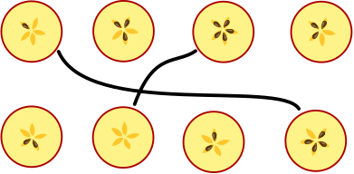

## Body

On peut partager des pommes en deux, ce qui donne la moitié du bas et la moitié du haut. Certains pépins de pomme restent dans la moitié du haut, les autres dans la moitié du bas. On peut voir que les moitiés vont ensemble en regardant les pépins et les trous: 

On fait cela pour Noël en Tchéquie. Gala partage quatre pommes. Elle arrange les moitiés du haut et celles du bas en deux rangées.

## Question/Challenge - for the brochures

Quelles moitiés de pommes vont ensemble? Relie les moitiés de pommes.

## Question/Challenge - for the online challenge

Quelles moitiés de pommes vont ensemble?

[interactive]

## Interactivity instruction - for the online challenge

Tire des lignes entre les moitiés de pommes qui vont ensemble. Quand tu as fini, clique sur "Enregistrer la réponse".

## Answer Options/Interactivity Description
4 apple slices are draggables in 4 containers. The draggables can be dropped in the fields with question mark.

## Answer Explanation

Voici la bonne réponse:

Chaque pomme a cinq pépins. Deux moitiés de pomme allant ensemble doivent donc avoir cinq pépins en tout. Ces moitiés peuvent donc facilement être reliées:

Les quatre moitiés restantes ne sont pas si faciles à relier. Les deux moitiés du haut ont trois pépins chacune, les deux moitiés du bas deux pépins chacune. Il faut donc regarder le motif formé par les pépins plus exactement, car si deux moitiés vont ensemble, leurs motifs vont aussi ensemble. Pour vérifier cela, il peut être nécessaire de tourner les moitiés de pomme. Les moitiés de pommes peuvent ensuite être reliées comme sur l'image ci-dessous: à gauche, la moitié du haut a trois pépins côte à côte, puis deux trous (P-P-P-T-T), la moitié du bas a trois trous côte à côte, puis deux pépins (T-T-T-P-P): les moitiés vont ensemble. Les moitiés de droite vont également ensemble: la moitié du haut a le motif P-T-P-T-P (en commençant en haut au centre), et celle du bas T-P-T-P-T.

## This is Informatics

On a vu dans l'explication de la réponse que si deux moitiés de pomme vont ensemble, il n'y a pas que le nombre de pépins qui correspond, mais aussi l'ordre des pépins et des trous. Il faut donc également considérer cet ordre lors de l'attribution des moitiés de pomme. Il ne suffit pas de savoir combien de pépins a chaque moitié.

Des questions semblables sont présentes dans des problèmes qui doivent être résolus à l'aide d'ordinateurs. Les informaticiennes et informaticiens doivent réfléchir à la manière dont les informations que le programme doit considérer sont décrites. On essaie en général de faire aussi simple que possible: les programmes simples ont moins de risque de contenir des erreurs. Pour le problème des moitiés de pomme, il semblait d'abord suffisant de décrire les moitiés uniquement à l'aide du nombre de pépins. Ensuite, on a vu que ce n'était pas suffisant dans toutes les situations. Il faut donc pouvoir décrire un ordre afin de pouvoir décrire les moitiés de pomme dans un programme informatique. C'est possible à l'aide de la structure de données appelée _liste_, par exemple, qui existe dans la plupart des langages de programmation.

## This is Computational Thinking

--

## Informatics Keywords and Websites

- Ordre
- Liste: https://fr.wikipedia.org/wiki/Liste_(informatique)

## Computational Thinking Keywords and Websites

--

## Wording and Phrases
 
 - _halbieren_: in zwei Hälften schneiden
 - _Kerngehäuse_: der innere Teil des Apfels, in dem die Kerne enthalten sind
 - _Apfel(hälfte)_: Hälfte eines Apfels
 - _Apfelkern_: Samen eines Apfels
 - _Kernfächer_: die einzelnen Fächer innerhalb des Kerngehäuses, in dem die Apfelkerne enthalten sind
 - _Ziffern bzw. Zahlwörter_: für die Anzahl Kerne in der Erläuterung Ziffern, für die Anzahl Hälften ein Zahlwort. 

## Comments

_Susanne, 2023-08-21_: Sprache vereinfacht, Graphiken angepasst 

_Name, Datum_: Kommentar 2

 * We don't delete the original english version of the task for making possible to look up the older comments.