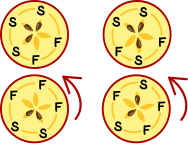

## Body

Le mele possono essere divise in metà superiore e inferiore.
Alcuni torsoli di mela rimangono nella metà superiore, gli altri in quella inferiore.
Dai fori e dai torsoli della mela si vede che le metà si incastrano:

 
 
Questo è quello che fanno nella Repubblica Ceca a Natale. Gala taglia a metà quattro mele.
Mette le metà superiori e quelle inferiori in due file.

## Question/Challenge - for the brochures

Quali metà di mele stanno bene insieme? Abbina le metà della mela l'una all'altra.

 
 

## Question/Challenge - for the online challenge

Quali metà di mele vanno insieme?

[interattivo]

## Interactivity instruction - for the online challenge

Traccia delle linee tra le metà della mela che si incastrino tra loro. Al termine, fa clic su "Salva risposta".

## Answer Options/Interactivity Description
4 apple slices are draggables in 4 containers. The draggables can be dropped in the fields with question mark.

## Answer Explanation

La risposta corretta:

 
 
Ogni mela ha 5 torsoli. Due metà di mele uguali devono avere un totale di 5 torsoli. Queste metà possono quindi essere facilmente abbinate:

 
 
Le altre quattro metà non sono così facili da assegnare. Le due metà superiori hanno 3 torsoli ciascuna, mentre le due metà inferiori hanno 2 torsoli ciascuna. Pertanto, osserviamo più da vicino i modelli dei torsoli delle mele.  Perché quando due metà si uniscono, anche i modelli si uniscono. Per vedere questo, tuttavia, potrebbe essere necessario girare le metà.  A questo punto le metà possono essere disposte come mostrato nell'immagine seguente: a sinistra, la metà superiore ha tre semi direttamente uno dietro l'altro e poi due fori (S-S-S-F-F), la metà inferiore ha tre fori direttamente uno dietro l'altro e poi due semi (F-F-F-S-S): le metà si incastrano. Anche le metà destre si incastrano tra loro: lo schema della metà superiore è (se si parte dall'alto al centro) S-F-S-F-S, quello della metà inferiore è F-S-F-S-F.

 
 
## This is Informatics

Nella spiegazione della risposta corretta, abbiamo visto che se due metà combaciano, non solo i numeri dei semi combaciano, ma anche le sequenze dei semi e dei fori (cioè i compartimenti vuoti del torsolo). Per un corretto abbinamento delle metà, occorre quindi considerare anche queste sequenze. Non è sufficiente sapere quanti semi ci sono in ogni metà.

Domande simili sorgono per i problemi che devono essere risolti con l'aiuto di programmi informatici. Gli informatici devono pensare a come descrivere le informazioni che il programma deve prendere in considerazione come dati. Spesso gli informatici cercando di semplificare questo "modello" il più possibile.  Dopotutto, i programmi semplici sono meno soggetti a errori. Nel caso del problema delle metà della mela in questo compito, inizialmente sembrava sufficiente descrivere le metà con il solo numero di semi. In seguito si è capito che questo non è sufficiente in tutti i casi. Per descrivere le metà della mela in un programma per computer, deve essere possibile descrivere un ordine. Questo può essere fatto, ad esempio, con l'aiuto della struttura dati _lista_, disponibile nella maggior parte dei linguaggi di programmazione.

## This is Computational Thinking

--

## Informatics Keywords and Websites

- Ordine
- Lista: https://it.wikipedia.org/wiki/Lista_concatenata

## Computational Thinking Keywords and Websites

--

## Wording and Phrases
 
 - _halbieren_: in zwei Hälften schneiden
 - _Kerngehäuse_: der innere Teil des Apfels, in dem die Kerne enthalten sind
 - _Apfel(hälfte)_: Hälfte eines Apfels
 - _Apfelkern_: Samen eines Apfels
 - _Kernfächer_: die einzelnen Fächer innerhalb des Kerngehäuses, in dem die Apfelkerne enthalten sind
 - _Ziffern bzw. Zahlwörter_: für die Anzahl Kerne in der Erläuterung Ziffern, für die Anzahl Hälften ein Zahlwort. 

## Comments

_Susanne, 2023-08-21_: Sprache vereinfacht, Graphiken angepasst 

_Name, Datum_: Kommentar 2

 * We don't delete the original english version of the task for making possible to look up the older comments.
