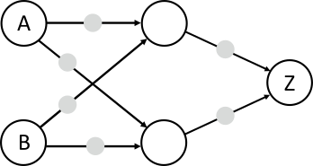
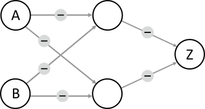

## Body

Anna und Ben wollen einen "Konflikt-Detektor" bauen, der anzeigt, ob sie eine unterschiedliche Meinung haben.

Sie verwenden Einheiten, die in zwei Zuständen sein können: Ja und Nein. Zwei Einheiten können mit einem Kabel verbunden werden.

Wenn eine Einheit im 
- Zustand Ja ist, sendet sie über alle ausgehenden Kabel ein Signal.
- Zustand Nein ist, sendet sie kein Signal.

Die Kabel werden so eingestellt, dass sie ein Signal als positives (+) oder negatives (–) Signal an die rechts angeschlossene Einheit übermitteln.

Eine angeschlossene Einheit geht in den Zustand Ja, wenn sie mehr positive als negative Signale empfängt, und sonst in den Zustand Nein. Als Eingabe setzt Anna den Zustand der Einheit A und Ben den Zustand der Einheit B.

| --------------------- | -------------------------------------------------------- |
| Zuerst bauen Anna und | Sie bemerken, dass die Einheit Z nur dann Ja ist, wenn A |
| Ben diese Maschine:   | Ja und B Nein ist. Das ist nicht das, was sie wollen.    |
| ![example]            | ![example_explanation]                                   |
 
[example]: graphics/graphics-new/2023-DE-01-example_compatible.svg "Bespiel (100px)"
[example_explanation]: graphics/graphics-new/-deu/2023-DE-01-example_explanation_compatible-deu.svg "Erläuterung (480px)"

Dann bauen Anna und Ben eine grössere Maschine (unten im Bild) und sind sicher, dass sie der Konflikt-Detektor sein kann: Z soll nur dann Ja sein, wenn A und B in unterschiedlichen Zuständen sind (Ja und Nein bzw. Nein und Ja). Ansonsten soll Z im Zustand Nein sein. Jetzt müssen nur noch die Kabel richtig eingestellt werden.

## Question/Challenge - for the brochures

Stelle für jedes Kabel ein, ob es ein Signal positiv (+) oder negativ (–) übermittelt, damit der Konflikt-Detektor korrekt arbeitet. 

## Question/Challenge - for the online challenge

Stelle für jedes Kabel ein, ob es ein Signal positiv (+) oder negativ (–) übermittelt, damit der Konflikt-Detektor korrekt arbeitet.

## Interactivity instruction - for the online challenge

Klicke auf die Signalkabel, um + und – zu ändern. Wenn du fertig bist, klicke auf "Antwort speichern".

## Answer Options/Interactivity Description

In the picture of the network, each edge has a marker that can take values "+" and "–". Clicking on the edge or the marker toggles between the two values. Initially, all edges have an empty grey box.  (DACH: We decided to have the markers preset to –.)

## Answer Explanation

Diese beiden Antworten sind richtig:

:::center
") ")
:::

Im Konflikt-Detektor muss die Ausgabe-Einheit genau bei zwei unterschiedlichen Eingaben (A=Ja und B=Nein sowie A=Nein und B=Ja) auf Ja sein. Z kann nur Ja sein, wenn über die zwei eingehenden Kabel mehr positive als negative Signale ankommen.  Mindestens eines der Kabel muss also ein positives Signal (+) übermitteln.  Nehmen wir einmal an, nur das obere Kabel, das zu Z führt, wird auf + gestellt. Dann muss die Einheit oben Mitte beide gewünschten Eingabekombinationen erkennen können, also in beiden Fällen Ja sein.  Zusammen mit den Eingabeeinheiten A und B bildet diese Einheit aber genau so eine Maschine, wie Anna und Ben sie zu Beginn gebaut haben.  Sie kann nur in genau einem der gewünschten Fälle Ja sein, und zwar, wenn eines ihrer Kabel auf + und das andere auf – gestellt wird:

")

Es wird also für jeden der gewünschten Eingabefälle eine eigene Einheit in der Mitte benötigt, eine für A=Ja und B=Nein, die andere für A=Nein und B=Ja.  Die Kabel zur ersten Einheit müssen auf + (Kabel von A) und – (B) gestellt werden, die Kabel zur anderen Einheit auf – (A) und + (B).  Welche Einheit in der Mitte welchen Fall übernimmt, ist egal; deshalb gibt es bei den Kabeln von A und B zur Mitte zwei Möglichkeiten.  Wenn nun jede Einheit in der Mitte in genau einem gewünschten Fall Ja ist, müssen beide Kabel von der Mitte zu Z auf + gestellt werden; nur dann ist Z=Ja in genau beiden gewünschten Fällen.

Für die erste richtige Antwort zeigt das Bild unten die Funktion des Konflikt-Detektors. Man sieht: Die obere Einheit in der Mitte erkennt den Fall A=Ja und B=Nein, die untere den Fall A=Nein und B=Ja. Die jeweilige Einheit sendet ein positives Signal zu Z, und Z ist Ja. Für die anderen Eingaben (A=Ja und B=Ja sowie A=Nein und B=Nein) sind beide mittleren Einheiten Nein, Z empfängt kein positives Signal und ist damit auch Nein.

:::center
") ") 

") ")
:::

## This is Informatics

Der Konflikt-Detektor verarbeitet zwei Eingabewerte (Ja oder Nein) und liefert die Ausgabe Ja genau dann, wenn die beiden Eingabewerte unterschiedlich sind. Diese logische Funktion nennt man Exklusiv-Oder (XOR, Kontravalenz). Die erste in dieser Biberaufgabe beschriebene Maschine von Anna und Ben (zwei Schalter und eine Ausgabe-Einheit) ist eine vereinfachte Version eines _Perzeptrons_, das Frank Rosenblatt im Jahr 1957 beschrieben hat. Die Ausgabe-Einheit bildet eine Nervenzelle (Neuron) nach, die Eingabesignale verarbeiten kann und ein Ausgabesignal erzeugt. Mit einem Perzeptron kann man zwar die logischen Operationen Und und Oder implementieren, nicht aber das Exklusiv-Oder. Dazu benötigt man eine weitere Schicht von Schalteinheiten wie in der Lösung dieser Aufgabe. Erst in den 1980er Jahren hat man das erkannt (z.B. Rumelhart, Hinton & Williams 1986) und war dann (später) in der Lage, künstliche neuronale Netze zu programmieren, die ähnlich wie das menschliche Gehirn arbeiten und z. B. Kamerabilder auswerten und Objekte erkennen können.  Die Informatik hat Methoden entwickelt, wie grosse neuronale Netze mit vielen Schichten und Einheiten ihre Berechnungen effizient durchführen können.  Solche Netze bilden die Grundlage vieler aktueller KI-Systeme.

## This is Computational Thinking

Dieser Abschnitt wird in diesem Jahr nicht bearbeitet.

## Informatics Keywords and Websites

- Rumelhart, D. E., Hinton, G. E., & Williams, R. J. (1986). Learning representations by back-propagating errors. Nature, 323(6088), 533-536 : http://www.cs.toronto.edu/~hinton/absps/naturebp.pdf
- Perzeptron, Überblick: https://de.wikipedia.org/wiki/Perzeptron
- Tutorial zur Programmierung eines Perzeptrons: https://neuromant.de/2018/11/25/Tutorial_Das-Perzeptron/
- Exklusive-Oder (Kontravalenz): https://de.wikipedia.org/wiki/Kontravalenz 

## Computational Thinking Keywords and Websites

Dieser Abschnitt wird in diesem Jahr nicht bearbeitet.

## Wording and Phrases

- _Konflikt-Detektor_: Ein relativ kurzer Begriff, der beschreibt, was die Maschine leisten soll.
- _Einheit_: Schalteinheit, die in den Zuständen Ja und Nein sein kann.
- _Kabel_: Verbindung zwischen zwei Einheiten, kann positive oder negative Signale senden
- _Signal_
- _positiv, negativ_
- _Exklusiv-Oder_ (dieser Begriff wird in der Wikipedia benutzt, Alternative: exklusives Oder, Kontravalenz)

## Comments

_Margareta Schlüter, 2023-05-04_:  Addressing reviewer comment that the text was too long. It might be hard to fully understand and solve the task within the limited time.", "Text is too long. It needs to be shortened in some ways."): This task introduces the concept of an artificial neural net-work from scratch. Although the system in this task is strongly simplified, it still requires a few sen-tences to explain (a network of units, the behavior of a single unit, input and output). Shortening the text would involve condensing the information to a degree that it is hard to understand, or deleting additional bits like the example network, that were included to support understanding. Either way, I believe that shortening the text makes the task harder to understand, and is therefore counterpro-ductive. One element that could be removed from the text without any further change is the lamp, whose only function is to return from the abstract system to the story.

_Margareta Schlüter, 2023-05-04_: Addressing reviewer comment "The text could be clearer. Did they build a machine that contained the network on the second image?  Is the challenge to have Z = Yes?": The last paragraph of the body was slightly adapted to make it clearer that the disagreement detector they built has the architecture of the second image. The pa-renthesis in the first paragraph of the body was added to make clearer what the challenge is and guide understanding of the second paragraph (however, this makes the text even a little longer, op-posing the reviewer comments mentioned above).

_Margareta Schlüter, 2023-05-04_: Addressing reviewer comment "Without simulation I think it is even hard for the oldest age group.": The two other reviewers and the German team agreed with the chosen age group. The thought was that there is only a low number of meaningful combinations (because there are only two binary inputs to each individual unit, and only three processing units). However, given that even understanding the working principle of the neural network is complex, I could imagine rating it one level harder for both age groups.

_Margareta Schlüter, 2023-05-04_: Addressing reviewer comment "[TiI] Even though this task contains the concept of multilayer perceptron, it is necessary to explain the XOR operator as well.": A paragraph about XOR as a logical operator was added to the TiI sec-tion, along with minor changes to the existing paragraph about artificial neural networks.

_Margareta Schlüter, 2023-05-05_: Addressing reviewer comment that definitions should be added to the Words and Phrases section: Definitions were added for all words in the list.

_Taina Lehtimäki (Working group O2), taina@cs.nuim.ie, 2023-05-16_: We were delighted to work with this task, it's difficult topic to tackle in a Bebras task, but the author has done it really well. We agree with the task author that in this task longer text is justified. We changed the age rating to 16-19 hard. 
  We clarified the task text in response to the reviewers comments. Main change was to change the description of the signal wires so that there are two different types (positive and negative) to make the concept easier to understand. We changed the Question to match the new task text. We changed the graphics: added switch for the input units and light bulb on the output unit to make it clear how the units are different from each other. We added examples of how the Starter Machine works with the four possible input combinations. Answer explanation section: we added a figure which shows the states for each of the four input possibilities for both correct solutions. We updated the Informatics and Computational Thinking sections.

_Michael Weigend, mw@creative-informatics.de, Christian Datzko, christian@bebras.services 2023-07-21_: Übersetzung ins Deutsche. Die Aufgabenstellung und die zugehörige Grafik wurden (in Ab-weichung von der Version des internationalen Bebras Task Workshop) auf der Basis der ursprüngli-chen Version der Autorin erstellt. (Die Version des IBTW enthielt eine sehr lange und schwer ver-ständliche Aufgabenformulierung und viel zu komplexe Grafiken mit Schaltern und Lampen)
Für die Erklärung der richtigen Lösung gibt es zwei Versionen.

In Version 1 werden die beiden richtigen Lösungen erklärt. Anschliessend wird kurz erklärt, dass man durch Überprüfen aller Kombinationsmöglichkeiten nachweisen kann, dass dies die einzigen Lösun-gen sind.

Version 2 (von Christian Datzko) ist ein Beweis, dass  es genau zwei Lösungen gibt.
Der Abschnitt "Das ist Informatik" wurde überarbeitet und auch gekürzt. Die Erklärung der logischen Operationen beschränkt sich auf XOR.

