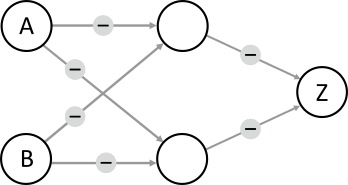

## Body

Anna et Ben veulent construire un "détecteur de conflit" qui indique s'ils sont d'avis différents. 

Pour cela, ils utilisent des éléments qui peuvent être dans deux états: Oui ou Non. Deux éléments peuvent être reliés par un câble.

Lorsqu'un élément est
 - dans l'état Oui: il transmet un signal par tous ses câbles sortants;
 - dans l'état Non: il ne transmet aucun signal.
 
On peut régler chaque câble pour qu'un signal transmis devienne positif (+) ou négatif (–) pour l'élément de droite auquel il est relié. Un élément qui reçoit des signaux passe à l'état Oui s'il reçoit plus de signaux positifs que de signaux négatifs, et reste à l'état Non sinon.

Anna fixe l'état de l'élément A et Ben l'état de l'élément B; ce sont les entrées du détecteur.

| -------------------------- | ----------------------------------------------------------------------------- |
| Anna et Ben  | Ils remarquent que l'élément Z n'est dans l'état Oui |
| commencent par  | que lorsque A est dans l'état Oui et B est dans l'état Non.|
| construire cette machine: | Ce n'est pas ce qu'ils veulent.     |
| ![example]                 | ![example_explanation]                                                        |
 
[example]: graphics/graphics-new/2023-DE-01-example_compatible.svg "Exemple (100px)"
[example_explanation]: graphics/graphics-new/-fra/2023-DE-01-example_explanation-compatible-fra.svg "Explication (480px)"

 Anna et Ben construisent alors une plus grande machine (image ci-dessous) et sont sûrs qu'elle peut être un détecteur de conflit: l'état de Z ne doit être Oui que lorsque les état de A et B sont différents (Oui et Non ou Non et Oui). Sinon, Z doit être dans l'état Non. Il ne reste plus qu'à régler les câbles correctement.

## Question/Challenge - for the brochures

Règle le type de signal, positif ou négatif, transmis par chaque câble afin que le détecteur de conflit fonctionne correctement.

## Question/Challenge - for the online challenge

Règle le type de signal, positif ou négatif, transmis par chaque câble afin que le détecteur de conflit fonctionne correctement.

## Interactivity instruction - for the online challenge

Clique sur un câble pour changer le type de signal entre positif (+) et négatif (-). Quand tu as fini, clique sur "Enregistrer la réponse".

## Answer Options/Interactivity Description

In the picture of the network, each edge has a marker that can take values "+" and "–". Clicking on the edge or the marker toggles between the two values. Initially, all edges have an empty grey box.  (DACH: We decided to have the markers preset to –.)

## Answer Explanation

Les deux réponses suivantes sont justes:

:::center
") ")
:::

L'élement de sortie Z du détecteur de conflit doit être dans l'état Oui seulement en présence de deux entrées différentes (A = Oui et B = Non ainsi que A = Non et B = Oui). Z ne peut être en l'état Oui que s'il reçoit plus de signaux positifs que négatifs par ses deux câbles entrant. Au moins un des câbles doit donc transmettre un signal positif (+). Imaginons que seul le câble du haut menant à Z soit réglé sur +. L'élément en haut au centre doit alors pouvoir reconnaître les deux combinaisons d'entrées en conflit, donc être en l'état Oui dans les deux cas. Mais cet élément forme, avec les deux éléments d'entrée A et B, exactement la machine qu'Anna et Ben avait construite au début. Cet élément ne peut donc être en l'état Oui que dans un des deux cas de conflit, et l'un des câbles doit être réglé sur + et l'autre sur – pour cela:

")

Il faut donc un élément central pour chacun des cas de conflit, un pour A = Oui et B = Non et un pour A = Non et B = Oui. Les câbles entrant dans le premier élément doivent être réglés sur + (câble sortant de A) et – (câble sortant de B), les câbles entrant dans l'autre élément sur – (A) et + (B). Lequel des deux éléments centraux réagit à quel cas n'a pas d'importance, c'est pour cela qu'il y a deux possibilités de régler les câbles allant de A et B au milieu. Comme chaque élément central est dans l'état Oui dans exactement un des deux cas de conflit, les deux câbles sortant du milieu et entrant en Z doivent être réglés sur + afin que Z soit dans l'état Oui exactement dans ces deux cas.

L'image ci-dessous montre le fonctionnement du détecteur de conflit pour la première bonne réponse. On voit que l'élément du haut au milieu reconnaît le cas A = Oui et B = Non et celui du bas le cas A = Non et B = Oui. L'élement reconnaissant le conflit transmet un signal positif à Z, et Z passe donc en l'état Oui. Pour les autres entrées (A = Oui et B = Oui ainsi que A = Non et B = Non), les deux éléments du milieu sont en l'état Non, Z ne reçoit donc pas de signal positif et passe en l'état Non.

:::center
") ") 

") ")
:::

## This is Informatics

Le détecteur de conflit traite deux valeurs d'entrée (Oui et Non) et retourne la sortie Oui lorsque les deux valeurs d'entrée sont différentes. Cette fonction logique s'appelle un OU exclusif (XOR, disjonction). La première machine d'Anna et Ben décrite dans cet exercice est une version simplifiée d'un _perceptron_ comme décrit par Frank Rosenblatt en 1957. L'élément de sortie simule une cellule nerveuse (un neurone) qui peut traiter des signaux d'entrée et générer un signal de sortie. On peut implémenter les fonctions logiques ET et OU à l'aide d'un perceptron, mais pas le OU exclusif. Pour cela, une couche d'éléments supplémentaire est nécessaire, comme décrit dans cet exercice. C'est uniquement dans les années 80 que ceci a été découvert (Rumelhart, Hinton & Williams, 1986) et qu'on a par la suite été en mesure de programmer des réseaux de neurones artificiels qui fonctionnent de manière similaire au cerveau humain et sont capables, par exemple, d'analyser des images et d'y reconnaître des objets.
On a développé des méthodes informatiques permettant à de grands réseaux de neurones comprenant beaucoup de couches et d'éléments d'effectuer leurs calculs de manière efficace. Ces réseaux forment la base de beaucoup de systèmes d'intelligence artificielle actuels.

## This is Computational Thinking

Dieser Abschnitt wird in diesem Jahr nicht bearbeitet.

## Informatics Keywords and Websites

- Rumelhart, D. E., Hinton, G. E., & Williams, R. J. (1986). Learning representations by back-propagating errors. Nature, 323(6088), 533-536: http://www.cs.toronto.edu/~hinton/absps/naturebp.pdf
- Perceptron: https://fr.wikipedia.org/wiki/Perceptron
- Fonction OU exclusif: https://fr.wikipedia.org/wiki/Fonction_OU_exclusif

## Computational Thinking Keywords and Websites

Dieser Abschnitt wird in diesem Jahr nicht bearbeitet.

## Wording and Phrases

- _Konflikt-Detektor_: Ein relativ kurzer Begriff, der beschreibt, was die Maschine leisten soll.
- _Einheit_: Schalteinheit, die in den Zuständen Ja und Nein sein kann.
- _Kabel_: Verbindung zwischen zwei Einheiten, kann positive oder negative Signale senden
- _Signal_
- _positiv, negativ_
- _Exklusiv-Oder_ (dieser Begriff wird in der Wikipedia benutzt, Alternative: exklusives Oder, Kontravalenz)

## Comments

_Margareta Schlüter, 2023-05-04_:  Addressing reviewer comment that the text was too long. It might be hard to fully understand and solve the task within the limited time.", "Text is too long. It needs to be shortened in some ways."): This task introduces the concept of an artificial neural net-work from scratch. Although the system in this task is strongly simplified, it still requires a few sen-tences to explain (a network of units, the behavior of a single unit, input and output). Shortening the text would involve condensing the information to a degree that it is hard to understand, or deleting additional bits like the example network, that were included to support understanding. Either way, I believe that shortening the text makes the task harder to understand, and is therefore counterpro-ductive. One element that could be removed from the text without any further change is the lamp, whose only function is to return from the abstract system to the story.

_Margareta Schlüter, 2023-05-04_: Addressing reviewer comment "The text could be clearer. Did they build a machine that contained the network on the second image?  Is the challenge to have Z = Yes?": The last paragraph of the body was slightly adapted to make it clearer that the disagreement detector they built has the architecture of the second image. The pa-renthesis in the first paragraph of the body was added to make clearer what the challenge is and guide understanding of the second paragraph (however, this makes the text even a little longer, op-posing the reviewer comments mentioned above).

_Margareta Schlüter, 2023-05-04_: Addressing reviewer comment "Without simulation I think it is even hard for the oldest age group.": The two other reviewers and the German team agreed with the chosen age group. The thought was that there is only a low number of meaningful combinations (because there are only two binary inputs to each individual unit, and only three processing units). However, given that even understanding the working principle of the neural network is complex, I could imagine rating it one level harder for both age groups.

_Margareta Schlüter, 2023-05-04_: Addressing reviewer comment "[TiI] Even though this task contains the concept of multilayer perceptron, it is necessary to explain the XOR operator as well.": A paragraph about XOR as a logical operator was added to the TiI sec-tion, along with minor changes to the existing paragraph about artificial neural networks.

_Margareta Schlüter, 2023-05-05_: Addressing reviewer comment that definitions should be added to the Words and Phrases section: Definitions were added for all words in the list.

_Taina Lehtimäki (Working group O2), taina@cs.nuim.ie, 2023-05-16_: We were delighted to work with this task, it's difficult topic to tackle in a Bebras task, but the author has done it really well. We agree with the task author that in this task longer text is justified. We changed the age rating to 16-19 hard. 
  We clarified the task text in response to the reviewers comments. Main change was to change the description of the signal wires so that there are two different types (positive and negative) to make the concept easier to understand. We changed the Question to match the new task text. We changed the graphics: added switch for the input units and light bulb on the output unit to make it clear how the units are different from each other. We added examples of how the Starter Machine works with the four possible input combinations. Answer explanation section: we added a figure which shows the states for each of the four input possibilities for both correct solutions. We updated the Informatics and Computational Thinking sections.

_Michael Weigend, mw@creative-informatics.de, Christian Datzko, christian@bebras.services 2023-07-21_: Übersetzung ins Deutsche. Die Aufgabenstellung und die zugehörige Grafik wurden (in Ab-weichung von der Version des internationalen Bebras Task Workshop) auf der Basis der ursprüngli-chen Version der Autorin erstellt. (Die Version des IBTW enthielt eine sehr lange und schwer ver-ständliche Aufgabenformulierung und viel zu komplexe Grafiken mit Schaltern und Lampen)
Für die Erklärung der richtigen Lösung gibt es zwei Versionen.

In Version 1 werden die beiden richtigen Lösungen erklärt. Anschliessend wird kurz erklärt, dass man durch Überprüfen aller Kombinationsmöglichkeiten nachweisen kann, dass dies die einzigen Lösun-gen sind.

Version 2 (von Christian Datzko) ist ein Beweis, dass  es genau zwei Lösungen gibt.
Der Abschnitt "Das ist Informatik" wurde überarbeitet und auch gekürzt. Die Erklärung der logischen Operationen beschränkt sich auf XOR.
