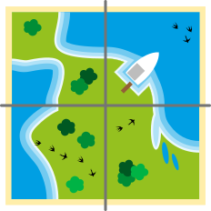

## Body

Edu hat ein neues Spiel. Es besteht aus Kärtchen mit Wasser- und Landflächen.
Mit den Kärtchen kann Edu Landschaften legen. Die Kärtchen müssen _zusammenpassen_: Land an Land. Wasser an Wasser.

:::center

:::

Edu legt zwei Kärtchen und lässt zwei Lücken.

## Question/Challenge - for the brochures

Welche Kärtchen passen in die Lücken?

## Question/Challenge - for the online challenge

Welche Kärtchen passen in die Lücken?

## Interactivity instruction - for the online challenge

Ziehe die passenden Kärtchen in die Lücken. Du kannst die Kärtchen nicht drehen. Klicke auf ein Kärtchen, um es zurückzulegen. Wenn du fertig bist, klicke auf "Antwort speichern".

## Answer Options/Interactivity Description

The tiles are all draggables (not the already placed), the gray spaces are containers. You can drag the tiles into the gray spaces. When clicking the tiles spring back to the first postion.

## Answer Explanation

Das ist die richtige Antwort:

Die beiden Kärtchen passen in die Lücken: Überall liegt Wasser an Wasser und Land an Land. Von den sechs möglichen Kärtchen passen nur diese beiden in die Lücken.

Nur wenn man die Kärtchen drehen dürfte, würden noch weitere Kärtchen in die Lücken passen.

## This is Informatics

[W]: graphics/2023-DE-06-explanation_W.svg
[L]: graphics/2023-DE-06-explanation_L.svg
[LW]: graphics/2023-DE-06-explanation_LW.svg

Schauen wir uns Edus Kärtchen genauer an. Alle Kärtchen können in vier Bereiche geteilt werden. Die äusseren Ränder dieser Bereiche zeigen entweder Land oder Wasser.

Es gibt also nur zwei verschiedene Bereicharten, denn die äusseren Ränder zeigen entweder Wasser (![W]) oder Land (![L]).

Zwei Kärtchen passen nur zusammen, wenn ihre benachbarten Bereicharten gleich sind. Daher können wir für drei Bereiche der Lücken die erforderliche Art eintragen. Der vierte Bereich kann Wasser oder Land sein, deswegen tragen wir ![LW] ein.

Auf diese Weise erstellen wir für jede Lücke ein Muster. Die Kärtchen, die die Lücken füllen sollen, müssen in diese Muster passen: Bei ![L] und ![W] muss der Bereich des Kärtchens auch ![L] beziehungsweise ![W] haben. Bei ![LW] kann der Bereich ![L] oder ![W] haben.

Wir haben eine Eigenschaft der Kärtchen entdeckt. Diese Entdeckung haben wir genutzt, um sie durch eine Anordnung der Zeichen ![L] und ![W] zu ersetzen. Durch diesen Schritt haben wir, die in den Bildern enthaltenen Informationen, erheblich reduziert. Wir konzentrieren uns auf die Information, die zur Lösung dieser Aufgabe erforderlich sind. Informatiker würden sich auf die Anordnung der Zeichen in den Bildern beziehen. Durch die Reduktion der Bilder auf die Bereicharten ![L] und ![W] entsteht ein Modell für die fehlenden Kärtchen. _Modellierung_ bedeutet _Abstraktion_ (oder Vereinfachung), und Abstraktion reduziert die Information. Computer müssen mit Modellen von der Realität arbeiten. Bei der Erstellung solcher Modelle muss darauf geachtet werden, dass wichtige Eigenschaften der Realität nicht verloren gehen.

## This is Computational Thinking

Natürlich, man kann hier ausdrücklich "Abstraktion" erwähnen.

## Informatics Keywords and Websites

- Modellierung, Codierung: https://de.wikipedia.org/wiki/Datenmodellierung

## Computational Thinking Keywords and Websites

Abstraktion

## Wording and Phrases

- _Kärtchen_: quadratisches Bild, mit Seiten die entweder Wasser oder Land haben
- _benachbarte Kärtchen_: Kärtchen, die direkt nebeneinander liegen
- _Kärtchen passen, passende Kärtchen_: zwei benachbarte Kärtchen, die entweder zusammenpassen (wie im Task definiert) oder nicht
- _Lücken, Lücken füllen_: eine Lücke ist ein leerer Platz in einer Anordnung von Kärtchen. Wenn die Kärtchen genau an diesem Platz platziert wird, dann füllt sie die Lücke.

## Comments

Report changes on this file (older comments can be looked up in the original document)

_Susanne Datzko, 2023-09-25_: Abschnitte in Bereiche umbenannt. Insbesondere in Erklärung und DiI die Sprache etwas vereinfacht. Graphiken angepasst.

_Name, Datum_: Kommentar 2
