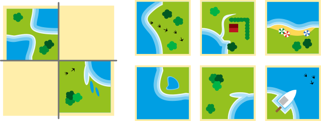
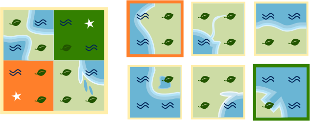

## Body

Edu a un nouveau jeu. Il est fait de cartes avec des zones de terre et d'eau. Edu peut former des paysages avec ses cartes. Les cartes doivent _aller ensemble_: terre contre terre, eau contre eau.

:::center

:::

Edu pose deux cartes et laisse deux trous.

## Question/Challenge - for the brochures

Quelles cartes vont dans les trous? Tu n’as pas le droit de tourner les cartes.

## Question/Challenge - for the online challenge

Quelles cartes vont dans les trous?

## Interactivity instruction - for the online challenge

Glisse les bonnes cartes dans les trous. Tu ne peux pas tourner les cartes. Clique sur une carte pour l'enlever. Quand tu as fini, clique sur "Enregistrer la réponse".

## Answer Options/Interactivity Description

The tiles are all draggables (not the already placed), the gray spaces are containers. You can drag the tiles into the gray spaces. When clicking the tiles spring back to the first postion.

## Answer Explanation

Voici la bonne réponse:

Les deux cartes vont dans les trous: il y a partout de la terre contre de la terre et de l'eau contre de l'eau. Seules ces deux cartes vont dans les trous parmi les six cartes.

Si l'on avait le droit de tourner les cartes, d'autres cartes iraient aussi dans les trous.

## This is Informatics

[W]: graphics/2023-DE-06-explanation_W.svg
[L]: graphics/2023-DE-06-explanation_L.svg
[LW]: graphics/2023-DE-06-explanation_LW.svg

Regardons les cartes d'Edu plus en détail. Chaque carte peut être divisée en quatre parties. Les bords extérieurs de ces parties montrent de la terre (![L]) ou de l'eau (![W]) .

Il n'y a donc que deux sortes de parties, car les bords extérieurs montrent soit de l'eau (![W]), soit de la terre (![L]).

Deux cartes ne vont ensemble que si leurs parties voisines sont les mêmes. Pour trois parties de chaque trou, nous pouvons donc indiquer quelle sorte de partie est nécessaire. La quatrième partie peut être de l'eau ou de la terre, donc nous indiquons ![LW].

De cette manière, nous créons un motif pour chaque trou. Les cartes devant aller dans ces trous doivent correspondre à ces motifs: pour ![L] et ![W], la partie de la carte doit également être ![L] et ![W]; pour ![LW], la partie de la carte peut être ![L] ou ![W].

Nous avons découvert une propriété des cartes. Nous avons utilisé cette propriété pour remplacer les cartes par un arrangement des symboles ![L] et ![W]. Nous avons ainsi réduit largement la quantité d'information présente dans les images. Nous nous concentrons sur les informations qui sont nécessaires à la résolution de cet exercice. Les informaticiens et informaticiennes se référeraient à l'arrangement des symboles sur les images. Le fait de réduire les images aux types de partie ![L] et ![W] crée un modèle des cartes manquantes. L'_abstraction_ est nécessaire à la _modélisation_, et l'abstraction réduit la quantité d'information. Les ordinateurs doivent travailler avec des modèles de la réalité. Il faut être attentif à ne pas perdre certaines propriétés importantes de la réalité lors de la création de tels modèles.

## This is Computational Thinking

Natürlich, man kann hier ausdrücklich "Abstraktion" erwähnen.

## Informatics Keywords and Websites

- Modélisation: https://fr.wikipedia.org/wiki/Modélisation
- Codage: https://fr.wikipedia.org/wiki/Codage_de_l%27information
- Abstraction: https://fr.wikipedia.org/wiki/Abstraction_(informatique)

## Computational Thinking Keywords and Websites

Abstraktion

## Wording and Phrases

- _Kärtchen_: quadratisches Bild, mit Seiten die entweder Wasser oder Land haben
- _benachbarte Kärtchen_: Kärtchen, die direkt nebeneinander liegen
- _Kärtchen passen, passende Kärtchen_: zwei benachbarte Kärtchen, die entweder zusammenpassen (wie im Task definiert) oder nicht
- _Lücken, Lücken füllen_: eine Lücke ist ein leerer Platz in einer Anordnung von Kärtchen. Wenn die Kärtchen genau an diesem Platz platziert wird, dann füllt sie die Lücke.

## Comments

Report changes on this file (older comments can be looked up in the original document)

_Susanne Datzko, 2023-09-25_: Abschnitte in Bereiche umbenannt. Insbesondere in Erklärung und DiI die Sprache etwas vereinfacht. Graphiken angepasst.

_Name, Datum_: Kommentar 2
