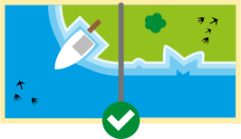
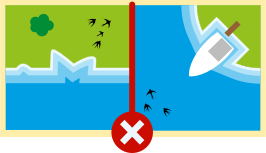
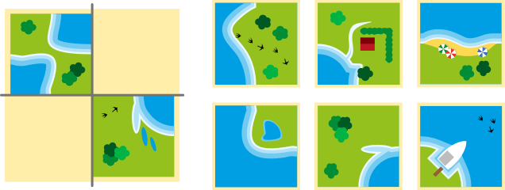
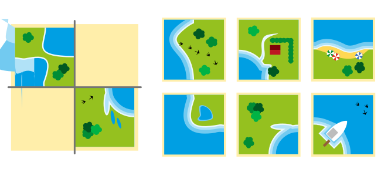
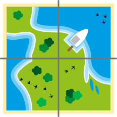
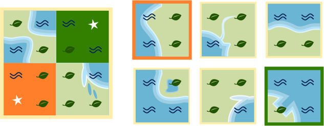

## Body

Edu ha un nuovo gioco. È composto da carte con aree d'acqua e di terra.
Edu può usare le carte per disporre i paesaggi. Le carte devono combaciare: terra con terra; acqua con acqua.

:::center
 
 
:::

Edu piazza due carte e lascia due spazi vuoti.

## Question/Challenge - for the brochures

Quali carte si inseriscono negli spazi vuoti?
Non puoi girare le carte.

 
 
## Question/Challenge - for the online challenge

Quali carte si inseriscono negli spazi vuoti?

 
 
## Interactivity instruction - for the online challenge

Trascina le carte corrispondenti negli spazi vuoti. Fa clic su una carta per rimetterla a posto. Al termine, fa clic su "Salva risposta".

## Answer Options/Interactivity Description

The tiles are all draggables (not the already placed), the gray spaces are containers. You can drag the tiles into the gray spaces. When clicking the tiles spring back to the first postion.

## Answer Explanation

Questa è la risposta giusta:

 
 
Le due carte si inseriscono negli spazi vuoti: ovunque c'è acqua su acqua e terra su terra. Delle sei carte possibili, solo queste due si inseriscono negli spazi vuoti.

Solo se si potesse girare le carte sarebbe possibile inserire altre combinazioni negli spazi vuoti.

## This is Informatics

[W]: graphics/2023-DE-06-explanation_W.svg
[L]: graphics/2023-DE-06-explanation_L.svg
[LW]: graphics/2023-DE-06-explanation_LW.svg

Diamo un'occhiata più da vicino alle carte di Edu. Tutte le carte possono essere divise in quattro aree. I bordi esterni di queste aree mostrano terra o acqua.

 
 
Esistono quindi solo due tipi di aree diverse, perché i bordi esterni mostrano l'acqua (![W]) o la terra (![L]).

 
 
Due tessere si incastrano tra loro solo se i tipi di area vicini sono uguali. Pertanto, possiamo inserire il tipo richiesto per tre aree degli spazi vuoti. La quarta area può essere acqua o terra, quindi inseriamo ![LW].

In questo modo si crea un modello per ogni spazio vuoto. Le tessere che devono riempire gli spazi vuoti devono rientrare in questi schemi: per ![L] e ![W], l'area della tessera deve avere rispettivamente ![L] e ![W]. Con ![LW], l'area può avere ![L] o ![W].

Abbiamo scoperto una proprietà dei cartoncini. Abbiamo utilizzato questa scoperta per sostituirli con una disposizione dei caratteri ![L] e ![W]. Con questo passo, abbiamo ridotto in modo significativo le informazioni contenute nelle immagini. Ci concentriamo sulle informazioni necessarie per risolvere il compito. Gli informatici, in questo caso, fanno capo alla disposizione dei caratteri nelle immagini. Riducendo le immagini ai tipi di area ![L] e ![W], si crea un modello per le carte mancanti. Modellare significa astrarre (o semplificare) e l'astrazione riduce l'informazione. I computer devono lavorare con modelli della realtà. Quando si creano tali modelli, bisogna fare attenzione a non perdere importanti proprietà della realtà.

## This is Computational Thinking

Natürlich, man kann hier ausdrücklich "Abstraktion" erwähnen.

## Informatics Keywords and Websites

- Modellizzazione: https://it.wikipedia.org/wiki/Modellizzazione
- Codice: https://it.wikipedia.org/wiki/Codice_(teoria_dell%27informazione)
- Astrazione: https://it.wikipedia.org/wiki/Astrazione_(informatica)

## Computational Thinking Keywords and Websites

Abstraktion

## Wording and Phrases

- _Kärtchen_: quadratisches Bild, mit Seiten die entweder Wasser oder Land haben
- _benachbarte Kärtchen_: Kärtchen, die direkt nebeneinander liegen
- _Kärtchen passen, passende Kärtchen_: zwei benachbarte Kärtchen, die entweder zusammenpassen (wie im Task definiert) oder nicht
- _Lücken, Lücken füllen_: eine Lücke ist ein leerer Platz in einer Anordnung von Kärtchen. Wenn die Kärtchen genau an diesem Platz platziert wird, dann füllt sie die Lücke.

## Comments

Report changes on this file (older comments can be looked up in the original document)

_Susanne Datzko, 2023-09-25_: Abschnitte in Bereiche umbenannt. Insbesondere in Erklärung und DiI die Sprache etwas vereinfacht. Graphiken angepasst.

_Name, Datum_: Kommentar 2
