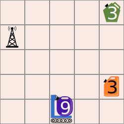

## Body

Zérobot a un réservoir de carburant échangeable. Il se déplace dans une grille: vers le haut, le bas, la gauche et la droite. Le niveau de son réservoir baisse de 1 à chaque déplacement d'une case.

Il y a des réservoirs de rechange sur certaines cases; le chiffre écrit dessus indique leur niveau de carburant. Lorsque Zérobot arrive sur une de ces cases, il change son réservoir indépendemment du niveau de carburant de celui-ci. Il prend le réservoir de rechange, dépose son réservoir précédent sur la case et continue sa route.

La position de Zérobot et le niveau de son réservoir sont représentés comme cela sur l'image: 

Alarme: les réservoirs sont défectueux et pourraient exploser!

Voici la mission de Zérobot: il doit aller à la station de base  en vidant tous les réservoirs (niveau 0).

[tank0]: graphics/2023-DE-08a-tank_compatible.svg "Réservoir"
[tank1]: graphics/2023-DE-08a-tank31_compatible.svg "Réservoir de niveau 3"
[tank2]: graphics/2023-DE-08a-tank32_compatible.svg "Réservoir de niveau 3"
[tank3]: graphics/2023-DE-08a-tank9_compatible.svg "Réservoir de niveau 9"
[Basisstation]: graphics/2023-DE-08-basisstation.svg "Station de base"

## Question/Challenge - for the brochures

Comment Zérobot doit-il se déplacer pour accomplir sa mission?

## Question/Challenge - for the online challenge

Comment Zérobot doit-il se déplacer pour accomplir sa mission?

## Interactivity instruction - for the online challenge

Glisse les symboles des réservoirs dans l'ordre dans lequel Zérobot doit les prendre. Quand tu as fini, clique sur "Enregistrer la réponse".

## Answer Options/Interactivity Description

It must be possible to click on replacement batteries and the home square to mark Zerobot's stops. Then, we envision two alternatives:

1. Upon each click, Zerobot moves to that stop, with the battery charges updating. This would result in a full feedback task.
2. Upon each click, an illustration of the (growing) sequence of intermediate goals is updated; it is empty at the beginning. In this case, it was necessary to distinguish the replacement battery. Alternatively, the batteries / home square could be marked with numbers, according to the order that they are visited in.

## Answer Explanation

Voici la bonne réponse:

Zérobot peut rouler jusqu'à la station de base en 15 déplacements de manière à ce que tous les réservoirs aient un niveau de carburant 0:

")

Pour pouvoir expliquer la bonne réponse plus facilement, nous nommons les cases contenant les réservoirs et la station de base A, B et C, respectivement.

[tank_violett]: graphics/2023-DE-08-tank0-withoutdiget.svg "Réservoir 0 ohne Füllstand (18px)"
[tank_orange]:  graphics/2023-DE-08-tank1-withoutdiget.svg "Réservoir 1 ohne Füllstand (18px)"
[tank_green]:   graphics/2023-DE-08-tank2-withoutdiget.svg "Réservoir 2 ohne Füllstand (18px)"

Zérobot se déplace de trois cases jusqu'à la case A et échange ![tank_violett] (niveau 6) contre ![tank_orange] (niveau 3). Il se déplace ensuite de trois cases jusqu'à la case B et échange ![tank_orange] (niveau 0) contre ![tank_green] (niveau 3). Il se déplace ensuite à nouveau jusqu'à la case A et échange ![tank_green] (niveau 0) contre ![tank_violett] (niveau 6). Il se déplace ensuite de 6 cases jusqu'à la station de base C. ![tank_violett] a ensuite le niveau de carburant 0. Mission accomplie!

Est-ce la seule bonne réponse? Zérobot doit effectuer exactement 15 déplacements: 15 déplacements sont nécessaires pour utiliser tout le carburant disponible, soit $9 + 3 + 3 = 15$ unités. Il n'y a pas assez de carburant pour plus de déplacements. Pour vider tous les réservoirs, Zérobot doit passer par les deux cases contenant les réservoirs de rechange, et même deux fois par la case A. Si Zérobot commençait par passer par la case B, il aurait besoin de 17 déplacements pour atteindre la station de base, ce qui n'est pas possible. La réponse ci-dessus est donc la seule solution possible.

## This is Informatics

Cet exercice du Castor aborde des problèmes fondamentaux de la mobilité autonome: chaque robot mobile autonome (comme une voiture autonome) doit considérer quelle quantité d'énergie, sous forme de carburant ou de charge des batteries, il a à disposition lorsqu'il planifie ses activités. D'un côté, il doit s'assurer d'atteindre une station service ou une station de charge avant d'avoir épuisé ses réserves d'énergie; d'un autres côté, il y a certaines conditions à respecter. Dans cet exercice, la condition est que tout le carburant doit être utilisé à la fin de la mission. En réalité, les conditions sont plutôt liées à la position et disponibilité de stations de charge. Les logiciels qui dirigent les robots mobiles contiennent des éléments qui assurent un niveau d'énergie suffisant par la recharge (systèmes de contrôle de batterie intelligents).

En plus de cela, des programmes informatiques sont utilisés pour planifier et gérer des réseaux de recharge efficaces. Les informaticiens et informaticiennes étudient le problème du placement des stations de charge: les stations de charge pour les robots mobiles doivent être placées de manière à ce qu'un robot ayant une certaine charge minimale puisse atteindre une des stations de charge disponible. Des protocoles de communication entre les stations de charge et les voitures autonomes comme l'OCPP (_Open Charge Point Protocol_) ont été dévelopés.

## This is Computational Thinking

It certainly is.

## Informatics Keywords and Websites

- Véhicule autonome: https://fr.wikipedia.org/wiki/Véhicule_autonome
- Station de recharge: https://fr.wikipedia.org/wiki/Station_de_recharge#Infrastructures_de_recharge

## Computational Thinking Keywords and Websites

EDIT HERE

## Wording and Phrases

- *Zerobot*: Name of the acting entity in this task, an autonomous mobile robot. This name is a mix of "zero" and "robot".
- *Austauschtank*
- *Füllstand*
- *Quadrat*: Quadratisches Feld auf der Karte.
- *Basistation*: Endziel des Roboters.
- *Ziel*: Ein Zwischenziel des Roboters auf dem Weg zur Basisstation.
- *Tank*

## Comments

- Wolfgang Pohl, pohl@bwinf.de (2023-03-12): On principle, more difficult variations of the task should be possible by modifying the challenge. I have not tried to find a variation yet, though.
- Wolfgang Pohl, pohl@bwinf.de (2023-03-31): I propose a slightly different version of the task: The initial situation is the same, but the initial charge of the replacement batteries are unknown. Then, the challenge is to determine the lowest initial charge for each replacement battery such that Zerobot reaches home and all batteries are charged down to 0. This task would start with the same challenge image, but with charges of replacement batteries not provided. Then, the interaction would be to enter numbers into the replacement batteries:

 The solution is the same, but the interaction is easier, and the task would be slightly harder to solve.
I like this alternative challenge better than this one here, but the German task group did not agree …

- Wolfgang Pohl, pohl@bwinf.de (2023-04-30): *(Reply to reviews)* I tried to explain the alternative version above a little more clearly. The task would be to minimize the initial charge for each battery. With the given challenge, though, there is no difference to minimizing the sum of initial charges of all batteries.
- Wolfgang Pohl, pohl@bwinf.de (2023-04-30): *(Reply to reviews)* I changed colors in order to cater for colour-blindness.
- Wolfgang Pohl, pohl@bwinf.de (2023-04-30): *(Reply to reviews)* I tried to explain in the body what "swap batteries" means. I would prefer, though, to avoid this explanation, as it makes the text longer. Only one of three reviews asked for an explanation.
- Wolfgang Pohl, pohl@bwinf.de (2023-04-30): *(Reply to reviews)* I tried to improve the answer explanation.
- Wolfgang Pohl, pohl@bwinf.de (2023-04-30): *(Reply to reviews)* As the CT sections are optional, I did not work no them.
- L1 Working Group, 2023-05-16: Minor edits in task body, added image.
- Michael Weigend, mw@creative-informatics.de (2023-07-04): Übersetzung ins Deutsche. Die Story wurde etwas abgewandelt. Statt Battereien werden nun Wasserstofftanks ausgewechselt. (Es gibt tatsächlich austauschbare Wasserstofftanks für Autos wie die von NMUX.) Entsprechend wurde auch "Das ist Informatik" angepasst und etwas abstrakter formuliert. Als zweite konktrete Informatik-Technik wird ein Kommunikationsprotokoll zwischen Ladestationen und E-Autos erwähnt.
- Wolfgang Pohl, pohl@bwinf.de (2023-10-02): Leider wird so nicht mehr klar, dass alle Tanks leer werden müssen.  Und die verwendeten Wörter sind sehr lang, so dass der Text deutlich länger geworden ist.

