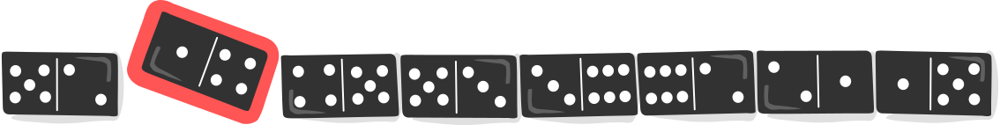

## Body

Jeder Dominostein hat zwei Felder. Auf jedem Feld sind 1 bis 6 Punkte. Du hast diese acht Steine: 

")

Alle acht Steine sollst du so in eine Reihe legen, dass auf den angrenzenden Feldern zweier benachbarter Steine immer gleich viele Punkte sind.

:::center
  
:::

Du kannst mehrere solcher Reihen legen. Es gibt aber Steine, die du auf keinen Fall an den Anfang oder das Ende deiner Reihe legen kannst.

## Question/Challenge - for the brochures

Welche Steine sind das?

## Question/Challenge - for the online challenge

Welche Steine sind das?

## Interactivity instruction - for the online challenge

Klicke im obersten Bild einen Dominostein an, um ihn auszuwählen. Klicke nochmals, um ihn aus der Auswahl zu entfernen. Wenn du fertig bist, klicke auf "Antwort speichern".

## Answer Options/Interactivity Description

Every domino tile can be selected by clicking on it. Then the tile will be highlighted. By clicking again, the tile is deselected. Multiple tiles can be highlighted at the same time.

## Answer Explanation

Drei der acht Steine können nicht an den Anfang oder das Ende der Reihe gelegt werden:

![solution]

[solution]: graphics/2023-DE-09-domino_solution.svg "Lösung"

Um die Aufgabe zu lösen, untersuchen wir die Augenzahlen (die Punkte auf Dominosteinen nennt man auch _Augen_, wie bei einem Würfel) der 16 Felder der Dominosteine.  Wir halten fest, wie häufig die einzelnen Augenzahlen vorkommen, und ob die Häufigkeit eine gerade oder eine ungerade Zahl ist:

:::indent
| Augenzahl                                                      | Häufigkeit | Gerade/Ungerade |
| -------------------------------------------------------------- | ---------- | --------------- |
| ") | 3          | ungerade        |
| ") | 3          | ungerade        |
| ") | 2          | gerade          |
| ") | 2          | gerade          |
| ") | 4          | gerade          |
| ") | 2          | gerade          |
:::

Felder mit Augenzahlen, die mit gerader Häufigkeit vorkommen, müssen paarweise mitten in der Reihe liegen oder gleichzeitig an Anfang und Ende. Felder mit Augenzahlen, die mit ungerader Häufigkeit vorkommen, können aber nicht alle mitten in der Reihe liegen: Es kann nämlich nicht für jedes Feld mit dieser Augenzahl ein passendes angrenzendes Feld gefunden werden; das geht nur bei gerader Häufigkeit. Hier siehst du eine Reihe, in die ein Stein mit der dreimal vorkommenenden Augenzahl 1 nicht mehr mitten hinein passt.

Da es auf den acht Steinen dieser Biberaufgabe Felder mit ungerader Häufigkeit gibt, müssen Steine mit solchen Feldern außen liegen.  Steine, die zwei Felder mit gerader Häufigkeit haben, können also nicht an den Anfang oder das Ende der Reihe gelegt werden. Das sind folgende Steine:

![solution]

## This is Informatics

Es gibt mehrere Möglichkeiten, die acht Dominosteine dieser Biberaufgabe in eine korrekte Reihe zu legen. Um sich hier eine bessere Übersicht zu verschaffen, verwenden Informatiker sogenannte _Graphen_:

")

Im Graphen oben sind Quadrate (sogenannte _Knoten_) ersichtlich, die die sechs Augenzahlen der Dominosteine aufzeigen. Die acht Linien (sogenannte _Kanten_), stellen die acht Dominosteine dar; jede Linie verbindet zwei Felder. Der Dominostein 2-6 wird beispielsweise durch die folgende Kante dargestellt:

")

Um die Aufgabe zu lösen, müssen alle acht Dominosteine passend aneinander gereiht werden. Dabei ist nach dem Legen des ersten Dominosteins bereits klar, mit welcher Augenzahl der zweite Stein beginnen muss, denn angrenzende Felder zweier Steine sollen ja immer die gleiche Augenzahl haben. Im Graph erkennt man dies dadurch, dass Dominosteine genau dann nebeneinander gelegt werden dürfen, wenn deren Kanten sich bei demselben Knoten treffen. Die Steine 2-6 und 6-3 können beispielsweise aneinander gelegt werden, da sie beide die Augenzahl 6 enthalten:

")

Das Aneinanderreihen der Dominosteine lässt sich als _Weg_ (eine Abfolge von Kanten) durch den Graphen verstehen. Dieser Weg soll sämtliche Kanten _genau einmal_ besuchen, um sicherzustellen, dass die acht Dominosteine einerseits alle verwendet werden, andererseits aber auch nicht mehrmals zum Einsatz kommen.  Ein Weg, der _jede  Kante genau einmal_ besucht, wird _Eulerweg_ genannt. Der Name geht auf Leonhard Euler, einen Schweizer Mathematiker und den Erfinder der Graphentheorie, zurück. Euler konnte zeigen, dass in einem zusammenhängenden Graphen ein Eulerweg genau dann existiert, wenn maximal zwei Knoten eine ungerade Anzahl von diesem Knoten ausgehender Kanten haben.

## This is Computational Thinking

Optional - not to be filled 2023

## Informatics Keywords and Websites

 - Graph, Knoten, Kanten: https://de.wikipedia.org/wiki/Graph_(Graphentheorie)
 - Eulerweg: https://de.wikipedia.org/wiki/Eulerkreisproblem

## Computational Thinking Keywords and Websites

## Wording and Phrases

 - _Augenzahl_: Die Beschriftung einer Hälfte des Dominosteins, in unserem Fall eine Würfelzahl 1-6
 - _Domino-Reihe_: Eine Sequenz von Dominosteinen, die nebeneinander hingelegt werden.
 - _Randstein_: Ein Dominostein am Anfang oder Ende einer Domino-Reihe.

## Comments

Report changes on this file (older comments can be looked up in the original document)

_Name, Datum_: Kommentar 1

_Name, Datum_: Kommentar 2

 * We don't delete the original english version of the task for making possible to look up the older comments.