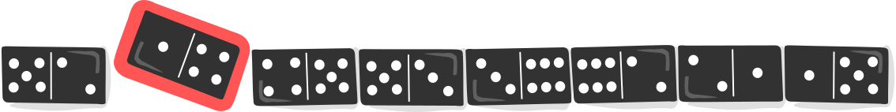

## Body

Ogni domino ha due caselle. Su ogni casella ci sono da 1 a 6 punti. Hai questi otto domino:

")
 
Posiziona tutti e otto i domino in fila in modo che ci sia sempre lo stesso numero di punti sulle caselle adiacenti di due domino vicini.

:::center
  
:::
 
È possibile disporre varie file di questo tipo. Tuttavia, ci sono domino che non possono essere posizionati all'inizio o alla fine della fila.

 
## Question/Challenge - for the brochures

Quali sono questi domino?

## Question/Challenge - for the online challenge

Quali sono questi domino?

## Interactivity instruction - for the online challenge

Fa clic su un domino nell'immagine superiore per selezionarlo. Fa nuovamente clic per rimuoverlo dalla selezione. Al termine, fa clic su "Salva risposta".

## Answer Options/Interactivity Description

Every domino tile can be selected by clicking on it. Then the tile will be highlighted. By clicking again, the tile is deselected. Multiple tiles can be highlighted at the same time.

## Answer Explanation

Tre delle otto pietre non possono essere posizionate all'inizio o alla fine della fila:

![solution] 
 
[solution]: graphics/2023-DE-09-domino_solution.svg "Soluzione"

Per risolvere il compito, si esamina il numero di occhi (i punti sul domino sono chiamati anche _occhi_, come su un dado) delle 16 caselle.  Registriamo la frequenza dei singoli numeri di occhi e se la frequenza è pari o dispari:

:::indent
| Numero di occhi                                                 | Frequenza | Pari/dispari |
| --------------------------------------------------------------- | --------- | ------------ |
| ")  | 3         | dispari      |
| ") | 3         | dispari      |
| ") | 2         | pari         |
| ") | 2         | pari         |
| ") | 4         | pari         |
| ") | 2         | pari         |
:::

Le caselle con un numero di punti pari devono trovarsi a coppie al centro della riga o contemporaneamente all'inizio e alla fine. Tuttavia, le caselle con un numero dispari di punti non possono trovarsi tutti al centro della fila: non è possibile trovare un quadrato adiacente corrispondente per ogni quadrato con questo numero di punti; questo è possibile solo con frequenze pari. Qui si vede una riga in cui una pietra con un numero 1 (che esiste tre volte) non si adatta più al centro.

 
 
Poiché sulle otto pietre di questo compito ci sono caselle con frequenze dispari, le pietre con tale caselle devono essere posizionate all'esterno. Le pietre che hanno due caselle con frequenza pari non possono essere posizionate all'inizio o alla fine della fila. Si tratta delle seguenti pietre:

![solution] 
 

## This is Informatics

Esistono diversi modi per posizionare le otto pietre di domino di questo compito in una fila corretta. Per avere una visione d'insieme, gli informatici utilizzano i cosiddetti _grafi_:

") 
 
Nel grafo qui sopra sono visibili le caselle (i cosiddetti _nodi_), che mostrano i sei numeri del domino. Le otto linee (chiamate _bordi_) rappresentano gli otto domino; ogni linea collega due caselle. Ad esempio, il domino 2-6 è rappresentato dal seguente bordo:

") 
 
Per risolvere il compito, tutti e otto i domino devono essere posizionati in una fila corrispondente. Dopo aver posizionato il primo domino, è già chiaro con quale numero di punti deve iniziare il secondo domino, perché i campi adiacenti di due domino devono sempre avere lo stesso numero di punti. Nel grafo, questo si può vedere dal fatto che i domino possono essere posizionati l'uno accanto all'altro esattamente quando i loro bordi si incontrano nello stesso nodo. Per esempio, le pietre 2-6 e 6-3 possono essere accostate perché entrambe contengono il numero 6:

") 
 

L'allineamento delle pietro può essere inteso come un _percorso_ (una sequenza di bordi) attraverso il grafo. Questo percorso deve visitare tutti gli spigoli _esattamente una volta_ per garantire che le otto pietre del domino vengano utilizzate tutte, ma anche che non vengano utilizzate più di una volta.  Un percorso che visita _ogni bordo esattamente una volta_ è chiamato _cammino euleriano_. Il nome risale a Leonhard Euler, matematico svizzero e inventore della teoria dei grafi. Euler  è riuscito a dimostrare che in un grafo connesso, un cammino di Euler, esiste esattamente quando al massimo due nodi hanno un numero dispari di bordi che partono da quel nodo.

## This is Computational Thinking

Optional - not to be filled 2023

## Informatics Keywords and Websites

- Grafo: https://it.wikipedia.org/wiki/Teoria_dei_grafi
- Nodi: https://it.wikipedia.org/wiki/Vertice_(teoria_dei_grafi)
- Cammino euleriano: https://it.wikipedia.org/wiki/Cammino_euleriano

## Computational Thinking Keywords and Websites

## Wording and Phrases

 - _Augenzahl_: Die Beschriftung einer Hälfte des Dominosteins, in unserem Fall eine Würfelzahl 1-6
 - _Domino-Reihe_: Eine Sequenz von Dominosteinen, die nebeneinander hingelegt werden.
 - _Randstein_: Ein Dominostein am Anfang oder Ende einer Domino-Reihe.

## Comments

Report changes on this file (older comments can be looked up in the original document)

_Name, Datum_: Kommentar 1

_Name, Datum_: Kommentar 2

 * We don't delete the original english version of the task for making possible to look up the older comments.
