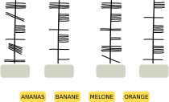
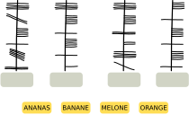
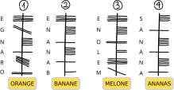

## Body
Sue kennt das alte irische Alphabet Ogham.
Jeder Buchstabe besteht aus einem oder mehreren Strichen, die entlang einer langen Linie angeordnet sind.
Zwei aufeinander folgende Buchstaben werden durch einen Zwischenraum getrennt.

Sue benutzt Ogham als Code.  Sie kodiert vier Wörter – ihre liebsten Fruchtsorten:\
ANANAS, BANANE, MELONE und ORANGE.

## Question/Challenge - for the brochures

Welches Wort passt zu welchem Ogham-Code?

## Question/Challenge - for the online challenge

Welches Wort passt zu welchem Ogham-Code?

## Interactivity instruction - for the online challenge

Ziehe die Wörter auf die richtigen Felder. Wenn du fertig bist, klicke "Antwort speichern".

## Answer Options/Interactivity Description

The yellow squares with the fruitnames are draggables. To be dragged into the gray containers under the Ogham-Code.

## Answer Explanation

So ist es richtig:

Es gibt verschiedene Möglichkeiten, die richtige Zuordnung zu bestimmen. Auf jeden Fall aber muss herausgefunden werden, in welcher Richtung die Buchstaben entlang der Linie geschrieben werden. Dabei hilft das besonders markante Wort ANANAS. Darin kommt der Buchstabe A dreimal vor, mit jeweils einem anderen Buchstaben dazwischen. 

Nur im Ogham-Code 4 kommt ein Buchstabe dreimal vor, und auch dort ist jeweils ein Buchstabe dazwischen. Code 4 ist also der einzige, zu dem das Wort ANANAS passt. So erkennt man, dass man in Ogham Wörter von unten nach oben schreibt und dass der dreifach vorkommende Buchstabe A in Ogham als horizontaler Strich durch die Linie geschrieben wird.

Dieser Ogham-Buchstabe A kommt nur im Code 2 zweimal vor.  Auch wegen der aus ANANAS bekannten Kodierung von N (fünf horizontale Striche rechts von der Linie) und der Anordnung der weiteren Buchstaben passt nur BANANE zu diesem Code. ORANGE passt nur zum Code 1; unter anderem, weil man dort den Ogham-Buchstaben A genau einmal findet.  Nun ist nur noch Code 3 übrig; er muss also das Ogham-Wort für MELONE sein und enthält die von den übrigen Wörtern bekannten Ogham-Buchstaben E und N an den passenden Stellen.

## This is Informatics

In dieser Biberaufgabe muss ein unbekannter Text entschlüsselt bzw. dechiffriert werden.  Das ist hier nicht sehr schwierig, weil der entschlüsselte _Klartext_ bekannt ist. Ausserdem ist der unbekannte Text auf gleiche Weise in Buchstaben und Wörter eingeteilt wie der bekannte Text. Beim Dechiffrieren eines geheimen Textes bzw. eines Textes in unbekannter Schrift, dessen Klartext nicht bekannt ist, hilft es in diesem Fall oft, sich Gedanken über die Häufigkeit von Buchstaben und Wörtern zu machen und auf dieser Grundlage zu versuchen, sie im Text zu finden. Auf diese Weise sind einige antike Alphabete und Schriften entschlüsselt worden. Schwierig wird es aber, wenn die Schriftzeichen im unbekannten Text nicht so einfach den Buchstaben und Wörtern der bekannten Sprache zuzuordnen sind wie im Fall von Ogham. Dann hilft oft nur der Abgleich mit bekannten Texten oder Schriften, wie in dieser Biberaufgabe. Zum Beispiel wurden die ägyptischen Hieroglyphen jahrhundertelang nicht entschlüsselt, bis durch einen Zufall ein Stein mit Hieroglyphen und zwei bekannten Schriften gefunden wurde, der Stein von Rosetta. Auf dem Stein fand sich dreimal der gleiche Text. Der war zwar in verschiedenen Sprachen geschrieben, enthielt aber immer dieselben Namen. So konnten wesentliche Elemente der Hieroglyphen entschlüsselt werden. Das gilt aber nicht für alle Schriften: Noch immer sind die etwa 650 Schriftzeichen der Maya-Kultur nicht vollständig entschlüsselt, genau so wenig wie die Schriften Linearschrift A und Linearschrift B aus der Mittelmeerregion.

Auch in der Informatik werden Schriftzeichen und Texte entschlüsselt – nachdem sie vorher zur abhörsicheren Datenübertragung verschlüsselt wurden.  Dazu werden aber ganz andere Verfahren verwendet als bei der Kodierung von Wörtern in anderen Schriften.  Solche einfachen Kodierungen sind insbesondere mit Hilfe von Computern zu leicht zu entschlüsseln, meist mit Hilfe der oben schon genannten Überlegungen zur Häufigkeit von Buchstaben und Wörtern.

## This is Computational Thinking

Wenn man diese Aufgabe löst, sucht man letztlich nach Mustern, die in dem codierten Text und im Klartext wiederzufinden sind, wie beispielsweise die Position des Buchstaben A. Solche Muster zu erkennen kommt häufig in der Informatik vor, insbesondere wenn komplexe Probleme auf andere zurückgeführt werden, die bereits gelöst sind.

## Informatics Keywords and Websites

- Kryptographie: https://de.wikipedia.org/wiki/Kryptographie
- Kryptoanalyse: https://de.wikipedia.org/wiki/Kryptoanalyse
- Ogham: https://de.wikipedia.org/wiki/Ogham 

## Computational Thinking Keywords and Websites

- _Pattern recognition:_ https://www.bbc.co.uk/bitesize/guides/zxxbgk7/revision/1
- _Decomposition:_ https://www.bbc.co.uk/bitesize/guides/zqqfyrd/revision/1

## Wording and Phrases

- _Ogham:_ name of an ancient Irish alphabet. 

## Comments

**L2 Note for translators:** tricky to translate into multiple languages (see Taina comment). We found a link that really helps: https://ogham.co 

Taina Lehtimäki, taina@cs.nuim.ie, 2023-03-31: Note for translators: It is important that the names of food items have same number of letters to make letters more difficult to figure out. Also different food items should have some letters in names in common to make it possible to solve. Ogham alphabet has 19 letters which match the following Latin alphabets: A, B, C, D, E, F, G, H, I, L, M, N, O, Q, R, S, T, U, Z  (graphics provided: Ogham_alphabet.svg)
Taina Lehtimaki, taina@cs.nuim.ie, 2023-05-08: Question changed to "Below are four foods written using Ogham. Please place the correct words into the corresponding boxes." as response to 2023-IE-02a task review.

**Review by** By: Zsuzsa Pluhár (svn: pluhar), on 2023-04-19, Non-assigned review 
This is the version where we have words with the same length. But I think, they are too long :) - so I would prefer the version "a" with 2-2 words in the same length. Nice task. I like it. I would use words with the same length (at least 2-2 as pairs), and don’t base the solution only on the length of the words. In question the "ranges" is coded (in solution the oranges). TiI: could be longer (this code can be broken via frequency analysis…). Graphics can be used (svg, self-made, clear, …)

**Response:** by Taina Lehtimaki taina@cs.nuim.ie, 2023-05-08: It’s a great idea to have 2-2 words with the same length. However it would be a slightly easier age category task than we intended with this one. We have kept the original words although they are quite long, as we think this is still appropriate for the age group. Also, in order to solve this task, the letters do not have to be decoded one-by-one, but instead this is intended to be solved by finding patterns (repeated letters etc.). As such, by having longer words there are more repeated letters available and this actually makes the task very manageable. Note for translating this task: having different length words will make the task much easier to solve. Having all words the same length makes the task harder. Also, you need to have some letters repeating between words in order to solve the task. 

**Review By:** gates  (svn: gates). On 2023-04-20. Assigned review.
[AGE] Appropriate for question. [IDEA] This is a really interesting topic, I love it! [TEXT] Clear, and covers all that is needed. Second sentence in second paragraph needs an extra word for clarity. [EXPL] Good and thorough. [TiI] Good but perhaps could be a little longer.  [TiCT] Good. [GRAPH] Fit for purpose. [OTHER] I really like this task, great to see a less broadly known perspective toward encryption.

**Response:** by Taina Lehtimaki taina@cs.nuim.ie, 2023-05-08: Second sentence in second paragraph made more clear. 

**Review By:** Sangsu Jeong (svn: sjung), on 2023-04-21, Assigned review. 
[IDEA] Interesting topic. [TEXT] I need some time to understand the problem. How about showing an example? [EXPL] I think it's good because there are various ways to find answers. But once you understand the problem, you can easily solve it. [GRAPH] fits the purpose.

**Response:** by Taina Lehtimaki taina@cs.nuim.ie, 2023-05-08: In our opinion it is better not to give an example. If we give an example it would not be a pattern recognition task anymore.

**L2 (Leo and Alieke):** Minor wording changes in question and body plus we added the links under computational thinking keywords and links from the a version. We removed the last sentence in the body because it repeats in the question. 
We removed the line "Ogham is read from bottom to top". This hiked up the difficulty another category and we need harder tasks. We triple checked if the task is still solvable. We also added a piece to the explanation to explain how this can be figured out.