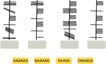
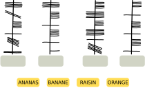
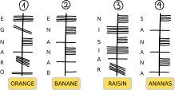

## Body

Sue connaît le vieil alphabet irlandais utilisé en écriture oghamique.
Chaque lettre est composée d'un ou plusieurs traits qui sont arrangés le long d'une longue ligne. Deux lettres qui se suivent sont séparées par un espace le long de la ligne.

Sue utilise l'écriture oghamique comme code secret. Elle écrit ainsi quatre mots – ses fruits préférés:\
ANANAS, BANANE, RAISIN et ORANGE.

## Question/Challenge - for the brochures

Quel mot correspond à quel code en Ogham?

## Question/Challenge - for the online challenge

Quel mot correspond à quel code en Ogham?

## Interactivity instruction - for the online challenge

Glisse les mots dans les bonnes cases. Quand tu as fini, clique sur "Enregistrer la réponse".

## Answer Options/Interactivity Description

The yellow squares with the fruitnames are draggables. To be dragged into the gray containers under the Ogham-Code.

## Answer Explanation

Voici la bonne réponse:

Il y a plusieurs possibilités de trouver la bonne assignation. Il faut dans tous les cas déterminer dans quel sens les lettres sont écrites le long de la ligne. Pour cela, le mot ANANAS est spécialement utile: il contient trois fois la lettre A, séparée par d'autres lettres.

Il n'y a que dans le code en Ogham 4 que la même lettre apparaît trois fois avec d'autres lettres entre deux. Le code 4 est donc le seul qui peut correspondre au mot ANANAS. On peut en déduire que les mots sont écrits de bas en haut en Ogham et que la lettre A s'écrit avec un trait horizontal traversant le ligne verticale.

La lettre A en Ogham n'est présente deux fois que dans le code 2. De plus, on connaît le symbole Ogham du N grâce au code d'ANANAS (cing traits verticaux à droite de la ligne), et l'ordre des autres lettres indique que seul le mot BANANE correspond à ce code. ORANGE ne va qu'avec le code 1, entre autre parce qu'on n'y trouve la lettre A qu'une seule fois et en troisième position. Il ne reste que le code 3 pour le mot RAISIN, et on y retrouve en effet les lettres Ogham R, S et N connues des autres mots aux bonnes positions.

## This is Informatics

Dans cet exercice du Castor, il faut déchiffrer un texte inconnu. Ici, ce n'est pas très difficile car le _texte clair_ est connu. De plus, le texte inconnu est divisé en lettres et en mots comme le texte connu. Lorsque l'on déchiffre un texte secret ou dans un alphabet inconnu sans le connaître en texte clair, c'est souvent utile de réfléchir à la fréquence des mots et des lettres, et d'utiliser cela comme base pour trouver ces mots et lettres dans le texte. C'est de cette manière que plusieurs écritures et alphabets antiques ont été déchiffrés. Cela devient plus compliqué lorsque les symboles du texte inconnu ne sont pas faciles à assigner aux lettres et mots du texte connu comme il le sont en Ogham. Dans ce cas, il est souvent nécessaire de comparer le texte à des textes ou écritures connues, comme dans cet exercice. Les hiéroglyphes égyptiens, par exemple, n'ont pas pu être déchiffrés pendant des siècles, jusqu'a ce qu'une pierre avec des hiéroglyphes et deux textes connus soit trouvée par hasard, la pierre de Rosette. Sur la pierre se trouvait trois fois le même texte écrit dans des langues différentes, mais contenant les mêmes noms. Ceci permit de déchiffrer des éléments essentiels des hiéroglyphes. Ce n'est cependant pas le cas de tous les alphabets: environ 650 symboles de la culture Maya ne sont toujours pas entièrement déchiffrés, ainsi que les écritures linéaires A et B de la région méditéranéenne. 

En informatique aussi, il faut déchiffrer des textes et des symboles – après qu'ils ont été encryptés pour le transfert de données sécurisé. Pour cela, des méthodes très différentes de celles utilisées pour coder des mots dans d'autres écritures sont appliquées. De tels chiffres simples sont trop faciles à déchiffrer, surtout avec des ordinateurs, en général à l'aide des analyses de fréquence des mots et lettres mentionnées plus haut.

## This is Computational Thinking

Pour résoudre cet exercice, on recherche des motifs se répétant dans le texte clair et le texte chiffré, comme la position de la lettre A. Le reconnaissance de motifs est souvent utilisée en informatique, principalement pour utiliser des problèmes déjà résolus pour en résoudre d'autres.

## Informatics Keywords and Websites

- Cryptographie: https://fr.wikipedia.org/wiki/Cryptographie
- Cryptoanalyse: https://fr.wikipedia.org/wiki/Cryptanalyse
- Ogham: https://fr.wikipedia.org/wiki/Ogham

## Computational Thinking Keywords and Websites

- Reconnaissance de motifs: https://fr.wikipedia.org/wiki/Reconnaissance_de_formes

## Wording and Phrases

- _Ogham:_ name of an ancient Irish alphabet. 

## Comments

**L2 Note for translators:** tricky to translate into multiple languages (see Taina comment). We found a link that really helps: https://ogham.co 

Taina Lehtimäki, taina@cs.nuim.ie, 2023-03-31: Note for translators: It is important that the names of food items have same number of letters to make letters more difficult to figure out. Also different food items should have some letters in names in common to make it possible to solve. Ogham alphabet has 19 letters which match the following Latin alphabets: A, B, C, D, E, F, G, H, I, L, M, N, O, Q, R, S, T, U, Z  (graphics provided: Ogham_alphabet.svg)
Taina Lehtimaki, taina@cs.nuim.ie, 2023-05-08: Question changed to "Below are four foods written using Ogham. Please place the correct words into the corresponding boxes." as response to 2023-IE-02a task review.

**Review by** By: Zsuzsa Pluhár (svn: pluhar), on 2023-04-19, Non-assigned review 
This is the version where we have words with the same length. But I think, they are too long :) - so I would prefer the version "a" with 2-2 words in the same length. Nice task. I like it. I would use words with the same length (at least 2-2 as pairs), and don’t base the solution only on the length of the words. In question the "ranges" is coded (in solution the oranges). TiI: could be longer (this code can be broken via frequency analysis…). Graphics can be used (svg, self-made, clear, …)

**Response:** by Taina Lehtimaki taina@cs.nuim.ie, 2023-05-08: It’s a great idea to have 2-2 words with the same length. However it would be a slightly easier age category task than we intended with this one. We have kept the original words although they are quite long, as we think this is still appropriate for the age group. Also, in order to solve this task, the letters do not have to be decoded one-by-one, but instead this is intended to be solved by finding patterns (repeated letters etc.). As such, by having longer words there are more repeated letters available and this actually makes the task very manageable. Note for translating this task: having different length words will make the task much easier to solve. Having all words the same length makes the task harder. Also, you need to have some letters repeating between words in order to solve the task. 

**Review By:** gates  (svn: gates). On 2023-04-20. Assigned review.
[AGE] Appropriate for question. [IDEA] This is a really interesting topic, I love it! [TEXT] Clear, and covers all that is needed. Second sentence in second paragraph needs an extra word for clarity. [EXPL] Good and thorough. [TiI] Good but perhaps could be a little longer.  [TiCT] Good. [GRAPH] Fit for purpose. [OTHER] I really like this task, great to see a less broadly known perspective toward encryption.

**Response:** by Taina Lehtimaki taina@cs.nuim.ie, 2023-05-08: Second sentence in second paragraph made more clear. 

**Review By:** Sangsu Jeong (svn: sjung), on 2023-04-21, Assigned review. 
[IDEA] Interesting topic. [TEXT] I need some time to understand the problem. How about showing an example? [EXPL] I think it's good because there are various ways to find answers. But once you understand the problem, you can easily solve it. [GRAPH] fits the purpose.

**Response:** by Taina Lehtimaki taina@cs.nuim.ie, 2023-05-08: In our opinion it is better not to give an example. If we give an example it would not be a pattern recognition task anymore.

**L2 (Leo and Alieke):** Minor wording changes in question and body plus we added the links under computational thinking keywords and links from the a version. We removed the last sentence in the body because it repeats in the question. 
We removed the line "Ogham is read from bottom to top". This hiked up the difficulty another category and we need harder tasks. We triple checked if the task is still solvable. We also added a piece to the explanation to explain how this can be figured out.