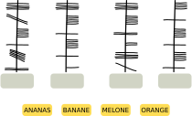
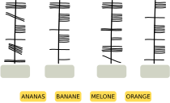
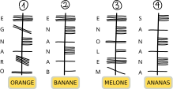

## Body
Sue conosce l'antico alfabeto irlandese Ogham.
Ogni lettera è composta da uno o più tratti disposti su una lunga linea.
Due lettere consecutive sono separate da uno spazio.

Sue usa l'Ogham come codice.  Codifica quattro parole (i suoi tipi di frutta preferiti in tedesco):\
ANANAS, BANANE, MELONE e ORANGE.

## Question/Challenge - for the brochures

Quale parola corrisponde a quale codice Ogham?

 
 
## Question/Challenge - for the online challenge

Quale parola corrisponde a quale codice Ogham?

 
 
## Interactivity instruction - for the online challenge

Trascina le parole nelle caselle corrette. Al termine, fa clic su "Salva risposta".

## Answer Options/Interactivity Description

The yellow squares with the fruitnames are draggables. To be dragged into the gray containers under the Ogham-Code.

## Answer Explanation

La risposta corretta:

 
 
Esistono vari modi per determinare l'assegnazione corretta. In ogni caso, però, bisogna scoprire in quale direzione sono scritte le lettere lungo la linea verticale. A questo proposito ci viene in aiuto la parola ANANAS, particolarmente suggestiva. In essa la lettera A ricorre tre volte, con una lettera diversa tra l'una e l'altra.

Solo nel codice Ogham 4 una lettera ricorre tre volte, e anche lì c'è una lettera in mezzo. Il codice 4 è quindi l'unico a cui si adatta la parola ANANAS. Questo dimostra che nell'Ogham le parole sono scritte dal basso verso l'alto e che la lettera A, che ricorre tre volte nell'Ogham, è scritta come una linea orizzontale che attraversa la linea verticale.

La lettera A in Ogham ricorre solo due volte nel codice 2. Anche a causa della codifica di N (cinque linee orizzontali a destra della linea) scoperta da ANANAS e della disposizione delle altre lettere, solo BANANE si adatta a questo codice. ORANGE si adatta solo al codice 1 perché la lettera A in Ogham si trova esattamente una volta. Ora rimane solo il codice 3; deve quindi essere la parola Ogham per MELONE e contiene le lettere Ogham E e N scoperte dalle altre parole nei posti appropriati.

## This is Informatics

In questo compito, un testo sconosciuto deve essere decodificato o decifrato.  Non si tratta di un compito molto difficile, perché il testo originale è noto. Inoltre, il testo sconosciuto è suddiviso in lettere e parole allo stesso modo del testo noto. Quando si decifra un testo segreto o un testo in una scrittura sconosciuta di cui non si conosce il testo in chiaro, spesso è utile pensare alla frequenza delle lettere e delle parole e su questa base cercare di trovarle nel testo. Alcuni alfabeti e scritture antiche sono stati decifrati in questo modo. Diventa difficile, tuttavia, quando i caratteri del testo sconosciuto non sono così facili da assegnare alle lettere e alle parole della lingua conosciuta, come nel caso dell'Ogham. In questi casi, l'unico modo per aiutarsi è confrontare il testo con testi o scritture note, come in questo compito. Per esempio, i geroglifici egiziani non sono stati decifrati per secoli finché, per caso, è stata trovata una pietra con geroglifici e due scritture conosciute, la Stele di Rosetta. Lo stesso testo è stato trovato tre volte sulla pietra. Era scritto in lingue diverse, ma conteneva sempre gli stessi nomi. In questo modo è stato possibile decifrare elementi essenziali dei geroglifici. Tuttavia, questo non vale per tutte le scritture: I circa 650 caratteri della cultura Maya non sono ancora stati completamente decifrati, così come le scritture Lineare A e Lineare B della regione mediterranea.

Anche in informatica i caratteri e i testi vengono decodificati, dopo essere stati precedentemente criptati per una trasmissione di dati a prova di intercettazione. Tuttavia, si utilizzano procedure completamente diverse rispetto alla codifica di parole in altre scritture. Codifiche così semplici sono troppo facili da decodificare, specialmente con l'aiuto dei computer, grazie alle considerazioni già citate sulla frequenza delle lettere e delle parole.

## This is Computational Thinking

Wenn man diese Aufgabe löst, sucht man letztlich nach Mustern, die in dem codierten Text und im Klartext wiederzufinden sind, wie beispielsweise die Position des Buchstaben A. Solche Muster zu erkennen kommt häufig in der Informatik vor, insbesondere wenn komplexe Probleme auf andere zurückgeführt werden, die bereits gelöst sind.

## Informatics Keywords and Websites

- Crittografia: https://it.wikipedia.org/wiki/Crittografia
- Crittoanalisi: https://it.wikipedia.org/wiki/Crittoanalisi
- Alfabeto ogamico: https://it.wikipedia.org/wiki/Alfabeto_ogamico

## Computational Thinking Keywords and Websites

- _Pattern recognition:_ https://www.bbc.co.uk/bitesize/guides/zxxbgk7/revision/1
- _Decomposition:_ https://www.bbc.co.uk/bitesize/guides/zqqfyrd/revision/1

## Wording and Phrases

- _Ogham:_ name of an ancient Irish alphabet. 

## Comments

**L2 Note for translators:** tricky to translate into multiple languages (see Taina comment). We found a link that really helps: https://ogham.co 

Taina Lehtimäki, taina@cs.nuim.ie, 2023-03-31: Note for translators: It is important that the names of food items have same number of letters to make letters more difficult to figure out. Also different food items should have some letters in names in common to make it possible to solve. Ogham alphabet has 19 letters which match the following Latin alphabets: A, B, C, D, E, F, G, H, I, L, M, N, O, Q, R, S, T, U, Z  (graphics provided: Ogham_alphabet.svg)
Taina Lehtimaki, taina@cs.nuim.ie, 2023-05-08: Question changed to "Below are four foods written using Ogham. Please place the correct words into the corresponding boxes." as response to 2023-IE-02a task review.  

**Review by** By: Zsuzsa Pluhár (svn: pluhar), on 2023-04-19, Non-assigned review 
This is the version where we have words with the same length. But I think, they are too long :) - so I would prefer the version "a" with 2-2 words in the same length. Nice task. I like it. I would use words with the same length (at least 2-2 as pairs), and don’t base the solution only on the length of the words. In question the "ranges" is coded (in solution the oranges). TiI: could be longer (this code can be broken via frequency analysis…). Graphics can be used (svg, self-made, clear, …)

**Response:** by Taina Lehtimaki taina@cs.nuim.ie, 2023-05-08: It’s a great idea to have 2-2 words with the same length. However it would be a slightly easier age category task than we intended with this one. We have kept the original words although they are quite long, as we think this is still appropriate for the age group. Also, in order to solve this task, the letters do not have to be decoded one-by-one, but instead this is intended to be solved by finding patterns (repeated letters etc.). As such, by having longer words there are more repeated letters available and this actually makes the task very manageable. Note for translating this task: having different length words will make the task much easier to solve. Having all words the same length makes the task harder. Also, you need to have some letters repeating between words in order to solve the task. 

**Review By:** gates  (svn: gates). On 2023-04-20. Assigned review.
[AGE] Appropriate for question. [IDEA] This is a really interesting topic, I love it! [TEXT] Clear, and covers all that is needed. Second sentence in second paragraph needs an extra word for clarity. [EXPL] Good and thorough. [TiI] Good but perhaps could be a little longer.  [TiCT] Good. [GRAPH] Fit for purpose. [OTHER] I really like this task, great to see a less broadly known perspective toward encryption.

**Response:** by Taina Lehtimaki taina@cs.nuim.ie, 2023-05-08: Second sentence in second paragraph made more clear. 

**Review By:** Sangsu Jeong (svn: sjung), on 2023-04-21, Assigned review. 
[IDEA] Interesting topic. [TEXT] I need some time to understand the problem. How about showing an example? [EXPL] I think it's good because there are various ways to find answers. But once you understand the problem, you can easily solve it. [GRAPH] fits the purpose.

**Response:** by Taina Lehtimaki taina@cs.nuim.ie, 2023-05-08: In our opinion it is better not to give an example. If we give an example it would not be a pattern recognition task anymore.

**L2 (Leo and Alieke):** Minor wording changes in question and body plus we added the links under computational thinking keywords and links from the a version. We removed the last sentence in the body because it repeats in the question. 
We removed the line "Ogham is read from bottom to top". This hiked up the difficulty another category and we need harder tasks. We triple checked if the task is still solvable. We also added a piece to the explanation to explain how this can be figured out.
