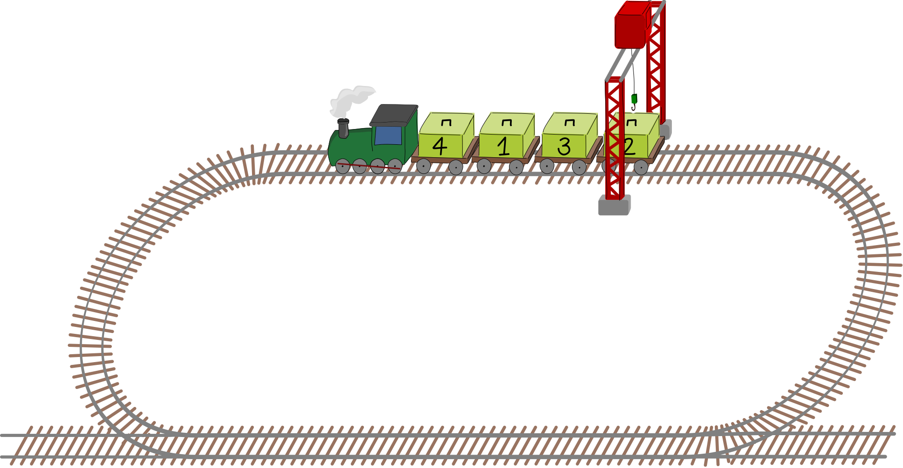
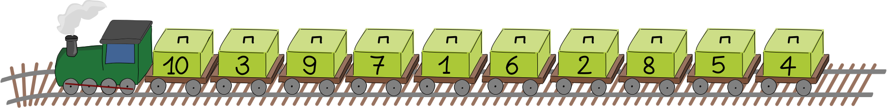
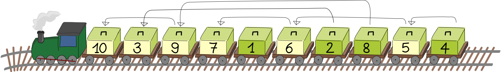

## Body

Un train tire des wagons chargés de caisses numérotées. La grue est à une position fixe et décharge les caisses. Pour décharger une caisse, la caisse doit être positionnée directement sous la grue.

La grue doit décharger les caisses dans l'ordre croissant de leurs numéros en commençant par la caisse 1. Le train ne peut rouler qu'en avant. Il doit faire un tour complet pour pouvoir décharger d'autres caisses après avoir dépassé la grue.

Voilà comment il décharge les caisses 1, 2, 3 et 4:

| Tour 1:                        | Tour 2:                 | Tour 3:                  |
| :---------------------------:+ | :--------------------:+ | :---------------------:+ |
| ![example1]                    | ![example2]             | ![example3]              |
| Il saute la caisse 4, décharge | Il saute la caisse 4 et | Il décharge la caisse 4. |
| la caisse 1, saute la caisse 3 | décharge la caisse 3.   |                          |
| et décharge la caisse 2.       |                         |                          |

[example1]: graphics/2023-IN-03b-example1.svg "Tour 1, caisses 1 et 2"
[example2]: graphics/2023-IN-03b-example2.svg "Tour 2, caisse 3"
[example3]: graphics/2023-IN-03b-example3.svg "Tour 3, caisse 4"

Le train ci-dessus doit donc faire trois tours pour décharger toutes les caisses dans le bon ordre.

## Question/Challenge - for the brochures

Combien de tours faut-il pour décharger le train suivant?

## Question/Challenge - for the online challenge

Combien de tours faut-il pour décharger le train suivant?

## Interactivity instruction - for the online challenge
---

## Answer Options/Interactivity Description

| ---------------- | ---------------- | ----------- |
| A) 1 tour        | E) 5 tours       | I) 9 tours  |
| B) 2 tours       | F) 6 tours       | J) 10 tours |
| C) 3 tours       | G) 7 tours       |             |
| D) 4 tours $~~~$ | H) 8 tours $~~~$ |             |

## Answer Explanation

La bonne réponse est sept tours.

L'ordre imposé pour décharger est 1, 2, 3, 4, 5, 6, 7, 8, 9 et 10. Au premier tour, les caisse 1 et 2 sont déchargées ensemble. Au deuxième tour, les caisses 3 et 4 sont déchargées ensemble, puis la caisse 5, puis la 6, puis les caisses 7 et 8 ensemble, puis la 9 et finalement la 10. Cela fait sept tours en tout.

Alternativement, on peut utiliser le fait qu'un tour supplémentaire est nécessaire chaque fois que la caisse suivante se trouve à la gauche de la caisse actuelle.

Par exemple, comme la caisse 3 est à gauche de la caisse 2, elle sera sautée pour décharger la caisse 2 et nécessitera un tour supplémentaire pour la ramener à la hauteur de la grue. Ici, c'est le cas pour les paires de caisses (2,3), (4,5), (5,6), (6,7), (8,9) et (9, 10); il faut donc six tours en plus du premier, ce qui fait sept tours en tout.

## This is Informatics

Lorsque, pour n'importe quel numéro de la suite 1, 2, 3, 4, 5, 6, 7, 8, 9, 10, le numéro suivant se trouve plus à gauche dans le train, on appelle cela une _inversion_. Chaque inversion nécessite un tour supplémentaire. On obtient la réponse de l'exercice en comptant le nombre d'inversions.

Il y a beaucoup d'applications liées au nombre d'inversions présentes dans une suite. Pour certains algorithmes de tri, comme le _tri à bulles_, le nombre d'inversions nous renseigne sur le nombre de permutations nécessaire pour obtenir la suite désirée. Si deux clients classent le même ensemble d'articles par préférence, le nombre d'inversions entre leurs classements nous informe sur leurs préférences communes. C'est utilisé par les magasins en ligne pour identifier des clients "similaires" et recommander des produits.

## This is Computational Thinking

--

## Informatics Keywords and Websites

 - Algorithme de tri: https://fr.wikipedia.org/wiki/Algorithme_de_tri
 - Tri à bulles: https://fr.wikipedia.org/wiki/Tri_à_bulles

## Computational Thinking Keywords and Websites

--

## Wording and Phrases

 - _Waggon_: Güterwagen eines Zuges
 - _nummerierte Kiste_: Kiste mit einer Nummer 
 - _Kran_: fest installierter Entladekran
 - _Runde_: Der Zug fährt 1x im Kreis, bis er wieder an die selbe Stelle gelangt.

## Comments

_Alvida Lozdienė (svn: lozdiene) , 2023-04-15 Assigned review_: I suggest adding an arrow to the picture to indicate the direction of movement of the train. Or in the text to say that it is moving anticlockwise. Also, the background of the wagons is too dark, as it is difficult to see the numbers. The background needs to be lightened. Move the age group to the left, as this is too easy for 16-19 year age participants

_Valentina Dagienė (svn: dagiene) , 2023-04-17 Assigned review_: I like the task, it is attractive and challenging thinking. [AGE] I would say that task difficulty can be made lower by one level: "medium" can be for 12yo-14yo. [IDEA] The task idea is quite original and attractive. For sure it requires some computational thinking skill to be understood and solved.

[TEXT] The text should be revised and made more clear. I am not sure that "carton" is clear object here, perhaps "panel" is better or simple "box". Text can be shortened e.g. cut phrases "a specific order", "not backwards". [EXPL] "Answer Explanation" section is written quite well. [TiI] "It’s informatics" section is not clear written, needs to be improved. Inversion should be explained more detailed. [TiCT] "This is Computational Thinking" section is empty. It would be good to write about methods for solving this task, it is important for computational thinking. [GRAPH] A figure is well done and clear. Official information is provided. [OTHER] More words should be added to "Wording and Phrases": longest, smallest, forward, go around.

_Raluca Constantinescu (svn: constantinescu), 2023-04-18 Assigned review_:
 [AGE] The difficulty level should be lowered by one level. I would say that this task is also about Data structures. [IDEA] The idea is original and attractive.

[TiI] It must be explained what inversions means. Also, the explanation about electronic com-merce should be developed more (or it should be added a source from which students can read more). In addition, it should indicate the sorting algorithm where inversions can be count-ed in order to determine how many steps should be taken (e.g. bubble sort).

[TiCT] Not available. [GRAPH] All the figures are clear and appealing. They are suitable for the age group. They are available in SVG format. [AUTH] Author’s name and email are available [NAME] Ok

_Madhavan Mukund, madhavan@cmi.ac.in, 2023-05-05_: Incorporated reviewer suggestions to shift difficulty levels down by one age group, simplify task description, add arrow for train direction, change background colour of boxes, and clarify some points in TiI.

_Task Workshop Tutoring Group 2, 2023-05-16_: 
- changed the label on boxes from weight to sequence order (1, 2, …) as the cognitive over-head of two digit numbers did not add anything to the computer science value of the task,
- simplified and improved text throughout,
- fixed incorrect answer in original from 8 rounds to 7 rounds,
- alternative graphics (only PNGs provided by original author),
- improved answer explanation section by adding a second more obvious brute-force approach to solving the task and tidying up the language,
- added missing TiCT section and CT references.
