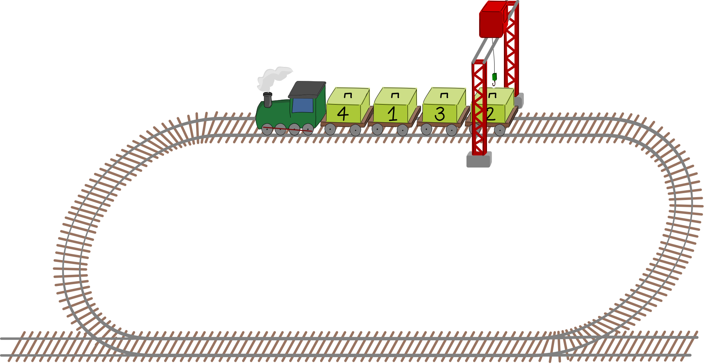
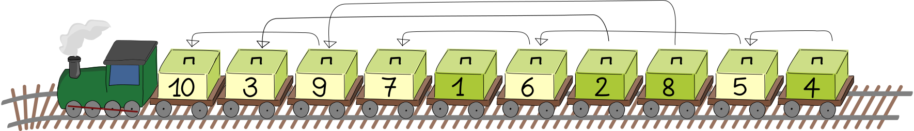

## Body

Un treno traina vagoni con casse numerate. La gru si trova in una posizione fissa e scarica le casse. Per scaricare una cassa, questa deve essere posizionata direttamente sotto la gru.

 
 
La gru deve scaricare le casse, partendo da 1, in ordine crescente. Il treno può andare solo in avanti. Quando è passato sotto la gru, deve fare un giro per poter scaricare altre casse.

In questo modo la gru scarica le casse 1, 2, 3 e 4 nell'ordine corretto:

| Turno 1:                     | Turno 2:            | Turno 3:            |
| :-------------------------:+ | :----------------:+ | :----------------:+ |
| ![example1]                  | ![example2]         | ![example3]         |
| Salta la cassa 4, scarica    | Salta la cassa 4 e  | Scarica la cassa 4. |
| la cassa 1, salta la cassa 3 | scarica la cassa 3. |                     |
| e scarica la cassa 2 2.      |                     |                     |

[example1]: graphics/2023-IN-03b-example1.svg "Round 1, caselle 1 e 2"
[example2]: graphics/2023-IN-03b-example2.svg "Round 2, casella 3"
[example3]: graphics/2023-IN-03b-example3.svg "Round 3, casella 4"

Quindi il treno deve percorrere tre giri affinché tutte le casse siano scaricate nell'ordine corretto.

## Question/Challenge - for the brochures

Quanti turni sono necessari per scaricare il seguente treno?

 
 

## Question/Challenge - for the online challenge

Quanti turni sono necessari per scaricare il seguente treno?

 
 
## Interactivity instruction - for the online challenge
---

## Answer Options/Interactivity Description

| ---------------- | ---------------- | ----------- |
| A) 1 turno       | E) 5 turni       | I) 9 turni  |
| B) 2 turni       | F) 6 turni       | J) 10 turni |
| C) 3 turni       | G) 7 turni       |             |
| D) 4 turni $~~~$ | H) 8 turni $~~~$ |             |

## Answer Explanation

La risposta corretta è 7 turni.

L'ordine prescritto per lo scarico è 1, 2, 3, 4, 5, 6, 7, 8, 9, 10. Al primo turno, la gru scarica le casse 1 e 2 insieme. Nel secondo turno, la gru scarica insieme 3 e 4, poi 5, poi 6, poi 7 e 8 insieme, poi 9 e infine 10. Questo corrisponde a 7 turni.

In alternativa, si può sfruttare il fatto che ogni volta che viene richiesto il numero di casella successivo a sinistra di uno dei numeri di casella della sequenza, è necessario un ulteriore giro di scarico.

 
 
Ad esempio, poiché il 3 si trova a sinistra del 2, viene saltato per scaricare il 2, quindi è necessario un giro supplementare per portare il 3 sotto la gru. Nella mossa data ci sono sei coppie di questo tipo (2,3), (4,5), (5,6), (6,7), (8,9) e (9,10), quindi sono necessari altri 6 turni, per un totale di 7 turni.

## This is Informatics

Se per un numero qualsiasi della sequenza 1, 2, 3, 4, 5, 6, 7, 8, 9, 10 la cassa con il numero successivo più grande si trova più a sinistra sul treno, si parla di _inversione_. Ogni inversione di questo tipo richiede un giro in più. Se contiamo il numero di inversioni, otteniamo la risposta.

Il conteggio delle inversioni rispetto a una sequenza desiderata ha molte applicazioni. In alcuni algoritmi di ordinamento, come il _bubble sort_, il numero di inversioni ci dice quante permutazioni sono necessarie per ordinare una particolare sequenza. Quando due clienti classificano lo stesso insieme di articoli, il numero di inversioni nelle loro classifiche ci dice quanto le loro preferenze siano simili. Questa funzione viene utilizzata dai negozi online per identificare i clienti "simili" e consigliare loro i prodotti.

## This is Computational Thinking

--

## Informatics Keywords and Websites

- Algoritmo di ordinamento: https://it.wikipedia.org/wiki/Algoritmo_di_ordinamento
- Bubble sort: https://it.wikipedia.org/wiki/Bubble_sort

## Computational Thinking Keywords and Websites

--

## Wording and Phrases

 - _Waggon_: Güterwagen eines Zuges
 - _nummerierte Kiste_: Kiste mit einer Nummer 
 - _Kran_: fest installierter Entladekran
 - _Runde_: Der Zug fährt 1x im Kreis, bis er wieder an die selbe Stelle gelangt.

## Comments

_Alvida Lozdienė (svn: lozdiene) , 2023-04-15 Assigned review_: I suggest adding an arrow to the picture to indicate the direction of movement of the train. Or in the text to say that it is moving anticlockwise. Also, the background of the wagons is too dark, as it is difficult to see the numbers. The background needs to be lightened. Move the age group to the left, as this is too easy for 16-19 year age participants

_Valentina Dagienė (svn: dagiene) , 2023-04-17 Assigned review_: I like the task, it is attractive and challenging thinking. [AGE] I would say that task difficulty can be made lower by one level: "medium" can be for 12yo-14yo. [IDEA] The task idea is quite original and attractive. For sure it requires some computational thinking skill to be understood and solved.

[TEXT] The text should be revised and made more clear. I am not sure that "carton" is clear object here, perhaps "panel" is better or simple "box". Text can be shortened e.g. cut phrases "a specific order", "not backwards". [EXPL] "Answer Explanation" section is written quite well. [TiI] "It’s informatics" section is not clear written, needs to be improved. Inversion should be explained more detailed. [TiCT] "This is Computational Thinking" section is empty. It would be good to write about methods for solving this task, it is important for computational thinking. [GRAPH] A figure is well done and clear. Official information is provided. [OTHER] More words should be added to "Wording and Phrases": longest, smallest, forward, go around.

_Raluca Constantinescu (svn: constantinescu), 2023-04-18 Assigned review_:
 [AGE] The difficulty level should be lowered by one level. I would say that this task is also about Data structures. [IDEA] The idea is original and attractive.

[TiI] It must be explained what inversions means. Also, the explanation about electronic com-merce should be developed more (or it should be added a source from which students can read more). In addition, it should indicate the sorting algorithm where inversions can be count-ed in order to determine how many steps should be taken (e.g. bubble sort).

[TiCT] Not available. [GRAPH] All the figures are clear and appealing. They are suitable for the age group. They are available in SVG format. [AUTH] Author’s name and email are available [NAME] Ok

_Madhavan Mukund, madhavan@cmi.ac.in, 2023-05-05_: Incorporated reviewer suggestions to shift difficulty levels down by one age group, simplify task description, add arrow for train direction, change background colour of boxes, and clarify some points in TiI.

_Task Workshop Tutoring Group 2, 2023-05-16_: 
- changed the label on boxes from weight to sequence order (1, 2, …) as the cognitive over-head of two digit numbers did not add anything to the computer science value of the task,
- simplified and improved text throughout,
- fixed incorrect answer in original from 8 rounds to 7 rounds,
- alternative graphics (only PNGs provided by original author),
- improved answer explanation section by adding a second more obvious brute-force approach to solving the task and tidying up the language,
- added missing TiCT section and CT references.
