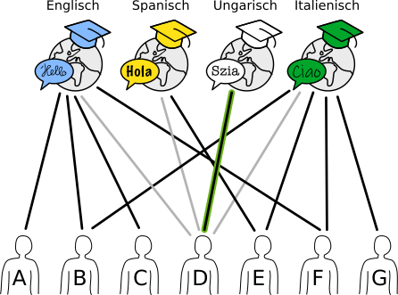
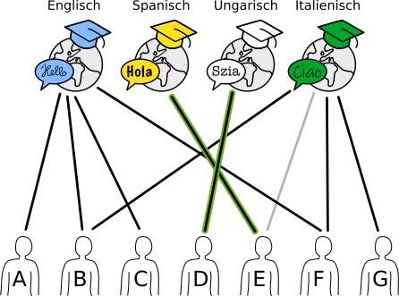
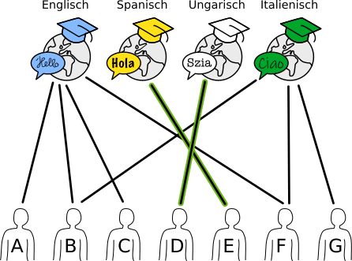
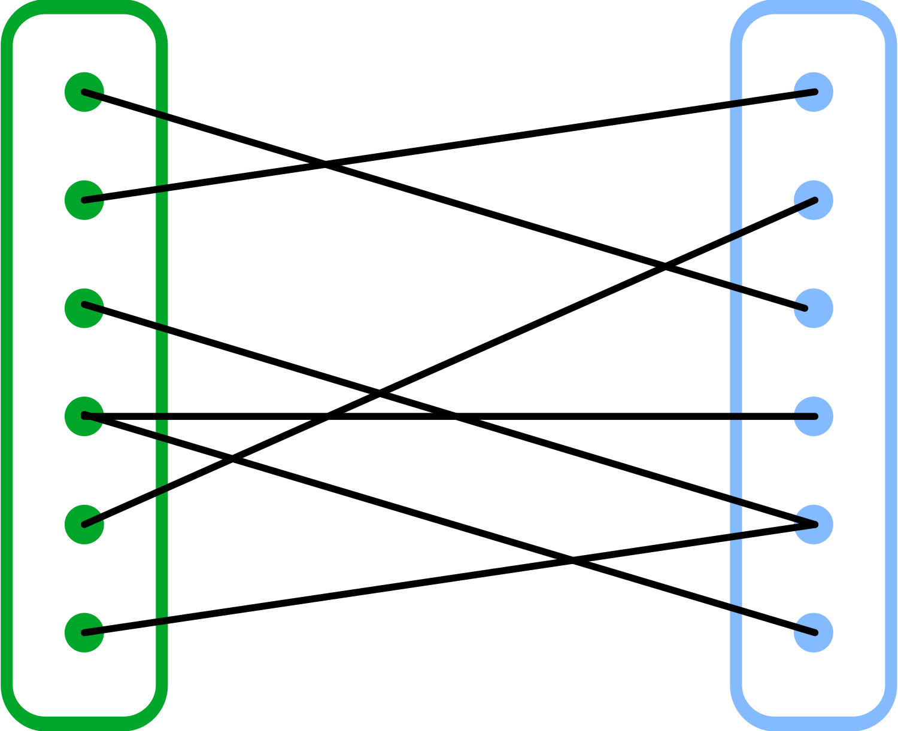

## Body

Eine Sprachschule plant vier Sommerkurse.
Die Linien im Bild zeigen, welche Lehrperson der Schule für welchen Kurs geeignet ist.

")

Eine Lehrperson kann nur einen Kurs halten.
Trotzdem gibt es mehrere Möglichkeiten, jedem Kurs eine geeignete Lehrperson zuzuordnen.

## Question/Challenge - for the brochures

Ordne jedem Kurs eine geeignete Lehrperson zu.
Markiere dazu die Linie zwischen Person und Kurs.

## Question/Challenge - for the online challenge

Ordne jedem Kurs eine geeignete Lehrperson zu.
Markiere dazu die Linie zwischen Person und Kurs.

## Interactivity instruction - for the online challenge

Klicke auf eine Linie, um sie zu markieren. Klicke nochmals, um die Markierung wieder zu entfernen. Wenn du fertig bist, klicke auf "Antwort speichern".

## Answer Options/Interactivity Description

Interaktive Frage. Der Teilnehmer klickt auf eine Kante und dadurch wird diese hervorgehoben. Der Teilnehmer muss eine gültige Zuteilung für alle Kurse vornehmen. Die Zuteilung ist für diese Situation nicht eindeutig, es gibt mehrere Möglichkeiten für eine Zuordnung.

Zur interaktiven Version alternative Multiple-Choice-Fragen.

Welche Antwort ist falsch?

a) Wenn B, F und G ausfallen, muss ein Kurs ausfallen

b) D wird den Spanischkurs durchführen.

c) E wird den Italienischkurs durchführen.

d) 4 Lehrer bekommen keinen Sommerkurs zugeteilt.

## Answer Explanation
--+ | --
D ist die einzige Lehrperson, die für den Ungarischkurs geeignet ist.  Sie muss diesem Kurs zugeordnet werden und kann keine weiteren Kurse übernehmen. | 

E ist jetzt die einzige Lehrperson, die für den Spanischkurs geeignet ist.  Sie muss diesem Kurs zugeordnet werden und kann keine weiteren Kurse übernehmen. | 

Bei den beiden verbleibenden Kursen (Englisch und Italienisch) kann man recht frei wählen. B und F dürfen aber nur einem Kurs zugeordnet werden, auch wenn sie für beide geeignet sind.| 

Dadurch gibt es insgesamt 10 Möglichkeiten, jedem Kurs eine geeignete Lehrperson zuzuordnen:

:::indent
| Englisch | Italienisch | Ungarisch | Spanisch |
| :------: | :---------: | :-------: | :------: |
|    A     |      B      |     D     |    E     |
|    A     |      F      |     D     |    E     |
|    A     |      G      |     D     |    E     |
|    B     |      F      |     D     |    E     |
|    B     |      G      |     D     |    E     |
|    C     |      B      |     D     |    E     |
|    C     |      F      |     D     |    E     |
|    C     |      G      |     D     |    E     |
|    F     |      B      |     D     |    E     |
|    F     |      G      |     D     |    E     |
:::

## This is Informatics

Ein _Graph_ besteht aus _Knoten_ (Punkten), die durch _Kanten_ (Linien) verbunden sind. Eine spezielle Klasse von Graphen sind _bipartite Graphen_: Die Knoten lassen sich in zwei getrennte Teilmengen teilen, sodass es nur Kanten zwischen Knoten verschiedener Teilmengen gibt.

Die Situation in dieser Biberaufgabe kann durch einen bipartiten Graphen dargestellt werden: Eine Teilmenge besteht aus den Kursen und die andere aus den Lehrpersonen. Bipartite Graphen eigenen sich sehr gut, _Zuordnungsprobleme_ zu modellieren und zu lösen. Zuordnungsprobleme begegnen uns häufig im Alltag, z.B. bei Stundenplänen oder bei der Verteilung von Arbeit an Angestellte oder Maschinen. Bei kleineren Problemen ist es einfach möglich, eine optimale Zuordnung zu finden; bei grösseren wird es jedoch relativ schnell sehr komplex. Aus diesem Grund wurden in der Informatik verschiedene Algorithmen entwickelt, um möglichst schnell möglichst viele passende Paare zu finden.

Zum Beispiel wird auch das sogenannte Heiratsproblem mithilfe eines bipartiten Graphen dargestellt. Dabei steht eine Menge von heiratswilligen Männern einer Menge von heiratswilligen Frauen gegenüber. Ziel des Verfahrens ist, unter Berücksichtigung der jeweiligen Wünsche, alle Männer beziehungsweise alle Frauen zu verheiraten. Der englische Mathematiker Philip Hall formulierte im Heiratssatz 1935 die Bedingungen, unter denen so eine Zuordnung möglich ist. 
 
In unserer Variante geht es nicht um diese vollständige Zuordnung, sondern darum, möglichst jeden Knoten der einen Teilmenge (die Kurse) einem Knoten der anderen Teilmenge zuzuordnen.

## This is Computational Thinking

—

## Informatics Keywords and Websites

- Bitpartierter Graph: https://de.wikipedia.org/wiki/Bipartiter_Graph
- Zuordnungsproblem: https://de.wikipedia.org/wiki/Zuordnungsproblem
- Programm zur Lösung der Aufgabe: https://www.coding4you.at/dachu_2023/ir02/index.html

## Computational Thinking Keywords and Websites

- Logic
- Decomposition

## Wording and Phrases

- _accounting_
- _warehouse_
- _call center_
- _packing_
- _hire_
- _job_ 
- _qualified_

## Comments

- Jalil Nedaeepour, nedaeepour@gmail.com, (2023-03-29): The Idea of this task proposal is from my previous studies about graphs and their applications.
- Jalil Nedaeepour, nedaeepour@gmail.com, (2023-05-05): I have implemented most of the suggestions of the reviewers.
- James Atlas, james.atlas@canterbury.ac.nz, 2023-05-16 and Özgür Özdemir, ozguregit-im@gmail.com: working group L5. Edited graphics to make the vertex and font sizes larger. Simplified language in rules. Corrected rules to be "one will be hired…" Changed difficulty to medium for 12-14. Changed Ali to Elif so that each vertex has a unique first character label. Changed answer option e to use Elif so that answers do not use the same person more than once. Fixed template. Rewrote informatics section to add constraint satisfaction. Added words to wording and phrases.

