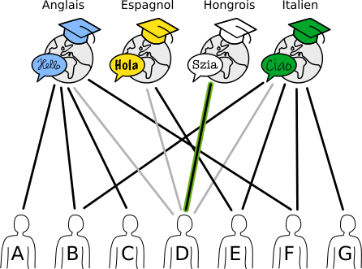
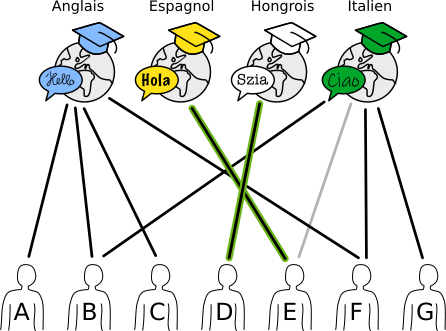
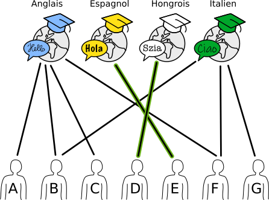

## Body

Une école de langue organise quatre cours d'été. Sur l'image ci-dessous, les lignes montrent quel enseignant de l'école est capable de donner quel cours.

")

Chaque enseignant ne peut donner qu'un seul cours. Il y a quand même plusieurs possibilités d'assigner un enseignant capable à chaque cours.

## Question/Challenge - for the brochures

Assigne un enseignant à chaque cours. Pour cela, surligne la ligne reliant l'enseignant au cours.

## Question/Challenge - for the online challenge

Assigne un enseignant à chaque cours. Pour cela, sélectionne la ligne reliant l'enseignant au cours.

## Interactivity instruction - for the online challenge

Clique sur une ligne pour la sélectionner. Clique à nouveau pour la déselectionner. Quand tu as fini, clique sur "Enregistrer la réponse".

## Answer Options/Interactivity Description

Interaktive Frage. Der Teilnehmer klickt auf eine Kante und dadurch wird diese hervorgehoben. Der Teilnehmer muss eine gültige Zuteilung für alle Kurse vornehmen. Die Zuteilung ist für diese Situation nicht eindeutig, es gibt mehrere Möglichkeiten für eine Zuordnung.

Zur interaktiven Version alternative Multiple-Choice-Fragen.

Quelle réponse est fausse?

a) Si B, F et G sont malade, un cours doit être annulé.

b) D va donner le cours d'espagnol.

c) E va donner le cours d'italien.

d) Quatre enseignants ne vont pas donner de cours d'été.

## Answer Explanation
--+ | --
D est la seule personne capable d'enseigner le hongrois. Elle doit donc être assignée à ce cours et ne peut pas en donner d'autre. | 

E est maintenant la seule personne capable d'enseigner l'esapgnol. Elle doit donc être assignée à ce cours et ne peut pas en donner d'autre. | 

Pour les deux cours restants, l'anglais et l'italien, on a le choix. B et F ne peuvent être assignés qu'à un seul cours chacun, même s'ils sont capables d'enseigner les deux. |

Il y a ainsi dix possibilités en tout d'assigner un enseignant capable à chaque cours:

:::indent
| anglais | italien | hongrois | espagnol |
| :-----: | :-----: | :------: | :------: |
|    A    |    B    |    D     |    E     |
|    A    |    F    |    D     |    E     |
|    A    |    G    |    D     |    E     |
|    B    |    F    |    D     |    E     |
|    B    |    G    |    D     |    E     |
|    C    |    B    |    D     |    E     |
|    C    |    F    |    D     |    E     |
|    C    |    G    |    D     |    E     |
|    F    |    B    |    D     |    E     |
|    F    |    G    |    D     |    E     |
:::

## This is Informatics

Un _graphe_ est constitué de _nœuds_ (points) qui sont reliés par des _arêtes_ (lignes). Les _graphes bipartis_ sont un type de graphe spécial: les nœuds peuvent être séparés en deux sous-ensembles de manière à ce qu'il n'y ait d'arêtes qu'entre les deux sous-ensembles.

La situation de cet exercice du Castor peut être représentée par un graphe biparti: les cours forment l'un des sous-ensembles et les enseignants l'autre sous-ensemble. Les graphes bipartis sont bien adapté à la modélisation et la résolution de problèmes d'affectation. On rencontre fréquemment des problèmes d'affectation au quotidien, par exemple lors de l'élaboration d'horaires ou de la répartition du travail entre des employés ou des machines. Pour le petits problèmes, il est possible de trouver simplement une solution optimale; cela devient cependant vite très complexe pour les plus grands problèmes. C'est pour cela que différents algorithmes permettant de trouver un maximum de paires rapidement ont été développés en informatique.

Une autre exemple de problème pouvant être représenté par un graphe biparti est le problème des mariages. Un ensemble d'hommes désirant se marier fait face à un ensemble de femmes désirant également se marier. Le but du procédé est de marier chaque homme à une femme (et chaque femme à un homme) en respectant les souhaits de partenaire de chacun. Le mathématicien Philipp Hall a formulé les conditions dans lesquelles une telle affectation est possible dans le lemme des mariages en 1935.

Dans notre cas, il ne s'agit pas de ce type d'affectation complète, mais d'affecter à chaque nœud d'un sous-ensemble (les cours) un nœud d'un autre sous-ensemble (les enseignants).

## This is Computational Thinking

---

## Informatics Keywords and Websites

- Graphe biparti: https://fr.wikipedia.org/wiki/Graphe_biparti
- Problème d'affectation: https://fr.wikipedia.org/wiki/Problème_d%27affectation
- Programme pour résoudre l'exercice: https://www.coding4you.at/dachu_2023/ir02/index.html
- Lemme des mariages: https://images.math.cnrs.fr/Le-lemme-des-Mariages.html

## Computational Thinking Keywords and Websites

- Logic
- Decomposition

## Wording and Phrases

- _accounting_
- _warehouse_
- _call center_
- _packing_
- _hire_
- _job_ 
- _qualified_

## Comments

- Jalil Nedaeepour, nedaeepour@gmail.com, (2023-03-29): The Idea of this task proposal is from my previous studies about graphs and their applications.
- Jalil Nedaeepour, nedaeepour@gmail.com, (2023-05-05): I have implemented most of the suggestions of the reviewers.
- James Atlas, james.atlas@canterbury.ac.nz, 2023-05-16 and Özgür Özdemir, ozguregit-im@gmail.com: working group L5. Edited graphics to make the vertex and font sizes larger. Simplified language in rules. Corrected rules to be "one will be hired…" Changed difficulty to medium for 12-14. Changed Ali to Elif so that each vertex has a unique first character label. Changed answer option e to use Elif so that answers do not use the same person more than once. Fixed template. Rewrote informatics section to add constraint satisfaction. Added words to wording and phrases.

