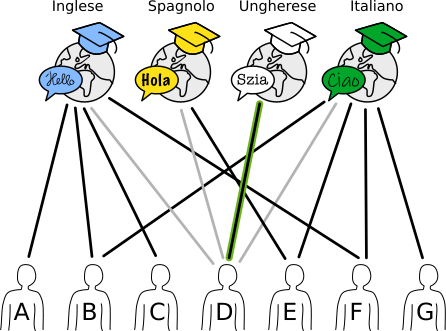
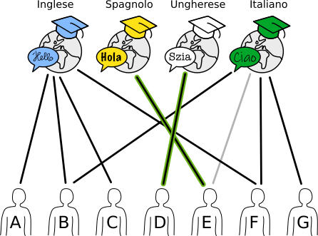
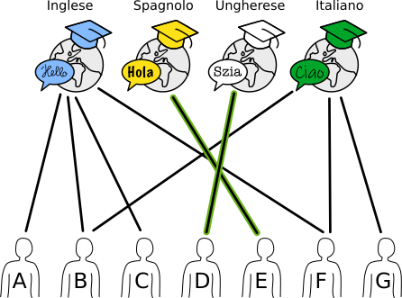

## Body

Una scuola di lingue ha in programma quattro corsi estivi.
Le linee nell'immagine mostrano quale insegnante della scuola è adatto a quale corso.

") 
 
Un insegnante può insegnare solo un corso.
Tuttavia, ci sono diversi modi per assegnare un insegnante adatto a ciascun corso.

## Question/Challenge - for the brochures

Assegna un insegnante appropriato a ciascun corso.
A tal fine, segna la linea tra la persona e il corso.

## Question/Challenge - for the online challenge

Assegna un insegnante appropriato a ciascun corso.
A tal fine, segna la linea tra la persona e il corso.

## Interactivity instruction - for the online challenge

Fa clic su una linea per segnarla. Fa nuovamente clic per rimuovere il contrassegno. Al termine, fa clic su "Salva risposta".

## Answer Options/Interactivity Description

Interaktive Frage. Der Teilnehmer klickt auf eine Kante und dadurch wird diese hervorgehoben. Der Teilnehmer muss eine gültige Zuteilung für alle Kurse vornehmen. Die Zuteilung ist für diese Situation nicht eindeutig, es gibt mehrere Möglichkeiten für eine Zuordnung.

Zur interaktiven Version alternative Multiple-Choice-Fragen.

Welche Antwort ist falsch?

a) Wenn B, F und G ausfallen, muss ein Kurs ausfallen

b) D wird den Spanischkurs durchführen.

c) E wird den Italienischkurs durchführen.

d) 4 Lehrer bekommen keinen Sommerkurs zugeteilt.

## Answer Explanation
--+ | --
D è l'unico insegnante che può insegnare il corso di ungherese. Deve essere assegnato a questo corso e non può insegnare altri corsi. | 

L'insegnante E è ora l'unico adatto per il corso di spagnolo. Deve essere assegnato a questo corso e non può insegnare altri corsi. | 

Per i due corsi rimanenti (inglese e italiano), si può scegliere liberamente. Tuttavia, B e F possono essere assegnati a un solo corso, anche se sono adatti a entrambi | 

Questo dà un totale di 10 possibilità di assegnare un insegnante adatto a ciascun corso:

:::indent
| Inglese | Italiano | Ungherese | Spagnolo |
| :-----: | :------: | :-------: | :------: |
|    A    |    B     |     D     |    E     |
|    A    |    F     |     D     |    E     |
|    A    |    G     |     D     |    E     |
|    B    |    F     |     D     |    E     |
|    B    |    G     |     D     |    E     |
|    C    |    B     |     D     |    E     |
|    C    |    F     |     D     |    E     |
|    C    |    G     |     D     |    E     |
|    F    |    B     |     D     |    E     |
|    F    |    G     |     D     |    E     |
:::

## This is Informatics

Un _grafo_ è costituito da _nodi_ (punti) collegati da _bordi_ (linee). Una classe speciale di grafi è costituita dai _grafi bipartiti_: i nodi possono essere suddivisi in due sottoinsiemi separati, in modo che esistano solo bordi tra nodi di sottoinsiemi diversi.

 
 
La situazione in questo compito può essere rappresentata da un grafo bipartito: Un sottoinsieme è costituito dai corsi e l'altro dai docenti. I grafi bipartiti sono ottimi per modellare e risolvere i problemi di assegnazione. Nella vita di tutti i giorni incontriamo spesso problemi di assegnazione, ad esempio negli orari o nella distribuzione del lavoro ai dipendenti o alle macchine. Per i problemi più piccoli è facile trovare un'assegnazione ottimale; per quelli più grandi, invece, diventa molto complesso in tempi relativamente brevi. Per questo motivo, in informatica sono stati sviluppati diversi algoritmi per trovare il maggior numero possibile di coppie corrispondenti nel minor tempo possibile.

Ad esempio, il cosiddetto problema del matrimonio viene rappresentato anche con l'aiuto di un grafo bipartito. In questo caso, un insieme di uomini che vogliono sposarsi viene confrontato con un insieme di donne che vogliono sposarsi. Lo scopo della procedura è quello di far sposare tutti gli uomini o tutte le donne, tenendo conto dei rispettivi desideri. Il matematico inglese Philip Hall ha formulato le condizioni per cui tale allocazione è possibile nel teorema del matrimonio nel 1935.

Nella nostra variante, non si tratta di un'assegnazione completa, ma piuttosto di assegnare il maggior numero possibile di nodi di un sottoinsieme (i corsi) a un nodo dell'altro sottoinsieme.

## This is Computational Thinking

—

## Informatics Keywords and Websites

- Grafo bipartito: https://it.wikipedia.org/wiki/Grafo_bipartito
- Problema di assegnazione: https://it.wikipedia.org/wiki/Problema_di_assegnazione
- Programma per la risoluzione del compito: https://www.coding4you.at/dachu_2023/ir02/index.html

## Computational Thinking Keywords and Websites

- Logic
- Decomposition

## Wording and Phrases

- _accounting_
- _warehouse_
- _call center_
- _packing_
- _hire_
- _job_ 
- _qualified_

## Comments

- Jalil Nedaeepour, nedaeepour@gmail.com, (2023-03-29): The Idea of this task proposal is from my previous studies about graphs and their applications.
- Jalil Nedaeepour, nedaeepour@gmail.com, (2023-05-05): I have implemented most of the suggestions of the reviewers.
- James Atlas, james.atlas@canterbury.ac.nz, 2023-05-16 and Özgür Özdemir, ozguregit-im@gmail.com: working group L5. Edited graphics to make the vertex and font sizes larger. Simplified language in rules. Corrected rules to be "one will be hired…" Changed difficulty to medium for 12-14. Changed Ali to Elif so that each vertex has a unique first character label. Changed answer option e to use Elif so that answers do not use the same person more than once. Fixed template. Rewrote informatics section to add constraint satisfaction. Added words to wording and phrases.

