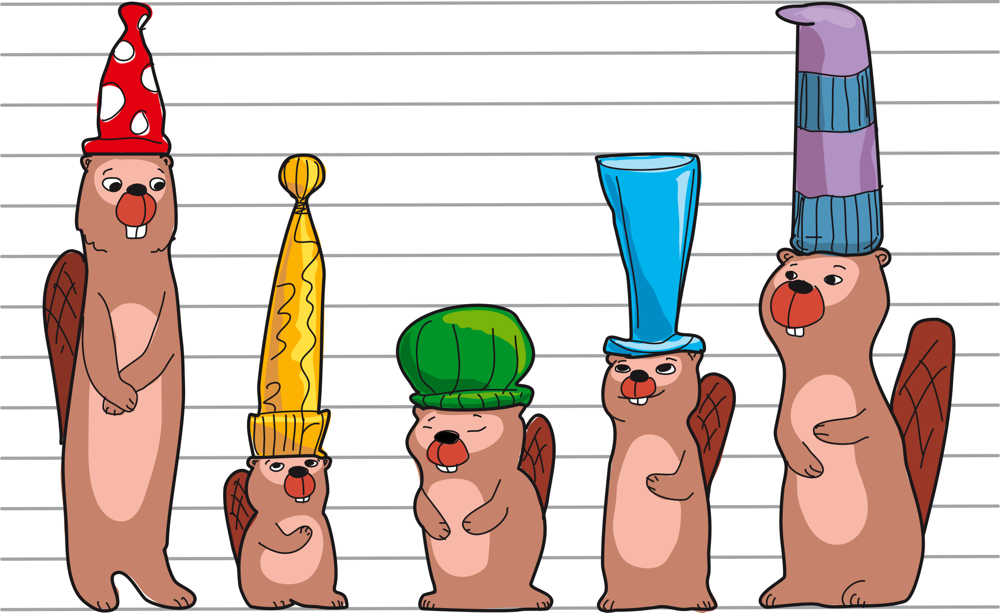

## Body

Les castors ont de nouveaux chapeaux.

## Question/Challenge - for the brochures

Trie les chapeaux selon leur taille.

## Question/Challenge - for the online challenge

Trie les chapeaux selon leur taille.

## Interactivity instruction - for the online challenge

Glisse les castors dans le bon ordre. Quand tu as fini, clique sur "Enregistrer la réponse".

## Answer Options/Interactivity Description

- The beavers with the hats can be dragged from right to left. Dragging the beaver between 2 other beavers is possible. The interacitvity opens a space between the 2 beavers.

## Answer Explanation

Voici les deux manières de trier les chapeaux:

:::center
")   ")
:::

Il y a deux bonnes réponses, les chapeaux peuvent devenir
- de plus en plus grands, ou
- de plus en plus petits
en allant de gauche à droite.

En triant les castors, on ne fait attention qu'aux chapeaux. C'est alors beaucoup plus facile de les trier par taille.

:::center
")    ")
:::

## This is Informatics

Beaucoup d'objets autour de nous sont triés pour mieux pouvoir choisir parmi eux: si les outils sont triés par taille, c'est plus facile de trouver un outil précis. On peut trouver un mot facilement dans un dictionnaire parce que les mots y sont triés par ordre alphabétique.

Dans cet exercice, tu devais trier les castors d'après la taille de leur chapeau. La difficulté est que la _propriété_ "taille du chapeau" n'est pas facile à reconnaître. Nous pouvons trier les castors d'après au moins trois tailles:
- Taille des castors (![beaver])
- Taille des chapeaux (![hat])
- Taille totale (![hat] + ![beaver])

")

[hat]: graphics/2023-LT-01-informatics02.svg "Chapeau (12px)"
[beaver]: graphics/2023-LT-01-informatics03.svg "Castor (18px)"

Le tri des castors est différent pour chacune de trois propriétés de taille.

:::center
| Castor | $~~~$![hat]$~~~$ | $~~~$![beaver]$~~~$ | ![hat] + ![beaver] |
| ------ | :--------------: | :-----------------: | :----------------: |
| A      |        3         |          9          |         12         |
| B      |        6         |          3          |         9          |
| C      |        2         |          4          |         6          |
| D      |        4         |          5          |         9          |
| E      |        5         |          7          |         12         |
:::

Pour trier, il est donc important de commencer par bien définir la propriété d'après laquelle il faudra trier. Ensuite, les valeurs de cette propriété doivent être triables: on peut trier d'après des propriétés qui sont exprimées en nombre (comme la taille, la longueur, le poids...): on peut dire quel nombre est le plus petit entre deux nombres. On peut trier des mots car l'ordre des lettres dans l'alphabet est défini et que c'est donc clair lequel de deux mots vient avant dans le dictionnaire. De manière générale, on peut dire que l'on peut trier d'après une propriété s'il existe une relation "plus petit que" (une _relation d'ordre_) entre ses valeurs individuelles.

Les ordinateurs gèrent de grands volumes de données. Pour pouvoir y trouver des données précises, les données doivent être triées. Il existe beaucoup de méthodes rapides de tri en informatique, et quelle méthode doit être utilisée dans quel cas est un sujet bien étudié.

## This is Computational Thinking

Optional - not to be filled 2023

## Informatics Keywords and Websites

 - Algorithme de tri: https://fr.wikipedia.org/wiki/Algorithme_de_tri
 - Relation d'ordre: https://fr.wikipedia.org/wiki/Relation_d%27ordre
 - Algorithme de recherche: https://fr.wikipedia.org/wiki/Algorithme_de_recherche

## Computational Thinking Keywords and Websites

 - 

## Wording and Phrases

German wording and phrases please here!

 - _Word 1_: Bedeutung in dieser Aufgabe
 - _Phrase 1_: Bedeutung in dieser Aufgabe 

## Comments

Report changes on this file (older comments can be looked up in the original document)

_Susanne Datzko, 2023-07-03_: 
Offene Fragen:
- Reicht "sortieren der Grösse nach?" Oder müssen wir sagen der Höhe nach?
- Reicht bei der Lösungserklärung evtl. auch einfach dieses Bild? 
")
- Ist der Exkurs zu Datenbank und Suchalgorithmen okay, oder zu weit hergeholt (bzw. zu anspruchsvoll)

_Name, Datum_: Kommentar 2

 * We don't delete the original english version of the task for making possible to look up the older comments.