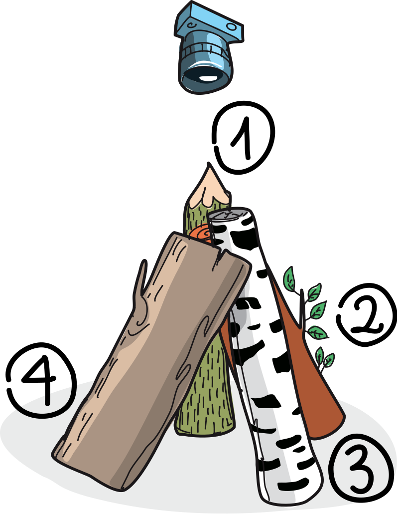
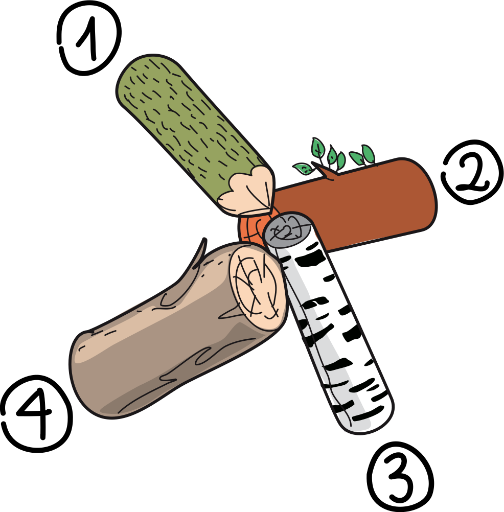

## Body

") 
 
Il castoro ha scattato una foto.

## Question/Challenge - for the brochures

Di quale delle quattro foto si tratta?

## Question/Challenge - for the online challenge

Di quale delle quattro foto si tratta?

## Interactivity instruction - for the online challenge

--

## Answer Options/Interactivity Description

| :-----: | :-----: | :-----: | :-----: |
| ![ansA] | ![ansB] | ![ansC] | ![ansD] |
|   A)    |   B)    |   C)    |   D)    |

[ansA]: graphics/2023-LT-02asw-A.svg "Risposta A (150px)"
[ansB]: graphics/2023-LT-02asw-B.svg "Risposta B (150px)"
[ansC]: graphics/2023-LT-02asw-C.svg "Risposta C (150px)"
[ansD]: graphics/2023-LT-02asw-D.svg "Risposta D (150px)"

## Answer Explanation

La risposta corretta è D). ![ansD]

I tronchi d'albero fotografati dal castoro sono disposti in cerchio. Per scoprire quale foto è quella giusta, osserviamo l'ordine dei tronchi in questa disposizione. Scegliamo un tronco (ad esempio quello appuntito) e gli diamo il numero 1. Poi determiniamo quale tronco si trova a sinistra e gli diamo il numero 2. Procediamo così finché tutti i tronchi hanno un numero. Nella situazione fotografata dal castoro, i tronchi sono in quest'ordine: 1 (tronco appuntito) - 2 (tronco marrone con foglie) - 3 (tronco di betulla) - 4 (tronco marrone spesso).

 
 
Ora guardiamo la sequenza dei tronchi nelle foto da A a D. Iniziamo come sopra con il tronco affilato 1 e andiamo sempre verso sinistra:
- Foto A: 1 – 3 – 2 – 4
- Foto B: 1 – 4 – 3 – 2
- Foto C: 1 – 3 – 4 – 2
- Foto D: 1 – 2 – 3 – 4

Solo la foto D mostra l'ordine corretto.

 
 
## This is Informatics

In questo compito, si considera l'ordine dei tronchi d'albero. Ciò che è possibile con pochi _elementi_ (qui quattro tronchi d'albero) semplicemente "guardando" e confrontando le coppie vicine, richiede una procedura automatizzata per problemi con molti più elementi. In un programma informatico che deve elaborare elementi vicini, gli elementi possono essere memorizzati in una struttura di dati adatta, come una lista concatenata:

") 
 
In una _lista concatenata_, ogni dato è memorizzato in un singolo nodo. Inoltre, in ogni nodo è memorizzato un _riferimento_ al nodo successivo della lista. Se l'ultimo nodo contiene un riferimento al primo nodo, si tratta di una struttura di dati anulare. Questo è importante nell'esempio, in modo da poter iniziare da qualsiasi tronco d'albero e scorrere la lista.

## This is Computational Thinking

Optional - not to be filled 2023

## Informatics Keywords and Websites

- Lista concatenata: https://it.wikipedia.org/wiki/Lista_concatenata

## Computational Thinking Keywords and Websites

Optional - not to be filled in 2023

## Wording and Phrases

German wording and phrases please here!

 - _Word 1_: Bedeutung in dieser Aufgabe
 - _Phrase 1_: Bedeutung in dieser Aufgabe 

## Comments

Report changes on this file (older comments can be looked up in the original document)

_Name, Datum_: Kommentar 1

_Name, Datum_: Kommentar 2

 * We don't delete the original english version of the task for making possible to look up the older comments.