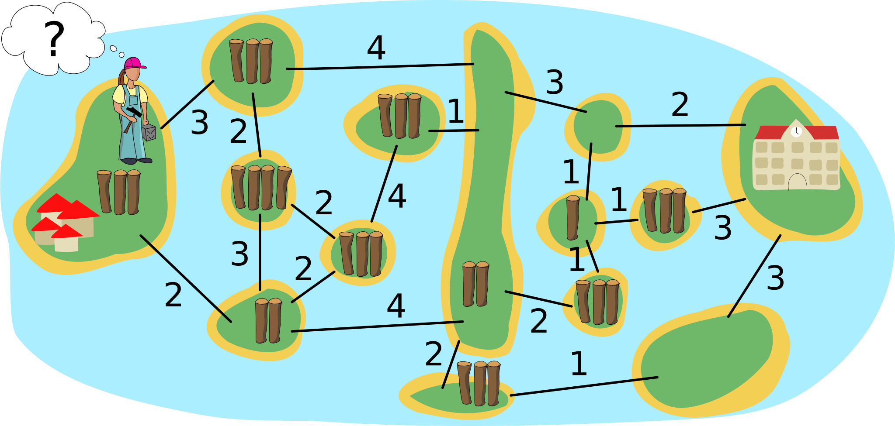
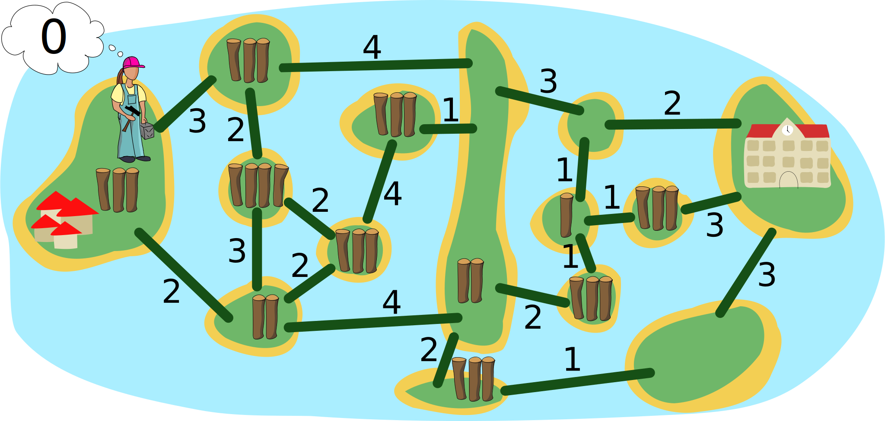
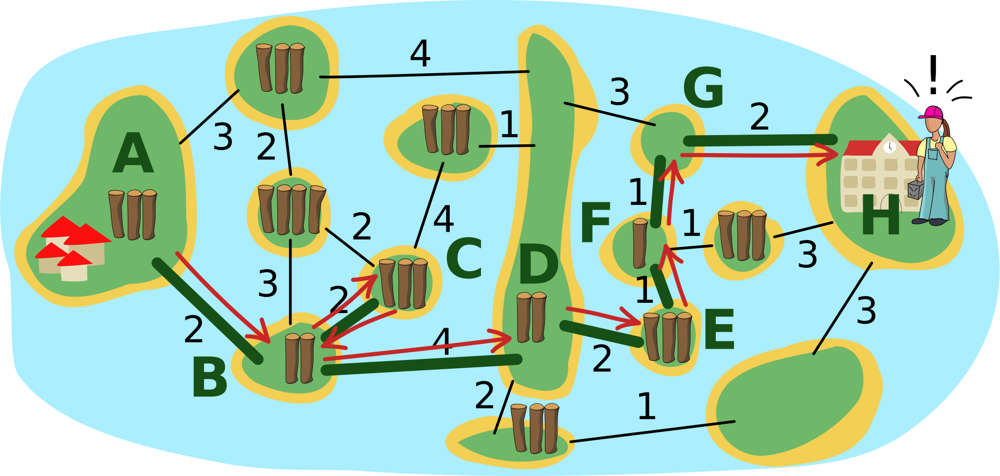

## Body

Auf der Insel ganz links sind Kinder eingezogen.
Bianca soll Brücken bauen, über die die Kinder zur Schule auf der Insel ganz rechts gehen können.

Die Insel-Karte zeigt, wie viele Baumstämme es auf jeder Insel gibt.
Diese Baumstämme kann Bianca nehmen, um an den Linien Brücken zu bauen.
Die Zahl an einer Linie sagt, wie viele Baumstämme dort für eine Brücke benutzt werden.
Sobald es zwischen zwei Inseln eine Brücke gibt, kann Bianca darüber gehen
und Stämme, die sie noch hat, mitnehmen.
Natürlich kann sie jeden Baumstamm nur für eine Brücke benutzen.

Bianca fängt auf er Insel links an.  Ihr Ziel ist, möglichst wenige Baumstämme zu benutzen.

## Question/Challenge - for the brochures

An welchen Linien soll Bianca Brücken bauen, damit sie ihr Ziel erreicht?

## Question/Challenge - for the online challenge

An welchen Linien soll Bianca Brücken bauen, damit sie ihr Ziel erreicht?

## Interactivity instruction - for the online challenge

Klicke eine Linie an, um sie auszuwählen. In Biancas Denkblase siehst du, wie viele Baumstämme du benutzt. Wenn du fertig bist, klicke auf "Antwort speichern"!

## Answer Options/Interactivity Description

Each "path" must be clickable and when clicked, a bridge (maybe trunks in the appropriate number laid out?) appears. Any bridge could be built at any point in time, even impossible bridges (to allow the students to start from the school as well).

Es würde sich lohnen, die momentane Summe der angeklickten Brücken und die Summe der insgesamt zur Verfügung stehenden Baumstämme anzuzeigen; dann wäre jedoch das Problem, dass damit die feasibility noch nicht gezeigt ist, und dass dies zu Missverständnissen führen könnte.

## Answer Explanation

So ist es richtig:

Die grünen Linien zeigen, wo Bianca Brücken gebaut hat.  Die roten Pfeile zeigen, wie Bianca über die Brücken gegangen ist:

- Auf der Insel A nimmt sie die drei Baumstämme und benutzt zwei davon für die erste Brücke. Mit dem verbleibenden Baumstamm geht sie über die Brücke und hat auf der Insel B $3 - 2 + 2 = 3$ Baumstämme.  Das sind nicht genug, um eine Brücke zur Insel D zu bauen.
- Deshalb baut sie mit 2 Stämmen eine Brücke zur Insel C.  Sie geht über die Brücke, nimmt die 3 Stämme von der Insel C und geht zurück.  Nun hat sie $3 - 2 + 3 = 4$ Stämme.
- Damit baut sie eine Brücke zur Insel D, geht über die Brücke und hat dann die 2 Stämme von Insel D.
- Damit baut sie eine Brücke zur Insel E und kann dort 3 Stämme nehmen.  Sie baut weitere Brücken zu den Inseln F und G.  Auf der Insel E hat sie also 3 Stämme, auf der Insel F $3 - 1 + 1 = 3$ Stämme und auf der Insel G noch 2 Stämme.
- Die reichen genau, um eine Brücke zur Insel H mit der Schule zu bauen.

Insgesamt konnte Bianca also Brücken für einen Weg von Insel A zu Insel H bauen und hat dafür 14 Baumstämme benutzt.  Aber geht es auch mit weniger Stämmen?  Dazu müssen alle möglichen Wege untersucht werden.  Weil die alle über die lange Insel D führen, lässt sich das Problem in zwei Teile zerlegen: Von Insel A zu Insel D, und von Insel D zu Insel H: 

- Für die Brücken von Insel A bis Insel D hat Bianca 8 Stämme benutzt und kam ohne Stamm auf Insel D an.  Wir notieren ihren Weg so: $2-[2,2]-4$ (von der Insel A über die Linie mit der 2 zur Insel B, dann zwischen B und C hin und zurück über die 2, dann über die 4 zu Insel D).  Ein Weg mit weniger Stämmen wäre $3-4$, kann aber nur mit Umweg gebaut werden ($3-[2,2]-4$), verbraucht also 9 Stämme, wobei Bianca auf Insel D mit einem Stamm im Vorrat ankommt.  Alle anderen Wege von Insel A bis D verbrauchen 9 Stämme oder mehr.
- Für die Brücken von Insel D bis H hat Bianca 6 Stämme benutzt. Den direkten Weg $3-2$ kann sie nicht bauen, auch nicht mit einem Stamm im Vorrat. Alle anderen Wege von Insel D zu Insel H verbrauchen 6 Stämme oder mehr.

Es ist also nicht möglich, mit weniger als 14 Stämmen Brücken zu bauen, über die die Kinder von der Dorf-Insel A zur Schul-Insel H gehen können.  Mit den von ihr gebauten Brücken hat Bianca also ihr Ziel erreicht.

## This is Informatics

Die Insel-Karte mit den durch Linien angezeigten "Brücken-Bauplätzen" kann als _Graph_ modelliert werden:  Das ist eine mathematische Struktur, die Objekte (auch Knoten genannt) paarweise miteinander in Relation setzt (die Paare nennt man auch Kanten).  In einem Graphen man die Inseln als Knoten und die Linien als Kanten modellieren.  Dabei haben die Kanten _Gewichte_, nämlich die Anzahl der für den Brückenbau entlang einer Linie benutzten Baumstämme, aber auch die Knoten (die Anzahl der Stämme auf einer Insel) – das ist eher ungewöhnlich.  Für Graphen, bei denen nur die Kanten gewichtet sind, kennt die Informatik mehrere effiziente Algorithmen, die einen kürzesten Weg (über Kanten mit minimaler Summe der Gewichte) zwischen zwei Knoten berechnen können.

Das Problem, das Bianca in dieser Biberaufgabe optimal lösen möchte, ist komplizierter:  Sie möchte zwar auch einen kürzesten Weg gehen, hat aber eine Randbedingung:  Die Summe der Knotengewichte auf ihrem bisherigen Weg (die Stämme, die sie nehmen konnte) abzüglich der Summe der Kantengewichte auf ihrem Weg (die Stämme, die sie für den Brückenbau benutzt hat) muss grösser sein als das Gewicht der Kante, die sie als nächste gehen bzw. wo sie eine Brücke bauen möchte.  Um den optimalen Weg zu finden, müssen hier eventuell alle Möglichkeiten ausprobiert werden.  Die Zerlegung des Problems in zwei Teile hilft, die Anzahl der Möglichkeiten zu reduzieren.  Und wegen der Randbedingung kann man viele Möglichkeiten ausschliessen, bevor man sie komplett probiert hat.  In der Informatik ist ein solches Vorgehen (Probieren und Ausschliessen) als _Backtracking_ bekannt (siehe auch die Biberaufgabe "Gemüsebeet").

## This is Computational Thinking

Beim Lösen des Problems begegnen wir einem vier wichtige Aspekte des Computational Thinking:
- Es ist im Grunde egal, dass es um Inseln und Brücken geht, alleine die Struktur des Graphen ist relevant. Diesen Vorgang nennt man Abstrahieren, wenn die wesentlichen Informationen verwendet werden und alle übrigen (die Einkleidung durch die Aufgabe) weggelassen werden.
- Das ziemlich komplexe Problem wird in zwei Teile zerlegt (manchmal auch Dekomposition genannt), die für sich genommen relativ einfach lösbar sind.
- Dadurch dass zu jeder Zeit genügend Baumstämme für den Bau von Brücken vorhanden sein müssen, ist auch algorithmisches Denken oder das Denken in Abläufen notwendig.
- Zuletzt wird in der Regel eine lokale Optimierung stattgefunden haben: man hat eine mögliche Lösung gefunden und versucht durch Ausprobieren von leicht veränderten Alternativen eine bessere Lösung zu finden.

Im Abschnitt "Dies ist Informatik" oben wird zudem Algorithmenanalyse aufgezeigt.

## Informatics Keywords and Websites

- Graph: https://de.wikipedia.org/wiki/Graph_(Graphentheorie)
- gewichteter Graph: https://de.wikipedia.org/wiki/Kantengewichteter_Graph

## Computational Thinking Keywords and Websites

- Abstraktion (https://de.wikipedia.org/wiki/Abstraktion)
- Dekomposition (https://de.wikipedia.org/wiki/Modell#Modellbildung)
- Algorithmisches Denken (https://algdenken.phgr.ch)
- Lokale Optimierung (https://de.wikipedia.org/wiki/Lokale_Suche)
- Algorithmenanalyse (https://de.wikipedia.org/wiki/Algorithmus#Algorithmenanalyse)

## Wording and Phrases

- _Brücke_: Kante
- _Insel_: Knoten
- _Baumstamm_: "Kosten" zum Brückenbau und "Guthaben", das auf Inseln zu finden ist
- _benachbarte Insel_: eine Insel, die von einer anderen aus mit einer der angebotenen möglichen Brücken erreicht werden kann

## Comments

Zsuzsa Pluhár (svn: pluhar) on 2023-04-06
- [AGE] I don’t think, it could be the same "hard" or "medium" for 3 age groups. For 6-10yo I would not use (long text, process) this task. I would prefer (because of the long solving process for the oldest age group)
- [IDEA] The idea is nice. It requires some computational thinking skills to be understood and solved.
- [TEXT] The text can be improved: instead of "stick" I would prefer "board" or "lumber"; in the last sentence I would stress he can do that, but he doesn’t need to use all the sticks; without beavers, it would be shorter and less "not used information" in the text.
- [EXPL] The "Answer Explanation" section is available and complete. It is understandable by students of the appropriate level, but I would extend with the process "how to solve", how to find the solution (e.g: try to find the shortest path and check whether it is possible with the number of lumbers…; or present other strategies to solve the task)
- [TiI] The "It’s informatics" section is available, but it could be understood only by the oldest or IT specialist :). It is well connected to the task but needs to be improved.
- The "Students could solve the problem…" section is not for TiI.
- [TiCT] The "This is Computational Thinking" section is available. The keywords for CT are keywords for IT!
- [GRAPH] The figures are clear, in SVG format and appealing, CC-licensed, and may be re-used and modified, but it would be nice to create a nicer representation (colors, bigger numbers with small lumbers, …)
- [AUTH] The name(s) and mail address(es) of the author(s) are available.
- [NAME] The names of the task folder and file(s) are compiled to the prescribed format.
- [OTHER] –

Yong Mao (svn: mao) on 2023-04-10
- [AGE] For 6-12yo, I suggest it is better not to include this task. It exceeds the level of those ages.
- [EXPL] It only explained why the correct answer is feasible to the constraint, but not explained why it is the optimal feasible answer. I suggest to add more explanation to this section.

Leonardo Cavalcante (svn: cavalcante) on 2023-04-19
- Nice task, but not for all the age groups. It is too hard for the first 2 age groups. I think it would be better suggesting this task only for the last 3 age groups. Maybe saying Brian doesn’t need to use all the sticks he just got to build a bridge to go to the next land would be helpful.
- Why not answer options as well (numbers from 14 to 17)?
- Answer explanation section needs more explanation. Why is the path shown the one built with the fewest sticks?

James Atlas (author) on 2023-05-03
- [AGE] Changed to 14-16 Hard and 16-19 Medium as per suggestions
- [TEXT] Changed stick to board throughout. Edited text slightly to make rules clear (Brian does not need to use all boards, can travel to any land that is connected by bridges to pick up boards).
- [EXPL] Rewrote explanation by moving divide and conquer approach originally in [TiI] to this section and expanding it to the specific values in the problem. Added labelled edge paths to explanation. Explain feasibility of a path. Added proof by enumeration using upper and lower bounds.
- [GRAPH] Added color. Increased font sizes. Added graphic for Brian and for boards on each land mass.
- [TiI] Significant rewrite. Removed specific problem values / steps (these are now in the EXPL section). Tied the approaches used in the solution to more general algorithms and informatics techniques. Modified keywords.
- [TiCT] Fixed CT keywords.
- [Other] Added interactivity idea option.

D-A-CH-HU (pre-2023-06-27):
- ZsP: die Process zu lösen ist zu lang mit dem Finden des Minimums
- Giovanni: very nice task. Maybe the interactive version would be more appropriate.
- SD: Interaktiv besser, evtl. Zeitkiller, Aufgabentext reduzieren wenn möglich
- WP: Ganz spannende schwierige Aufgabe. Bookkeeping in der Interaktivität reduzieren? geht langsam das Optimum zu finden

Christian Datzko on 2023-07-12:
- I streamlined the conditions into one set of rules.
- A added the condition that no bridges may be destroyed and the logs recovered (necessary in my opinion).
- Made the answer explanation a little bit more one flow of text without adding the extra level of abstraction.

