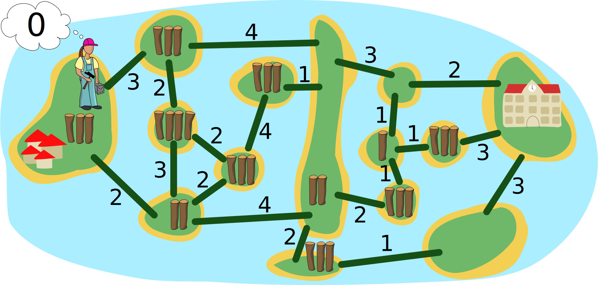

## Body

Des enfants ont emménagé sur l'île tout à gauche. Bianca doit construire des ponts permettant aux enfants d'aller à l'école sur l'île tout à droite.

La carte des îles montre combien il y a de troncs sur chaque île. Bianca peut prendre ces troncs pour construire des ponts sur les lignes. Le chiffre au-dessus d'une ligne indique combien de troncs sont nécessaires pour y contruire un pont. Dès qu'un pont entre deux îles est construit, Bianca peut le traverser en prenant avec les troncs qu'il lui reste. Elle ne peut bien sûr utiliser chaque tronc que pour un seul pont.

Bianca commence sur l'île de gauche. Son but est d'utiliser le moins de troncs possible.

## Question/Challenge - for the brochures

Sur quelles lignes Bianca doit-elle construire des ponts pour atteindre son but?

## Question/Challenge - for the online challenge

Sur quelles lignes Bianca doit-elle construire des ponts pour atteindre son but?

## Interactivity instruction - for the online challenge

Clique sur une ligne pour la sélectionner. Tu peux voir combien de troncs tu utilises dans la bulle de Bianca. Quand tu as fini, clique sur "Enregistrer la réponse".

## Answer Options/Interactivity Description

Each "path" must be clickable and when clicked, a bridge (maybe trunks in the appropriate number laid out?) appears. Any bridge could be built at any point in time, even impossible bridges (to allow the students to start from the school as well).

Es würde sich lohnen, die momentane Summe der angeklickten Brücken und die Summe der insgesamt zur Verfügung stehenden Baumstämme anzuzeigen; dann wäre jedoch das Problem, dass damit die feasibility noch nicht gezeigt ist, und dass dies zu Missverständnissen führen könnte.

## Answer Explanation

Voici la bonne réponse:

Les lignes vertes montrent les ponts que Bianca a construits. Les flèches rouges montrent comment elle a traversé les ponts:
- Sur l'île A, elle prend trois troncs et en utilise deux pour construire le premier pont. Elle traverse le pont avec le tronc restant et a $3 - 2 + 2 = 3$ troncs sur l'île B. Cela ne suffit pas pour construire un pont vers l'île D.
- Elle construit donc un pont vers l'île C avec deux troncs. Elle traverse le pont, prend les trois troncs de l'île C et revient. Elle a maintenant $3 - 2 + 3 = 4$ troncs.
- Avec ces quatre troncs, elle construit un pont vers l'île D, le traverse et prend les deux troncs de l'île D.
- Avec ces deux troncs, elle construit un pont vers l'île E, le traverse et prend les trois troncs. Elle construit des ponts vers les îles F et G. Sur l'île E, Bianca a trois troncs; sur l'île F, $3 - 1 + 1 = 3$ troncs et sur l'île G ecore deux troncs.
- Ces deux troncs suffisent exactement pour construire un pont vers l'île H, où se trouve l'école.

Bianca a donc pu construire des ponts pour faire un chemin de l'île A à l'île H en utilisant 14 troncs en tout. Mais est-ce possible avec moins de troncs? Pour le savoir, il faut étudier tous les chemins possibles. Comme tous les chemins passent par la longue île D, le problème peut être divisé en deux: de l'île A à l'île D, et de l'île D à l'île H:
- Bianca a utilisé 8 troncs pour les ponts entre l'île A et l'île D, et est arrivée sans tronc sur l'île D. On note son chemin ainsi: $2-[2,2]-4$ (de l'île A par la ligne avec le 2 jusqu'à l'île B, puis aller-retour entre B et C par le ligne 2, puis par la ligne 4 jusqu'à D). Un chemin utilisant moins de troncs serait $3-4$, mais il ne peut être construit qu'avec un détour ($3-[2,2]-4$) et nécessite donc neuf troncs; Bianca arrive alors sur l'île D avec un tronc en réserve. Tous les autres chemins entre A et D utilisent neuf troncs ou plus.
- Bianca a utilisé six troncs pour les ponts entre les îles D et H. Elle ne peut pas construire le chemin direct $3-2$, même avec un tronc en réserve. Tous les autres chemins de l'île D à l'île H utilisent 6 troncs ou plus.

Ce n'est donc pas possible de construire des ponts permettant aux enfants de l'île-village A d'aller à l'île-école H avec moins de 14 troncs. Bianca a atteint son but.

## This is Informatics

La carte des îles avec les lignes représentant des ponts possibles peut être représentée par un _graphe_: une structure mathématique qui relie par des arêtes des paires d'objets (aussi appelés _nœuds_). Dans un graphe, les îles sont représentées par des nœuds et les lignes par des _arêtes_. Dans ce cas, les arêtes ont des _poids_ (le nombre de troncs nécessaires à la construction d'un pont), mais les nœuds également (le nombre de troncs disponibles sur l'île), ce qui est inhabituel. En informatique, on connaît plusieurs algorithmes efficaces pour calculer le plus court chemin (le chemin avec la plus petite somme des poids des arêtes) entre deux nœuds d'un graphe dont seules les arêtes ont un poids.

Le problème que Bianca veut résoudre de manière optimale dans cet exercice est plus compliqué: elle souhaite également trouver le plus court chemin, mais a encore une autre contrainte: la différence entre la somme des poids de tous les nœuds sur son chemin jusqu'ici (les troncs qu'elle a pu prendre) et la somme des poids des arêtes sur son chemin (les troncs utilisés pour les ponts) doit être plus grande que le poids de l'arête où Bianca souhaite construire le prochain pont. Pour trouver le chemin optimal, il faut ici essayer toutes les possibilité. C'est utile de diviser le problème en deux pour réduire le nombre de possibilités, et les contraintes nous permettent d'exclure beaucoup de chemins avant de les avoir complètement parcourus. En informatique, on appelle une telle méthode (essayer et exclure) le _retour sur trace_ (voir aussi l'exercice "Jardin potager").

## This is Computational Thinking

Beim Lösen des Problems begegnen wir einem vier wichtige Aspekte des Computational Thinking:
- Es ist im Grunde egal, dass es um Inseln und Brücken geht, alleine die Struktur des Graphen ist relevant. Diesen Vorgang nennt man Abstrahieren, wenn die wesentlichen Informationen verwendet werden und alle übrigen (die Einkleidung durch die Aufgabe) weggelassen werden.
- Das ziemlich komplexe Problem wird in zwei Teile zerlegt (manchmal auch Dekomposition genannt), die für sich genommen relativ einfach lösbar sind.
- Dadurch dass zu jeder Zeit genügend Baumstämme für den Bau von Brücken vorhanden sein müssen, ist auch algorithmisches Denken oder das Denken in Abläufen notwendig.
- Zuletzt wird in der Regel eine lokale Optimierung stattgefunden haben: man hat eine mögliche Lösung gefunden und versucht durch Ausprobieren von leicht veränderten Alternativen eine bessere Lösung zu finden.

Im Abschnitt "Dies ist Informatik" oben wird zudem Algorithmenanalyse aufgezeigt.

## Informatics Keywords and Websites

- Graphe: https://fr.wikipedia.org/wiki/Graphe_(mathématiques_discrètes)
- Retour sur trace: https://fr.wikipedia.org/wiki/Retour_sur_trace

## Computational Thinking Keywords and Websites

- Abstraktion (https://de.wikipedia.org/wiki/Abstraktion)
- Dekomposition (https://de.wikipedia.org/wiki/Modell#Modellbildung)
- Algorithmisches Denken (https://algdenken.phgr.ch)
- Lokale Optimierung (https://de.wikipedia.org/wiki/Lokale_Suche)
- Algorithmenanalyse (https://de.wikipedia.org/wiki/Algorithmus#Algorithmenanalyse)

## Wording and Phrases

- _Brücke_: Kante
- _Insel_: Knoten
- _Baumstamm_: "Kosten" zum Brückenbau und "Guthaben", das auf Inseln zu finden ist
- _benachbarte Insel_: eine Insel, die von einer anderen aus mit einer der angebotenen möglichen Brücken erreicht werden kann

## Comments

Zsuzsa Pluhár (svn: pluhar) on 2023-04-06
- [AGE] I don’t think, it could be the same "hard" or "medium" for 3 age groups. For 6-10yo I would not use (long text, process) this task. I would prefer (because of the long solving process for the oldest age group)
- [IDEA] The idea is nice. It requires some computational thinking skills to be understood and solved.
- [TEXT] The text can be improved: instead of "stick" I would prefer "board" or "lumber"; in the last sentence I would stress he can do that, but he doesn’t need to use all the sticks; without beavers, it would be shorter and less "not used information" in the text.
- [EXPL] The "Answer Explanation" section is available and complete. It is understandable by students of the appropriate level, but I would extend with the process "how to solve", how to find the solution (e.g: try to find the shortest path and check whether it is possible with the number of lumbers…; or present other strategies to solve the task)
- [TiI] The "It’s informatics" section is available, but it could be understood only by the oldest or IT specialist :). It is well connected to the task but needs to be improved.
- The "Students could solve the problem…" section is not for TiI.
- [TiCT] The "This is Computational Thinking" section is available. The keywords for CT are keywords for IT!
- [GRAPH] The figures are clear, in SVG format and appealing, CC-licensed, and may be re-used and modified, but it would be nice to create a nicer representation (colors, bigger numbers with small lumbers, …)
- [AUTH] The name(s) and mail address(es) of the author(s) are available.
- [NAME] The names of the task folder and file(s) are compiled to the prescribed format.
- [OTHER] –

Yong Mao (svn: mao) on 2023-04-10
- [AGE] For 6-12yo, I suggest it is better not to include this task. It exceeds the level of those ages.
- [EXPL] It only explained why the correct answer is feasible to the constraint, but not explained why it is the optimal feasible answer. I suggest to add more explanation to this section.

Leonardo Cavalcante (svn: cavalcante) on 2023-04-19
- Nice task, but not for all the age groups. It is too hard for the first 2 age groups. I think it would be better suggesting this task only for the last 3 age groups. Maybe saying Brian doesn’t need to use all the sticks he just got to build a bridge to go to the next land would be helpful.
- Why not answer options as well (numbers from 14 to 17)?
- Answer explanation section needs more explanation. Why is the path shown the one built with the fewest sticks?

James Atlas (author) on 2023-05-03
- [AGE] Changed to 14-16 Hard and 16-19 Medium as per suggestions
- [TEXT] Changed stick to board throughout. Edited text slightly to make rules clear (Brian does not need to use all boards, can travel to any land that is connected by bridges to pick up boards).
- [EXPL] Rewrote explanation by moving divide and conquer approach originally in [TiI] to this section and expanding it to the specific values in the problem. Added labelled edge paths to explanation. Explain feasibility of a path. Added proof by enumeration using upper and lower bounds.
- [GRAPH] Added color. Increased font sizes. Added graphic for Brian and for boards on each land mass.
- [TiI] Significant rewrite. Removed specific problem values / steps (these are now in the EXPL section). Tied the approaches used in the solution to more general algorithms and informatics techniques. Modified keywords.
- [TiCT] Fixed CT keywords.
- [Other] Added interactivity idea option.

D-A-CH-HU (pre-2023-06-27):
- ZsP: die Process zu lösen ist zu lang mit dem Finden des Minimums
- Giovanni: very nice task. Maybe the interactive version would be more appropriate.
- SD: Interaktiv besser, evtl. Zeitkiller, Aufgabentext reduzieren wenn möglich
- WP: Ganz spannende schwierige Aufgabe. Bookkeeping in der Interaktivität reduzieren? geht langsam das Optimum zu finden

Christian Datzko on 2023-07-12:
- I streamlined the conditions into one set of rules.
- A added the condition that no bridges may be destroyed and the logs recovered (necessary in my opinion).
- Made the answer explanation a little bit more one flow of text without adding the extra level of abstraction.

