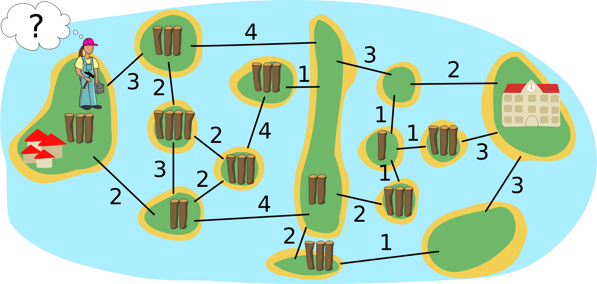

## Body

I bambini si sono trasferiti nell'isola all'estrema sinistra.
Bianca deve costruire dei ponti che permettano ai bambini di andare a scuola sull'isola all'estrema destra.

La mappa delle isole mostra quanti tronchi d'albero ci sono su ogni isola.
Bianca può prendere questi tronchi d'albero per costruire ponti lungo le linee.
Il numero su una linea indica quanti tronchi sono utilizzati in quel punto per un ponte.
Quando c'è un ponte tra due isole, Bianca può attraversarlo e portare con sé i tronchi che ha ancora.
Naturalmente, può usare ogni tronco d'albero per un solo ponte.

Bianca inizia sull'isola a sinistra.  Il suo obiettivo è utilizzare il minor numero possibile di tronchi.

## Question/Challenge - for the brochures

Su quali linee Bianca deve costruire i ponti per raggiungere la sua destinazione?

 
 
## Question/Challenge - for the online challenge

Su quali linee Bianca deve costruire i ponti per raggiungere la sua destinazione?

 
 
## Interactivity instruction - for the online challenge

Fa clic su una linea per selezionarla. Nel fumetto di Bianca puoi vedere quanti tronchi stai utilizzando. Al termine, fa clic su "Salva risposta".

## Answer Options/Interactivity Description

Each "path" must be clickable and when clicked, a bridge (maybe trunks in the appropriate number laid out?) appears. Any bridge could be built at any point in time, even impossible bridges (to allow the students to start from the school as well).

Es würde sich lohnen, die momentane Summe der angeklickten Brücken und die Summe der insgesamt zur Verfügung stehenden Baumstämme anzuzeigen; dann wäre jedoch das Problem, dass damit die feasibility noch nicht gezeigt ist, und dass dies zu Missverständnissen führen könnte.

## Answer Explanation

Questa è la risposta corretta:

 
 
Le linee verdi mostrano dove Bianca ha costruito i ponti. Le frecce rosse mostrano come Bianca ha attraversato i ponti:

- Sull'isola A prende i tre tronchi e ne usa due per il primo ponte. Con il tronco rimanente, attraversa il ponte e sull'isola B ha $3 - 2 + 2 = 3$ tronchi.  Questo non è sufficiente per costruire un ponte verso l'isola D.
- Pertanto, costruisce un ponte con 2 tronchi fino all'isola C. Attraversa il ponte, prende i 3 tronchi dall'isola C e torna indietro.  Ora ha $3 - 2 + 3 = 4$ tronchi.
- Con essi costruisce un ponte verso l'isola D, attraversa il ponte e poi ha i due tronchi dell'isola D.
- In seguito, costruisce un ponte per l'isola E e può prendere 3 tronchi. Costruisce altri ponti per le isole F e G. Così sull'isola E ha 3 tronchi, sull'isola F $3 - 1 + 1 = 3$ tronchi e sull'isola G ancora 2 tronchi.
- Questi sono esattamente sufficienti per costruire un ponte verso l'Isola H, dove si trova la scuola.

In totale, Bianca è riuscita a costruire i ponti per un percorso dall'isola A all'isola H, utilizzando 14 tronchi d'albero.  Ma è possibile anche con un numero inferiore di tronchi? A tal fine, è necessario esaminare tutti i possibili percorsi. Poiché tutti conducono attraverso la lunga isola D, il problema può essere diviso in due parti: dall'isola A all'isola D e dall'isola D all'isola H:

- Per i ponti dall'isola A all'isola D, Bianca ha utilizzato 8 tronchi ed è arrivata sull'isola D senza tronchi.  Il suo percorso è il seguente: $2-[2,2]-4$ (dall'isola A attraverso la linea con il 2 fino all'isola B, poi tra B e C e ritorno attraverso il 2, poi attraverso il 4 fino all'isola D). Un percorso con meno tronchi sarebbe di $3-4$, ma può essere costruito solo con una deviazione ($3-[2,2]-4$), quindi consuma 9 tronchi, e Bianca arriva sull'isola D con un tronco in più. Tutti gli altri percorsi dall'isola A a D consumano 9 o più tronchi.
- Per i ponti dall'isola D alla H, Bianca ha utilizzato 6 tronchi. Non può costruire il percorso diretto $3-2$, nemmeno con un tronco in più. Tutti gli altri percorsi dall'isola D all'isola H utilizzano 6 tronchi o più.

Non è quindi possibile costruire ponti con meno di 14 tronchi su cui i bambini possano camminare dall'isola A del villaggio all'isola H della scuola.  Con i ponti che ha costruito, Bianca ha quindi raggiunto il suo obiettivo.

## This is Informatics

La mappa dell'isola con i "siti di costruzione dei ponti" indicati dalle linee può essere modellata come un _grafo_: si tratta di una struttura matematica che mette in relazione gli oggetti (chiamati anche nodi) tra loro a coppie (le coppie sono chiamate anche bordi).  In un grafo, le isole sono modellate come nodi e le linee come bordi. In questo caso, gli spigoli hanno dei _pesi_, cioè il numero di tronchi utilizzati per costruire un ponte lungo una linea, ma anche i nodi (il numero di tronchi su un'isola) - questo è piuttosto insolito. Per i grafi in cui solo i bordi sono ponderati, l'informatica conosce diversi algoritmi efficienti in grado di calcolare il percorso più breve (tramite bordi con somma minima di pesi) tra due nodi.

Il problema che Bianca vuole risolvere in modo ottimale in questo compito è più complicato: anche lei vuole fare il percorso più breve, ma ha un vincolo: la somma dei pesi dei nodi sul suo percorso fino a quel momento (i tronchi che potrebbe utilizzare) meno la somma dei pesi dei bordi sul suo percorso (i tronchi che ha usato per costruire il ponte) deve essere maggiore del peso del bordo che vuole percorrere dopo o dove vuole costruire un ponte. Per trovare il percorso ottimale, potrebbe essere necessario provare tutte le possibilità. La suddivisione del problema in due parti aiuta a ridurre il numero di possibilità. Inoltre, grazie al vincolo, è possibile escludere molte possibilità prima di averle provate tutte. In informatica, una procedura di questo tipo (provare ed tornare indietro per esclusione) è nota come _backtracking_.

## This is Computational Thinking

Beim Lösen des Problems begegnen wir einem vier wichtige Aspekte des Computational Thinking:
- Es ist im Grunde egal, dass es um Inseln und Brücken geht, alleine die Struktur des Graphen ist relevant. Diesen Vorgang nennt man Abstrahieren, wenn die wesentlichen Informationen verwendet werden und alle übrigen (die Einkleidung durch die Aufgabe) weggelassen werden.
- Das ziemlich komplexe Problem wird in zwei Teile zerlegt (manchmal auch Dekomposition genannt), die für sich genommen relativ einfach lösbar sind.
- Dadurch dass zu jeder Zeit genügend Baumstämme für den Bau von Brücken vorhanden sein müssen, ist auch algorithmisches Denken oder das Denken in Abläufen notwendig.
- Zuletzt wird in der Regel eine lokale Optimierung stattgefunden haben: man hat eine mögliche Lösung gefunden und versucht durch Ausprobieren von leicht veränderten Alternativen eine bessere Lösung zu finden.

Im Abschnitt "Dies ist Informatik" oben wird zudem Algorithmenanalyse aufgezeigt.

## Informatics Keywords and Websites

- Grafo: https://it.wikipedia.org/wiki/Grafo
- Backtracking: https://it.wikipedia.org/wiki/Backtracking 

## Computational Thinking Keywords and Websites

- Abstraktion (https://de.wikipedia.org/wiki/Abstraktion)
- Dekomposition (https://de.wikipedia.org/wiki/Modell#Modellbildung)
- Algorithmisches Denken (https://algdenken.phgr.ch)
- Lokale Optimierung (https://de.wikipedia.org/wiki/Lokale_Suche)
- Algorithmenanalyse (https://de.wikipedia.org/wiki/Algorithmus#Algorithmenanalyse)

## Wording and Phrases

- _Brücke_: Kante
- _Insel_: Knoten
- _Baumstamm_: "Kosten" zum Brückenbau und "Guthaben", das auf Inseln zu finden ist
- _benachbarte Insel_: eine Insel, die von einer anderen aus mit einer der angebotenen möglichen Brücken erreicht werden kann

## Comments

Zsuzsa Pluhár (svn: pluhar) on 2023-04-06
- [AGE] I don’t think, it could be the same "hard" or "medium" for 3 age groups. For 6-10yo I would not use (long text, process) this task. I would prefer (because of the long solving process for the oldest age group)
- [IDEA] The idea is nice. It requires some computational thinking skills to be understood and solved.
- [TEXT] The text can be improved: instead of "stick" I would prefer "board" or "lumber"; in the last sentence I would stress he can do that, but he doesn’t need to use all the sticks; without beavers, it would be shorter and less "not used information" in the text.
- [EXPL] The "Answer Explanation" section is available and complete. It is understandable by students of the appropriate level, but I would extend with the process "how to solve", how to find the solution (e.g: try to find the shortest path and check whether it is possible with the number of lumbers…; or present other strategies to solve the task)
- [TiI] The "It’s informatics" section is available, but it could be understood only by the oldest or IT specialist :). It is well connected to the task but needs to be improved.
- The "Students could solve the problem…" section is not for TiI.
- [TiCT] The "This is Computational Thinking" section is available. The keywords for CT are keywords for IT!
- [GRAPH] The figures are clear, in SVG format and appealing, CC-licensed, and may be re-used and modified, but it would be nice to create a nicer representation (colors, bigger numbers with small lumbers, …)
- [AUTH] The name(s) and mail address(es) of the author(s) are available.
- [NAME] The names of the task folder and file(s) are compiled to the prescribed format.
- [OTHER] –

Yong Mao (svn: mao) on 2023-04-10
- [AGE] For 6-12yo, I suggest it is better not to include this task. It exceeds the level of those ages.
- [EXPL] It only explained why the correct answer is feasible to the constraint, but not explained why it is the optimal feasible answer. I suggest to add more explanation to this section.

Leonardo Cavalcante (svn: cavalcante) on 2023-04-19
- Nice task, but not for all the age groups. It is too hard for the first 2 age groups. I think it would be better suggesting this task only for the last 3 age groups. Maybe saying Brian doesn’t need to use all the sticks he just got to build a bridge to go to the next land would be helpful.
- Why not answer options as well (numbers from 14 to 17)?
- Answer explanation section needs more explanation. Why is the path shown the one built with the fewest sticks?

James Atlas (author) on 2023-05-03
- [AGE] Changed to 14-16 Hard and 16-19 Medium as per suggestions
- [TEXT] Changed stick to board throughout. Edited text slightly to make rules clear (Brian does not need to use all boards, can travel to any land that is connected by bridges to pick up boards).
- [EXPL] Rewrote explanation by moving divide and conquer approach originally in [TiI] to this section and expanding it to the specific values in the problem. Added labelled edge paths to explanation. Explain feasibility of a path. Added proof by enumeration using upper and lower bounds.
- [GRAPH] Added color. Increased font sizes. Added graphic for Brian and for boards on each land mass.
- [TiI] Significant rewrite. Removed specific problem values / steps (these are now in the EXPL section). Tied the approaches used in the solution to more general algorithms and informatics techniques. Modified keywords.
- [TiCT] Fixed CT keywords.
- [Other] Added interactivity idea option.

D-A-CH-HU (pre-2023-06-27):
- ZsP: die Process zu lösen ist zu lang mit dem Finden des Minimums
- Giovanni: very nice task. Maybe the interactive version would be more appropriate.
- SD: Interaktiv besser, evtl. Zeitkiller, Aufgabentext reduzieren wenn möglich
- WP: Ganz spannende schwierige Aufgabe. Bookkeeping in der Interaktivität reduzieren? geht langsam das Optimum zu finden

Christian Datzko on 2023-07-12:
- I streamlined the conditions into one set of rules.
- A added the condition that no bridges may be destroyed and the logs recovered (necessary in my opinion).
- Made the answer explanation a little bit more one flow of text without adding the extra level of abstraction.

