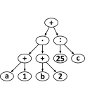

## Body

Un'espressione matematica è costituita da ...
- ... un _operatore_: **+**, **-**, **·** o **:**
- ... e gli _operandi_: numeri come 1, 2, ..., lettere come a, b, ... o ancora espressioni come (1 + 2).

La struttura di un'espressione matematica può essere rappresentata come un _albero strutturale_.
Questo diagramma di operatori e operandi è disegnato con un cerchio con l'operatore è collegato all'albero degli operandi da frecce.
Nel caso più semplice, si tratta di cerchi con un numero o una lettera.

Da un albero, a sua volta, si può leggere la _notazione postfissa_ di un'espressione matematica.
In questa notazione, per ogni espressione, gli operandi vengono scritti per primi, seguiti dall'operatore.

:::indent
| --------------------------- | :---------: | :---------------: |
| **Espressione matematica:** |   a + b     | (a + 1) ⋅ (b + c) |
| **Albero strutturale:**     | ![example1] |   ![example2]     |
| **Notazione postfissa:**    |   a b +     |   a 1 + b c + ⋅   |
:::

[example1]: graphics/2023-RO-02-example1-compatible.svg
[example2]: graphics/2023-RO-02-example2-compatible.svg

Ecco la notazione postfissa di un'altra espressione:

:::indent
a 1 + b 2 + · 25 c : +
:::

## Question/Challenge - for the brochures

Qual è l'albero strutturale di questa espressione?

## Question/Challenge - for the online challenge

Qual è l'albero strutturale di questa espressione?

## Answer Options/Interactivity Description

[A]: graphics/2023-RO-02-answerA-compatible.svg
[B]: graphics/2023-RO-02-answerB-compatible.svg
[C]: graphics/2023-RO-02-answerC-compatible.svg
[D]: graphics/2023-RO-02-answerD-compatible.svg

| :--: | :--: | :--: | :--: |
| ![A] | ![B] | ![C] | ![D] |
|  A)  |  B)  |  C)  |  D)  |

## Answer Explanation

La risposta C è corretta: 

Come descritto nel compito, l'operatore centrale di un'espressione matematica si trova in cima all'albero (è la sua _radice_) e alla fine nella notazione postfissa. Se si vuole trovare o creare l'albero di struttura di un'espressione in notazione postfissa, si deve cercare l'ultimo carattere della notazione postfissa in cima all'albero, in questo caso il +. Solo negli alberi delle risposte A e C si trova un + nella radice.

L'operatore + ha due operandi, uno a sinistra e uno a destra. Nella notazione postfissa, si può vedere direttamente (al penultimo carattere) che l'operando di destra dell'espressione è di nuovo un'espressione che ha l'operatore :. Nell'albero strutturale, quindi, deve esserci un : a destra sotto la radice. Questo è il caso solo dell'albero della risposta C. Quindi questa deve essere la risposta corretta.

Questo può essere dimostrato anche convertendo completamente l'albero della risposta C in notazione postfissa:
- I tre sottoalberi più "piccoli", ciascuno composto da 3 elementi, diventano a 1 +, b 2 + e 25 c :.
- I due sottoalberi di sinistra di questi tre "più piccoli" diventano l'operando di sinistra del **+** superiore, in modo che la trasformazione del sottoalbero di sinistra sia ora 1 + b 2 + ·. Il terzo dei sottoalberi "più piccoli" è già l'operando destro.
- Quindi la notazione postfissa della struttura ad albero della risposta C è complessivamente: a 1 + b 2 + · 25 c : +. Questa è esattamente l'espressione data nel compito.

## This is Informatics

La _notazione postfissa_, detta anche _notazione polacca inversa_, è spesso utilizzata per formulare espressioni matematiche o di altro tipo (ad esempio nei linguaggi di programmazione) senza equivoci e in modo compatto. Se si dovesse scrivere l'espressione data dalla struttura ad albero della risposta C in notazione normale (cioè con gli operatori tra gli operandi, quindi chiamata anche _notazione prefisso_), si dovrebbero mettere le parentesi (a + 1) - (b + 2) + 25 : c, che non sono necessarie nella notazione postfissa. La notazione postfissa è stata introdotta per la prima volta da Jan Łukasiewicz (1878-1956), con l'operatore davanti agli operandi. È il modo in cui si scrive l'applicazione delle funzioni, tra le altre cose: in matematica $f(x, y)$, in programmazione `nomefunzione(argomento1, argomento2, argomento3)`.  Nel computer si usa, tra l'altro, quando si _parsano_ le espressioni di un linguaggio di programmazione.

Nel recente passato, molte persone hanno conosciuto la notazione postfissa soprattutto con l'uso delle prime calcolatrici scientifiche: con essa si potevano inserire e calcolare espressioni matematiche complesse in modo rapido e affidabile e, soprattutto, senza parentesi.  Ancora oggi, esiste una comunità che utilizza calcolatrici programmabili (come le HP 35s) con la notazione postfissa.

## This is Computational Thinking

Um die Aufgabe zu lösen, muss ein komplexer mathematischer Ausdruck durch _Zerlegen_ oder _Dekomposition_ in kleinere mathematische Ausdrücke verwandelt werden, die für sich im Kontext verständlich sind. Zudem muss ein Vorgang dahingehend _analysiert_ werden, dass seine Funktionsweise auch in rückwärtiger Reihenfolge verständlich wird. Im Grunde wird dabei dieselbe Information zwischen unterschiedlichen Darstellungsweisen konvertiert.

## Informatics Keywords and Websites
- Notazione polacca inversa: https://it.wikipedia.org/wiki/Notazione_polacca_inversa
- Albero sintttico: https://it.wikipedia.org/wiki/Albero_sintattico
- Jan Łukasiewicz: https://it.wikipedia.org/wiki/Jan_%C5%81ukasiewicz
- HP 35s: https://it.wikipedia.org/wiki/HP_35s

## Computational Thinking Keywords and Websites

- Zerlegen, Dekomposition: https://de.wikipedia.org/wiki/Modell#Modellbildung

## Wording and Phrases

- _Mathematischer Ausdruck:_ bewusst als solchen belassen, auch wenn hier eine gewisse Nähe zur Mathematik offensichtlich wird

- _Operator / Operand:_ Für die Altersgruppe sind diese Fachbegriffe angemessen.

- _Strukturbaum:_ graphische Repräsentation eines Ausdrucks

## Comments

Raluca Constantinescu, raluca.constantinescu@ecdl.ro, 2023-05-04
 
By: Alvida Lozdienė (svn: lozdiene) on 2023-04-15 Assigned review: _The authors need to revise the answer numbers, as the correct answer is d and not c. Also, the figures for answers a and b are reversed. // I suggest changing the age group to 14-16 years_

By: JUAN GUTIERREZ (svn: jgutierrez) on 2023-04-21 Assigned review: _I think it the coding rules should be explained generally, not just for the examples given. This should include also the operator /. // There is a typo, as correct answer is d._

By: Taina Lehtimäki (svn: lehtimaki) on 2023-04-22 Assigned review: _[AGE] 12-14 hard, 14-16 medium, 16-18 easy // [IDEA] It’s a good task. // [TEXT] Text is clear. // [EXPL] First sentence should be: "The correct answer is d."  Explanation is very good and also cover the incorrect answers. // [TiI] Good and appropriate for the age group. // [TiCT] Could also talk about representation and logic (tree structures) // [GRAPH] No SVG graphics. // [AUTH] OK. // [NAME] OK. // [OTHER] -_

D-A-CH-HU (pre-2023-06-27):
- CD: Mention real-life calculators like the HP 35S
- SD: Der kleine Biber muss da nicht rein. Ich finde die Aufgabe zu "trocken".
- WP: Der Transfer zwischen textueller Notation und Syntaxbaum; das ist ein ziemlich originelles Thema.
- lineare Textnotation zu einem Syntax-Baum
- Erklärung durch Beispiel

Christian Datzko, christian@bebras.services, 2023-07-10:
- _De-Beaverized._
- _Recreated graphics with lower case letters (variables are usually lower case) and the proper symbols for multiplication (·) and division (:)._
- _I kept the task "dry" as it is: it’s a hard question and any story wouldn’t make it much more relatable._
- _I decidedly did not add more examples. The "tree → expression" examples are fine; the students’ job is to come up with a good "expression → tree" idea or waste time going "tree → expressen" up to four times._

EDIT ABOVE (keep this template and add above this line): author, e-mail, date (YYYY-MM-DD): _Comment, including documentation of and reasons for changes, and precautions to take when further developing this task._
