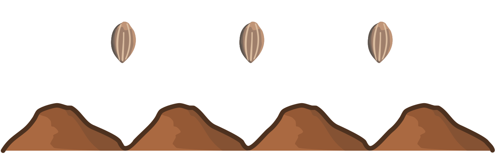

## Body

Der Kaninchenroboter kann folgende Anweisungen ausführen:

 ") Springe nach **links** auf den nächsten Hügel.

 ") Springe nach **rechts** auf den nächsten Hügel.

 ") **Pflanze** einen Karottensamen auf den Hügel, auf dem du stehst.

Der Kaninchenroboter hat diese Folge von Anweisungen ausgeführt:

")

Dabei ist der Roboter auf vier Hügeln gewesen.
Wir wissen aber nicht, auf welchem Hügel er angefangen hat.

## Question/Challenge - for the brochures
Auf welche Hügel hat der Roboter die Rüeblisamen gepflanzt?

## Question/Challenge - for the online challenge
Auf welche Hügel hat der Roboter die Rüeblisamen gepflanzt? 

## Interactivity instruction - for the online challenge

Ziehe die Samen auf die richtigen Hügel. Wenn du fertig bist, klicke "Antwort speichern".

## Answer Options/Interactivity Description

<!-- empty -->

:::comment
The seeds are draggables. On each mound is a container to drop the seeds in.
:::

## Answer Explanation
So ist es richtig: 

Um die richtige Antwort besser erklären zu können, geben wir den Hügeln Buchstaben (siehe oben) und den Anweisungen Nummern:

")

Zuerst bestimmen wir den Startpunkt des Roboters: Da der Roboter dreimal hintereinander nach links springt (Anweisungen 3, 5, 6), muss er vorher auf Hügel D stehen. Bevor er dreimal nach links springt, springt er einmal nach rechts (Anweisung 1). Der Roboter hat also auf Hügel C angefangen.
Folglich werden die Rüeblisamen – den Anweisungen 2, 4 und 7 entsprechend – zuerst auf Hügel D, dann auf Hügel C und zuletzt auf Hügel A gepflanzt.

## This is Informatics

Echte Roboter haben eingebaute Computer, und die werden so ähnlich _programmiert_ wie der Kaninchenroboter. Ein Computerprogramm besteht aus vielen einzelnen _Anweisungen_.

In unserem Fall wird die Abfolge der Anweisungen für den Roboter-Computer mit Hilfe von Bildblöcken angegeben. Das Ergebnis (_Output_) des Programms hängt nicht nur von der Startposition (_Input_), sondern auch von der Folge und Reihenfolge der Anweisungen ab.

Diese Biberaufgabe zeigt ein Beispiel für den Einsatz von Robotern in der Landwirtschaft. Roboter können nicht nur pflanzen, sondern auch bewässern, bestäuben oder Pflanzenschutzmittel gezielt verteilen.

## This is Computational Thinking

Optional - not to be filled 2023

## Informatics Keywords and Websites

 - Algorithmus: https://de.wikipedia.org/wiki/Algorithmus
 - Anweisungen: https://de.wikipedia.org/wiki/Anweisung_(Programmierung)
 - Smart Farming: https://de.wikipedia.org/wiki/Smart_Farming, https://www.agroscope.admin.ch/agroscope/de/home/themen/wirtschaft-technik/smart-farming.html
 - Roboter in der Landwirtschaft: https://cordis.europa.eu/article/id/441912-robots-help-farmers-say-goodbye-to-repetitive-tasks/de

## Computational Thinking Keywords and Websites

- Modelling and Simulation, 
- Evaluation

## Wording and Phrases

German wording and phrases please here!

 - _Kaninchenroboter_: ein Roboter mit Kaninchen Form/Gestalt
 - _Anweisung_: Befehl, "instruction" 

## Comments

Report changes on this file (older comments can be looked up in the original document)

_Zsuzsa, 2023-06-30: Ich habe die Bilder nicht verändert. Vielleicht wenn wir "Wasser" als Grenzen von Hügeln benutzen können, das neue Regel ("die Hügeln nicht verlassen") könnte noch eindeutiger sein, wie zB: "nicht ins Wasser springen".
_Zsuzsa, 2023-07-20: wir haben die "Hügel verlassen"-Problem weggelassen , weil es nicht important ist.

_Susanne Datzko, 2023-08-18: Interaktive Version erstellt. Lösungserklärung durch Buchstaben auf den Hügeln vereinfacht.