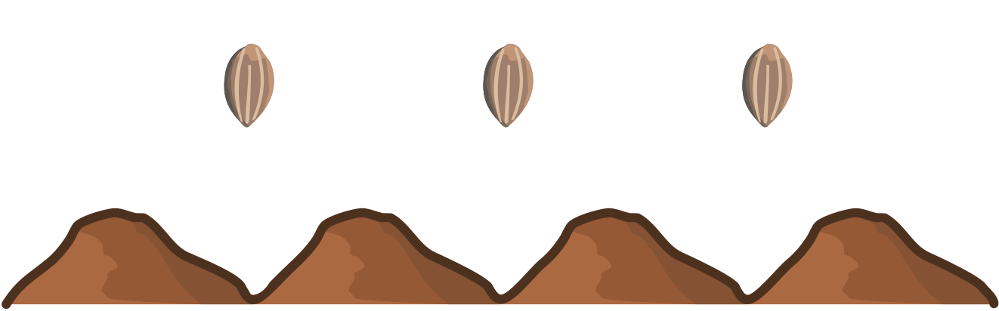

## Body

Le robot lapin peut exécuter les instructions suivantes:

") Saute vers la **gauche** sur la prochaine colline

") Saute vers la **droite** sur la prochaine colline

") **Plante** une graine de carotte sur la colline sur laquelle tu es

Le robot lapin a suivi la suite d'instructions suivante:

")

Il a passé sur quatre collines. Nous ne savons pas sur quelle colline il a commencé.

## Question/Challenge - for the brochures

Sur quelles collines le robot a-t-il planté des graines de carottes?

## Question/Challenge - for the online challenge

Sur quelles collines le robot a-t-il planté des graines de carottes?

## Interactivity instruction - for the online challenge

Glisse les graines sur les bonnes collines. Quand tu as fini, clique sur "Enregistrer la réponse".

## Answer Options/Interactivity Description

<!-- empty -->

:::comment
The seeds are draggables. On each mound is a container to drop the seeds in.
:::

## Answer Explanation

Voici la bonne réponse: 

Pour mieux pouvoir expliquer la bonne réponse, nous donnons des lettres aux collines (voir ci-dessus) et des numéros aux instructions:

")

Nous commençons par déterminer le point de départ du robot: avant de sauter trois fois de suite vers la gauche (instructions 3, 5 et 6), il doit se trouver sur la colline D. Avant cela, il saute une fois vers la droite (instruction 1). Le robot a donc commencé sur la colline C. Les graines de carottes sont donc plantées sur les collines D, puis C et finalement A, d'après les instructions 2, 4 et 7.

## This is Informatics

Les vrais robots ont des ordinateurs intégrés, et ils sont programmés de manière similaire au robot lapin. Un programme informatique est constitué de plusieurs _instructions_ individuelles.

Dans notre cas, la suite d'instructions pour l'ordinateur du robot est donnée sous forme d'images. Le résultat (_sortie_, _output_ en anglais) du programme ne dépend pas que de la position de départ (_entrée_, _input_ en anglais), mais aussi des instructions et de l'ordre dans lequel elles sont données.

Cet exercice du Castor illustre l'utilisation de robot dans l'agriculture. Les robots ne peuvent pas seulement planter, mais aussi arroser, polliniser et répandre des produits de protection de manière ciblée.

## This is Computational Thinking

Optional - not to be filled 2023

## Informatics Keywords and Websites

 - Algorithme: https://fr.wikipedia.org/wiki/Algorithme
 - Instruction: https://fr.wikipedia.org/wiki/Instruction_informatique
 - Smart Farming: https://www.agroscope.admin.ch/agroscope/fr/home/themes/economie-technique/smart-farming.html
 - Les robots et l'agriculture: https://cordis.europa.eu/article/id/441912-robots-help-farmers-say-goodbye-to-repetitive-tasks/fr

## Computational Thinking Keywords and Websites

- Modelling and Simulation, 
- Evaluation

## Wording and Phrases

German wording and phrases please here!

 - _Kaninchenroboter_: ein Roboter mit Kaninchen Form/Gestalt
 - _Anweisung_: Befehl, "instruction" 

## Comments

Report changes on this file (older comments can be looked up in the original document)

_Zsuzsa, 2023-06-30: Ich habe die Bilder nicht verändert. Vielleicht wenn wir "Wasser" als Grenzen von Hügeln benutzen können, das neue Regel ("die Hügeln nicht verlassen") könnte noch eindeutiger sein, wie zB: "nicht ins Wasser springen".
_Zsuzsa, 2023-07-20: wir haben die "Hügel verlassen"-Problem weggelassen , weil es nicht important ist.

_Susanne Datzko, 2023-08-18: Interaktive Version erstellt. Lösungserklärung durch Buchstaben auf den Hügeln vereinfacht.