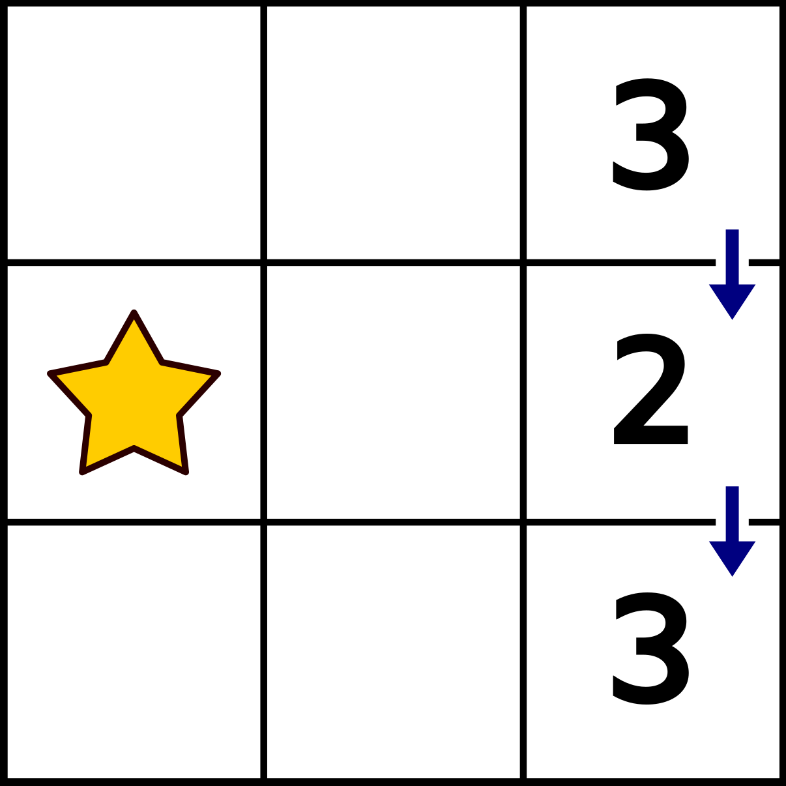
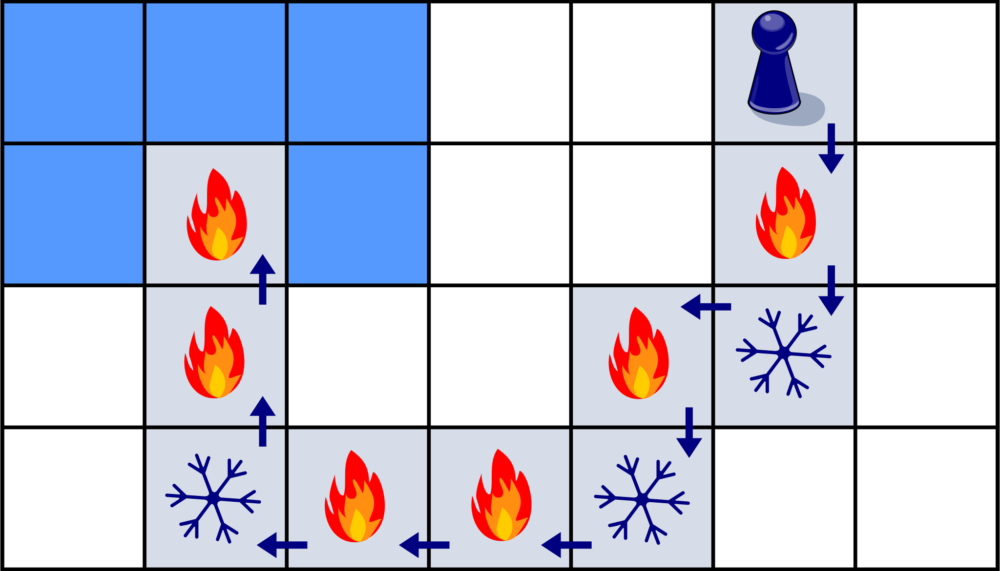
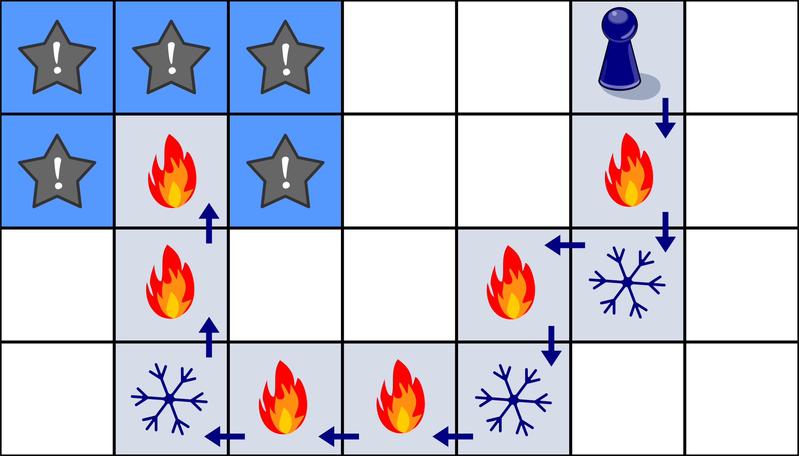
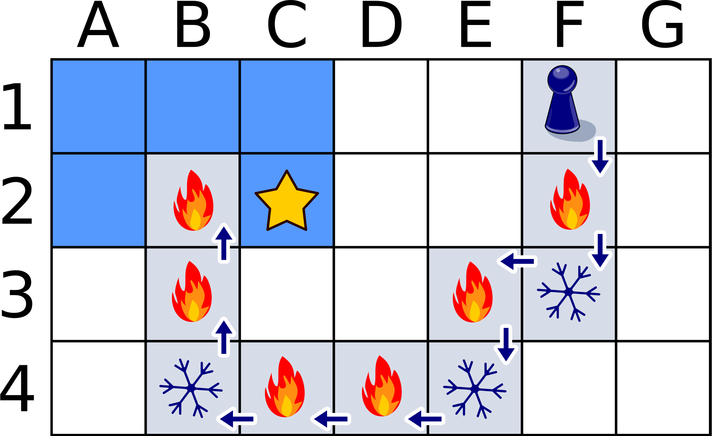

[star]: graphics/2023-SK-07_stern.svg "Stern (20px)"
[warmer]: graphics/2023-SK-07-warmer.svg "Wärmer (12px)"
[colder]: graphics/2023-SK-07-colder.svg "Kälter (20px)"
[gamepiece]: graphics/2023-SK-07-Daniel.svg "Spielfigur von Daniel (15px)"

## Body

Nina und Daniel spielen Schatzsuche. Auf einem Spielbrett mit quadratischen Feldern wählt Nina im Kopf ein Feld aus. Dort ist der Schatz versteckt.

Daniel wählt ein Startfeld aus. Von dort geht er schrittweise mit seiner Spielfigur ![gamepiece] um je ein Feld weiter: nach links, rechts, oben oder unten.

-- | --+
 | Beim ersten Versuch nehmen sie ein kleines Spielbrett. Nina versteckt den Schatz auf dem Feld mit dem Stern ![star]. Daniel startet rechts oben und macht zwei Schritte entlang der Pfeile. Nach jedem Schritt sagt Nina, ob Daniel nun näher ![warmer] am Schatz oder weiter weg ![colder] vom Schatz ist als vor dem Schritt.
 | Das Bild rechts zeigt Daniels Entfernungen vom Schatz. Die Entfernung vom Schatz ist die kleinste Anzahl Schritte, mit denen Daniel aktuell zum Schatz gehen könnte.

Nun nehmen sie ein grösseres Spielbrett.
Nina versteckt den Schatz auf einem der blau markierten Felder.
Das Bild zeigt wieder Daniels Schritte und was Nina nach jedem Schritt sagt.

## Question/Challenge - for the brochures

Wo ist der Schatz versteckt?

## Question/Challenge - for the online challenge

Wo ist der Schatz versteckt? 

## Interactivity instruction - for the online challenge

Klicke auf das richtige Quadrat. Wenn du fertig bist, klicke auf "Antwort speichern".

## Answer Options/Interactivity Description

click-to-select-one:  Man kann nur auf die fünf gelben Quadrate klicken. Es wird genau eines ausgewählt.

## Answer Explanation

So ist es richtig:

Wir verfolgen Daniels Weg und Ninas Rückmeldungen.  Daniel startet in Zeile 1 des Spielbretts. Nach dem ersten Schritt ist er in Zeile 2 und näher am Schatz als in Zeile 1.  Nach dem nächsten Schritt ist er in Zeile 3 und wieder weiter weg vom Schatz.  Da er in der gleichen Spalte geblieben ist, muss der Schatz auf einem Feld in Zeile 2 sein.  Denn egal, in welcher Spalte der Schatz versteckt ist:  Den kürzesten Weg zum Schatz von einer anderen Spalte aus hat man, wenn man in der gleichen Zeile ist.

Aber in welcher Spalte ist der Schatz versteckt?  Auf seinem weiteren Weg kommt Daniel in Zeile 4 mit einigen Schritten nach links dem Schatz zunächst näher; insbesondere ist er in Spalte 3 näher am Schatz als in Spalte 4.  Aber nach dem letzten Schritt in der Zeile ist Daniel in Spalte 2 weiter weg vom Schatz als in Spalte 3.  Der Schatz muss also auf einem Feld in Spalte 3 sein.  Denn was wir oben für Spalten gesagt haben, gilt auch für Zeilen:  Den kürzesten Weg zum Schatz von einer anderen Zeile aus hat man, wenn man in der gleichen Spalte ist.

## This is Informatics

Daniel geht (mit seiner Spielfigur) über das Spielbrett.  Von jedem Feld, auf dem er gerade steht, misst Nina die Entfernung zum Feld mit dem Schatz und nutzt dies für ihre Rückmeldung.  Üblicherweise wird die Entfernung zwischen zwei Punkten als Länge der geradlinigen Verbindung zwischen den Punkten gemessen (_euklidische Distanz_).  Doch die zwei Felder sind genau genommen keine Punkte.  Deshalb bemisst Nina die Entfernung zwischen zwei Feldern in der Anzahl von Schritten, die Daniel für einen kürzesten Weg vom einen Feld zum anderen gehen müsste.  Dieses _Maß_ kann man generell bei Rastern anwenden und ist in der Informatik als _Manhattan-Distanz_ bekannt – abgeleitet vom gerasterten Straßenplan des New Yorker Stadtteils Manhattan.
Daniel geht (mit seiner Spielfigur) über das Spielbrett.  Von jedem Feld, auf dem er gerade steht, misst Nina die Entfernung zum Feld mit dem Schatz und nutzt dies für ihre Rückmeldung.  Üblicherweise wird die Entfernung zwischen zwei Punkten als Länge der geradlinigen Verbindung zwischen den Punkten gemessen (_euklidische Distanz_).  Doch die zwei Felder sind genau genommen keine Punkte.  Deshalb bemisst Nina die Entfernung zwischen zwei Feldern in der Anzahl von Schritten, die Daniel für einen kürzesten Weg vom einen Feld zum anderen gehen müsste.  Dieses _Mass_ kann man generell bei Rastern anwenden und ist in der Informatik als _Manhattan-Distanz_ bekannt – abgeleitet vom gerasterten Strassenplan des New Yorker Stadtteils Manhattan.

Informatikerinnen und Informatiker wählen die Art der Distanzberechnung zwischen zwei Objekten in Abhängigkeit von der Frage, die sie lösen möchten. Wenn man zum Beispiel die Entfernung zwischen zwei gleich langen Wörtern in einer natürlichen Sprache messen möchte, kann man die Anzahl Stellen, an welchen sich die Wörter unterscheiden, zählen; das ist dann der  _Hamming-Abstand_ oder die _Hamming-Distanz_.  Sind die Wörter unterschiedlich lang, kann man die _Editierdistanz_ verwenden. Entfernungen bzw. Distanzen spielen in der Informatik häufig eine Rolle, wenn es darum geht, optimale Lösungen eines Problems zu finden.  Egal ob die Lösung eines Problems am schnellsten, am kürzesten oder am günstigsten sein soll:  Man muss oft nicht den Algorithmus ändern, sondern nur das Entfernungsmass: Dauer, Länge oder Kosten.

## This is Computational Thinking

Um diese Aufgabe zu bewältigen, überlegen wir uns zunächst eine verständliche und systematische Strategie. Mithilfe dieser Strategie können wir anschliessend die Navigation durch das Gitter vornehmen und die Hinweise für die Schatzsuche interpretieren. Systematik und Verständlichkeit sind wesentliche Zutaten guter Algorithmen und algorithmisch denkende Problemlöser. ((dieses finde ich zu allgemein und fast zu trivial)--> Es ist sehr allgemein - stimme zu. Wir füllen This is Computational Thinking nicht, in diesem Sinne würde ich es nicht entfernen)

Die Interpretation der Hinweise "N" und "W" helfen uns den Suchraum des Problems schrittweise zu verkleinen. Dieser Ansatz entspricht einer allgemeinen Methode, um Probleme zu lösen, die als _Teile und Herrsche_ bekannt ist. In unserem konkreten Fall signalisiert "W", dass wir uns im vorhergehenden Schritt vom Standort des Schatzes entfernt haben. Unter der verbleibenden potentiellen Standorten gibt es möglicherweise welche, die uns nun näher liegen als zuvor. Diese können als Standort des Schatzes ausgeschlossen werden. Die nun verbleibenden potentiellen Standorte werden mithilfe des nächsten Hinweises untersucht, bis am Ende ein Standort übrig bleibt, der dann unsere Lösung ist.

## Informatics Keywords and Websites

- Manhattan-Distanz: https://de.wikipedia.org/wiki/Manhattan-Metrik
- Hamming-Abstand: https://de.wikipedia.org/wiki/Hamming-Abstand
- Editierdistanz: https://de.wikipedia.org/wiki/Levenshtein-Distanz

## Computational Thinking Keywords and Websites

 - Algorithmus

## Wording and Phrases
 - Ein __Schritt__ ist eine waagerechte oder ein senkrechte Bewegung von Daniel in ein direkt beachbartes Feld.
 - Die __Entfernung__ ist die Anzahl der Schritte, die Daniel ab dem derzeitigen Feld über waagerechte und senkrechte Schritte am schnellsten zum Schatz führen.
 - Nach jedem Schritt ist eine Person oder ein Subjekt __näher__ oder __weiter weg__ von einem Punkt oder einem Ziel als zuvor. Die Entfernung ist um einen Schritt kleiner oder grösser geworden.

## Comments

--